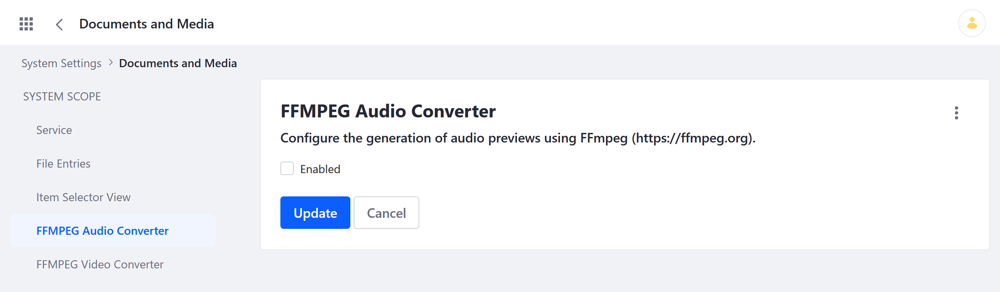
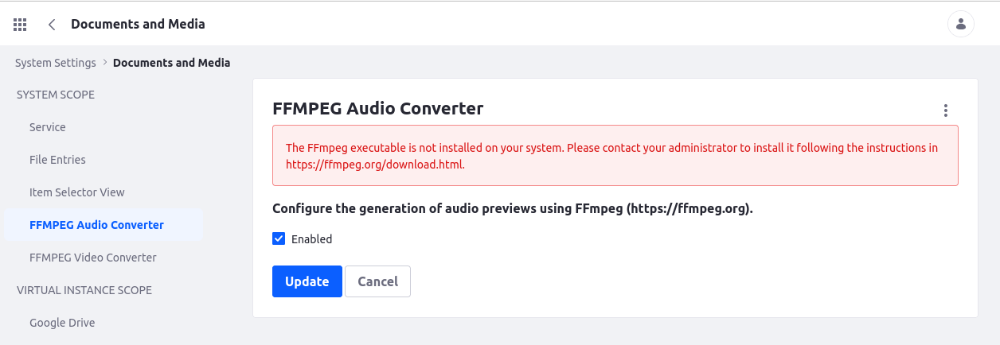

# Enabling FFmpeg for Audio and Video Previews

Documents and Media provides integration with the [FFmpeg](http://ffmpeg.org/) multimedia framework for generating audio and video file previews. To use this integration, you must first install FFmpeg on your server. If you're working in a clustered environment, FFmpeg must be installed on each node.

```{note}
Previously, Liferay used Xuggler to generate video and audio previews. However, the Xuggler library is currently unmaintained. As of Liferay 7.4, users are advised to use FFmpeg for generating previews.
```

Once installed, follow these steps to configure Documents and Media to use FFmpeg:

1. Open the *Global Menu* (), and go to *Control Panel* &rarr; *System Settings* &rarr; *Documents and Media*.

1. Go to *FFMPEG Audio Converter*, check *Enable*, and click *Update*.

1. Go to *FFMPEG Video Converter*, check *Enable*, and click *Update*.

   

   If FFmpeg is installed correctly on your system, Liferay displays a success message after clicking Update. Otherwise, Liferay displays an error message.

   

Once configured, audio and video previews are automatically generated for audio and video files at upload or update.

## Additional Information

* [Previewing Files](../uploading-and-managing/previewing-files.md)
* [Configuring Documents and Media Previews](./configuring-documents-and-media-previews.md)
