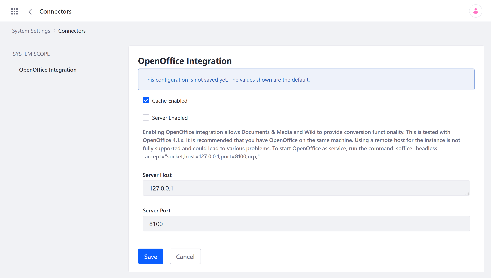

# Enabling OpenOffice / LibreOffice Integration

[OpenOffice](https://www.openoffice.org/) and [LibreOffice](https://www.libreoffice.org/) are open source productivity suites that you can integrate with Liferay. By default Liferay includes [PDFBox](https://pdfbox.apache.org/), which generates automatic previews for limited file types. However, you can integrate either of these suites for additional functionality, such as document conversion. The desired service must be installed on the server before it the Liferay integration can be enabled.

```{important}
While both OpenOffice and LibreOffice are capable of integration, some of their features may not be compatible with all Liferay products. View [Liferay's Integrated Technologies Compatibility Matrix](https://help.liferay.com/hc/en-us/articles/360016294272-Liferay-DXP-Integrated-Technologies-Compatibility-Matrix) for a list of supported technologies. 
```

Once installed, follow these steps to enable Liferay's OpenOffice/LibreOffice integration via the Control Panel:

1. Open the *Global Menu*, and go to *Control Panel* &rarr; *System Settings* &rarr; *Connectors* &rarr; *OpenOffice Integration*.

   ```{note}
   Alternatively, you can adjust these settings by deploying a `com.liferay.document.library.document.conversion.internal.configuration.OpenOfficeConfiguration.config` file to your `[Liferay Home]/osgi/configs` folder. 
   ```

   

2. Check the *Server Enabled* box.

3. Enter the desired *Server Host* and *Server Port*.

   ```{important}
   It is recommended that you have OpenOffice on the same machine. Using a remote host for the instance is not fully supported and can lead to unexpected issues.
   ```

4. Click on *Update*.

You can now use OpenOffice/LibreOffice compatible features, which include converting documents, viewing supported document types in your browser, and generating document thumbnails and previews.

## Additional Information

* [Configuring Documents and Media Previews](./configuring-documents-and-media-previews.md)
* [Sharing Documents and Media](../sharing-documents-and-media.md)
