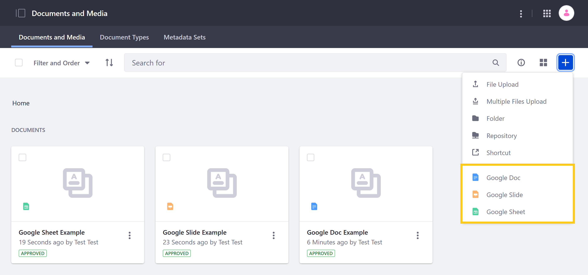

# Enabling Document Creation and Editing with Google Drive

Liferay DXP provides integration with Google Drive so you can create and edit Google Docs, Sheets, and Slides via the Documents and Media application. When adding or editing one of these document types, you're redirected to Google's external editor where you can compose your file.



```{note}
This integration can be enabled globally (i.e., for all portal instances in a DXP installation), or for individual instances. Configurations at an instance level override global configurations.
```

## Prerequisites

Enabling Liferay's Google Drive integration requires an active Google Project with the Google Drive API enabled and OAuth 2 properly configured. To set up OAuth 2, configure an OAuth consent screen, generate OAuth 2 credentials, and add the Liferay request URIs to the list of authorized URIs for the OAuth Client.

When generating OAuth 2 credentials, ensure you've selected *Web application* for the application type. Once generated, you'll need the credential's client ID and client secret for configuring Documents and Media.

Please consult Google Cloud documentation if needed:

* [Creating a Google Project](https://support.google.com/googleapi/answer/6251787?hl=en&ref_topic=7014522)
* [Enabling APIs for a Project](https://support.google.com/googleapi/answer/6158841)
* [Setting Up Your OAuth Consent Screen](https://support.google.com/cloud/answer/10311615?hl=en)
* [Setting Up OAuth 2](https://support.google.com/cloud/answer/6158849)

Once your Google Project is ready, you can configure Liferay's Documents and Media application.

## Configuring Documents and Media

Follow these steps to enable Liferay's integration with Google Drive.

1. Open the *Global Menu* (), click on the *Control Panel* tab, and go to *System Settings* &rarr; *Documents and Media*.

1. Click on *Google Drive* under Virtual Instance Scope.

    

1. Enter the Google Project's OAuth 2 *client ID* and *client secret*.

   ```{note}
   The [Google Picker API](https://developers.google.com/picker/docs) enables users to select photos, videos, maps and documents stored in Google from Liferay. It is only necessary when using Liferay's Plugin for Google Drive. See [Enabling Links to Google Drive Documents](./enabling-links-to-google-drive-documents.md) for more information.
   ```

1. Click on *Save*.

Once enabled, authorized users can create Google Docs, Slides, and Sheets via Documents and Media.

```{note}
To disable this feature, click on the *Actions* button for Google Drive, and select  *Reset Default Values*.
```

## Additional Information

* [Enabling Links to Google Drive Documents](./enabling-links-to-google-drive-documents.md)
* [Creating and Editing Documents with Google Drive](../../uploading-and-managing/creating-documents/creating-and-editing-documents-with-google-drive.md)
