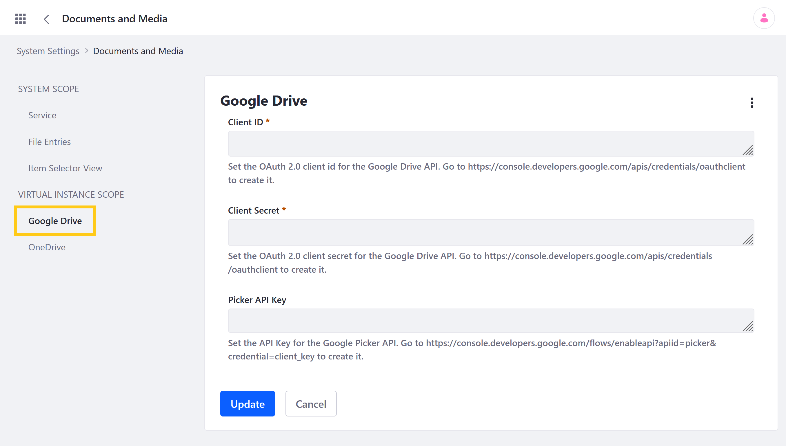
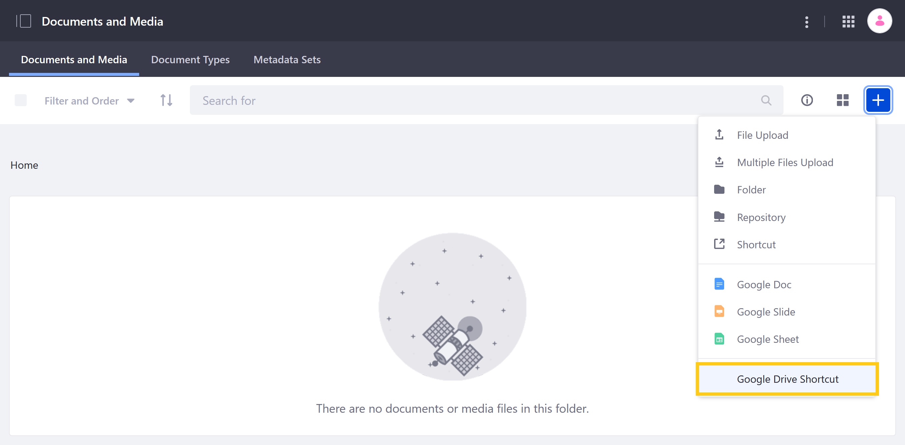
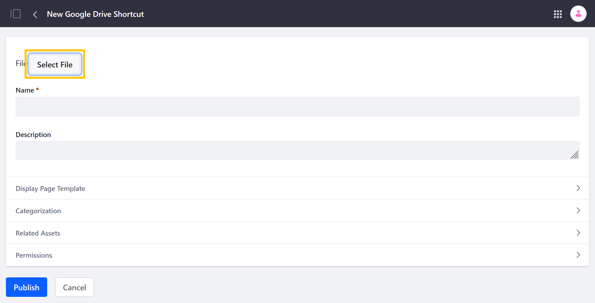
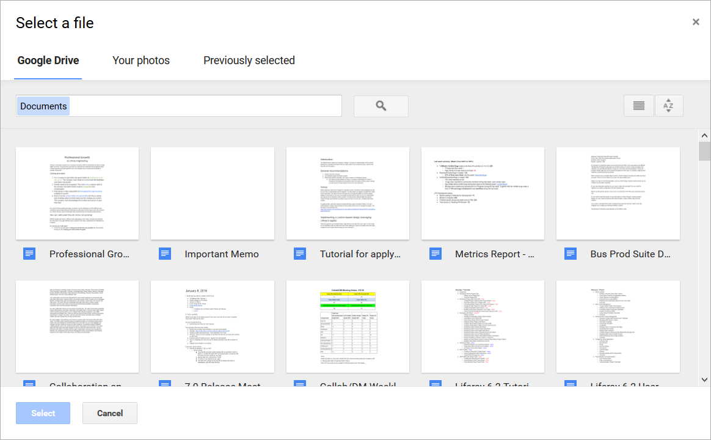

# Enabling Links to Google Drive Documents

Liferay provides a Marketplace plugin for integrating Documents and Media with Google Drive. When enabled, you can create shortcuts to your Google Drive files that enable you to view and manage them via Documents and Media. This plugin is available for both [Liferay Portal CE](https://web.liferay.com/marketplace/-/mp/application/105847499) and [Liferay DXP](https://web.liferay.com/marketplace/-/mp/application/98011653) systems. See [Installing Apps](../../../../system-administration/installing-and-managing-apps/installing-apps.md) for how to install the Liferay Plugin for Google Drive.

After installing it, you must set up your Google project and configure Liferay's Documents and Media application.

```{important}
The Liferay Plugin for Google Drive is a Labs application available for Liferay CE Portal and Liferay DXP. Labs apps are experimental and not supported by Liferay. They're released to accelerate the availability of useful and cutting-edge features. This status may change without notice. Use Labs apps at your own discretion.
```

## Setting Up Your Google Project

Enabling the Liferay plugin requires an active Google Project with both the Google Drive API Google Picker API enabled. The Google Drive API allows users to view and edit Google files (i.e., Docs, Sheets, and Slides) in their native editors. The Picker API allows users to view and select from digital assets (e.g., photos, videos, documents) stored in Google Drive when uploading files to Documents and Media. If you haven't created a Project yet, see [Creating a Google Project](https://support.google.com/googleapi/answer/6251787?hl=en&ref_topic=7014522). Otherwise, see [Enabling APIs](https://support.google.com/googleapi/answer/6158841) to learn how to enable the Picker API for your project.

```{note}
If desired, you can enable the creation and editing of Google documents via Documents and Media apart from the Liferay Plugin for Google Drive. See [Enabling Document Creation and Editing with Google Drive](./enabling-document-creation-and-editing-with-google-drive.md) for more information.
```

After enabling Google Picker API for your Project, [generate an API Key](https://support.google.com/googleapi/answer/6158862) for the Picker API, and [set up OAuth 2](https://support.google.com/cloud/answer/6158849). Setting up OAuth 2 includes configuring an OAuth consent screen, generating OAuth 2 credentials, and adding the Liferay request URI to the list of Authorized JavaScript Origins. When generating OAuth 2 credentials, ensure you've selected *Web application* for the application type.

Once your Google Project is prepared, you must configure the Documents and Media application via the Liferay control panel. This requires the Picker API key, as well as the OAuth2 client ID and client secret.

## Configuring Documents and Media

Follow these steps to configure the Documents and Media application.

1. Open the *Global Menu* (), click on the *Control Panel* tab, and go to *System Settings* &rarr; *Documents and Media*.

1. Click on *Google Drive* under Virtual Instance Scope.

    

1. Enter your project's OAuth 2.0 *client ID* and *client secret*.

1. Enter the *Picker API Key*.

1. Click on *Save*.

Once enabled, users can create Documents and Media shortcuts to Google assets.

```{note}
To disable this feature, click on the *Actions* button for Google Drive and select *Reset Default Values*.
```

## Creating Google Drive Shortcuts

Follow these steps to create Documents and Media shortcuts for Google Drive files.

1. Open the Documents and Media application in a Site Asset Library.

1. Click on the *Add* button () in the Documents and Media tab and select *Google Drive Shortcut*.

   

1. Click on *Select File*.

   

1. Select the desired Google account.

1. Select the desired Google Drive file.

   

1. Enter a *name* and *description* for the shortcut.

1. Click on *Publish* when finished.

Once published, the Google Drive file can now be accessed and used in Liferay via the Documents and Media application.

## Additional Information

* [Enabling Document Creation and Editing with Google Drive](./enabling-document-creation-and-editing-with-google-drive.md)
