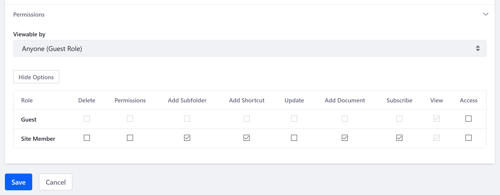

# Creating SharePoint Repositories in Documents and Media

Once you've added a [SharePoint OAuth2 configuration], you can use it to create repositories in Documents and Media that are mounted to SharePoint libraries.

Follow these steps:

1. Open the Documents and Media application in a Site or Asset Library.

1. Click the *Add* button (), and select *Repository*.

1. Enter a name and description for the repository.

1. Use the following fields to configure the repository.

   * **Repository Type**: Select the desired SharePoint Repository Configuration.
   * **Site Absolute URL**: Enter an absolute URL to resolve relative URLs (e.g., `https://[your-site-name].sharepoint.com` for SharePoint Online).
   * **Library Path**: Enter a relative path from the Site Absolute URL that points to the SharePoint Document Library you want to mount in Documents and Media.

1. Define permissions for the new Documents and Media SharePoint repository.

   

1. Click on *Save* when finished.

Users with the proper permissions can then read/write SharePoint documents and folders, perform document check-in/check-out, download documents, and more. Each action performed in one context is propagated in the other.

## Additional Information

* [Enabling Liferay's REST Connector to SharePoint](./enabling-liferays-rest-connector-to-sharepoint.md)
