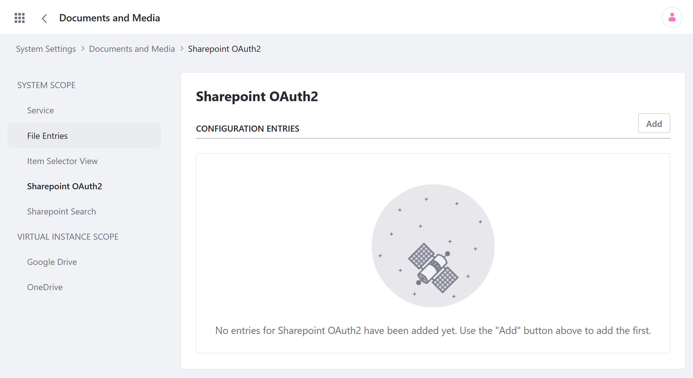
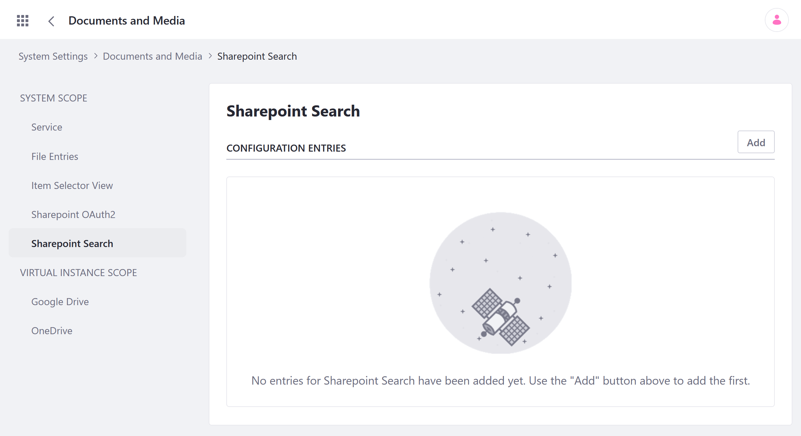
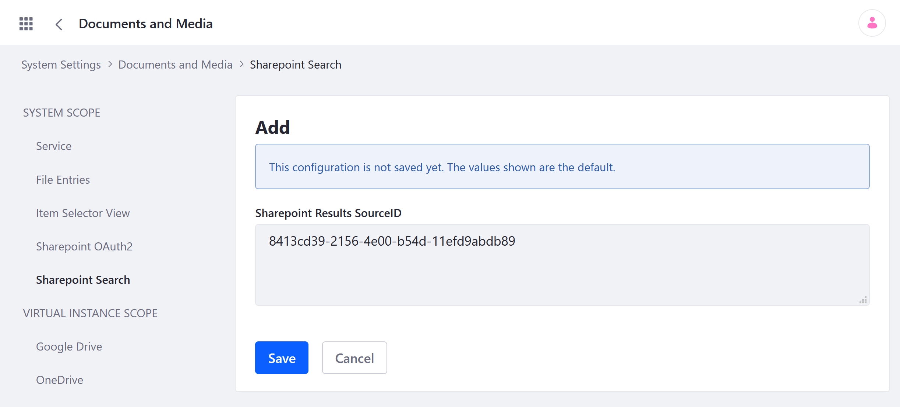

# Enabling Liferay's REST Connector to SharePoint

> Requires DXP Subscription; Compatible with SharePoint 2016 and SharePoint Online

Liferay's REST Connector to SharePoint provides Documents and Media integration with SharePoint libraries. With it, you can create Documents and Media repositories for mounting a SharePoint library. You can then read/write SharePoint documents and folders, perform document check-in/check-out, download documents, and more. Each action performed in one context is propagated in the other.

## Integration Limitations

This application uses SharePoint's API and has the following limitations:

* Version history is lost when moving or renaming a file without first checking it out.
* You can't change file extensions; you can only change file names.
* A file's current name propagates to all previous versions.
* The user who checks out a file is the only one who can see the version number of that file's working copy.
* Queries for suffixes or intermediate wildcards convert to queries for containment.
* Comments, ratings, and using a SharePoint folder as a Documents and Media root folder are unsupported.

For more information on how the REST connector works, see the [javadocs API reference](https://docs.liferay.com/dxp/apps/sharepoint-rest/latest/javadocs/).

## Installing the REST Connector

Follow these steps to install the Liferay REST Connector to SharePoint.

1. Download the [Liferay REST Connector to SharePoint](https://web.liferay.com/marketplace/-/mp/application/105406871) as an LPKG file via the Liferay Marketplace.

1. Copy the file to the instance's [`[LIFERAY_HOME]/deploy`](../../../../installation-and-upgrades/reference/liferay-home.md) folder to [deploy](../../../../system-administration/installing-and-managing-apps/installing-apps/installing-apps.md) it.

   If successful, you should see the following message in the console's logs:

   ```
   Processing Liferay REST Connector to SharePoint.lpkg
   The portal instance needs to be restarted to complete the installation of file:/opt/liferay/osgi/marketplace/Liferay%20REST%20Connector%20to%20SharePoint%20-%20API.lpkg
   ```

1. Restart the server to complete installation.

Once the connector is successfully deployed and installed, you can add SharePoint OAuth2 configuration entries to complete setup. If desired, you can also define custom search sources to restrict and fine tune SharePoint search results.

```important::
   Since the REST connector uses Azure ACS with OAuth2 for SharePoint server authorization, ensure HTTPS support is enabled in your Server.
```

## Updating to the Latest Version

Previously, the Liferay REST Connector to SharePoint was named Liferay Connector for SharePoint. If the older version of the application is installed on your Liferay server, follow these steps to install the latest version.

1. Download the [Liferay REST Connector to SharePoint](https://web.liferay.com/marketplace/-/mp/application/105406871) as an LPKG file via the Liferay Marketplace.

1. Stop the Liferay DXP server.

1. Navigate to the [`[LIFERAY_HOME]/osgi/marketplace`](../../../../installation-and-upgrades/reference/liferay-home.md) folder and replace the old LPKG file with the new one.

1. Restart the Liferay DXP server.

Once the server has finished restarting, the application is ready for use.

## Adding a SharePoint OAuth2 Configuration

Follow these steps to add a new SharePoint OAuth2 configuration via the Liferay Control Panel.

1. Open the *Global Menu* (), click on the *Control Panel* tab, and go to *System Settings* &rarr; *Documents & Media* &rarr; *SharePoint OAuth 2*.

   

1. Click *Add* to create a new SharePoint OAuth2 configuration entry.

1. Fill out the form (see below). 

1. Click *Save* when finished.

**Name**: The configuration's name

**Authorization Grant Endpoint**: The URL used to request OAuth2 authorization grants (e.g., `https://[your-site-name]/sharepoint.com/_layouts/oauthauthorize.aspx` for SharePoint Online)

**Authorization Token Endpoint**: The ACS URL (e.g., `https://accounts.accesscontrol.windows.net/[App ID]/tokens/OAuth/2` for SharePoint Online)

**Client ID**: The client ID

**Client Secret**: The client secret

**Scope**: The permission set required for your tokens; valid scopes are configured during the REST Connector's registration

**Tenant ID**: The Tenant ID

**Site Domain**: The site domain registered for your application

**Resource**: This value depends on the ACS service you use (e.g., `00000003-0000-0ff1-ce00-000000000000/[your-site-name].sharepoint.com@[tenant ID]` for SharePoint Online).

Once saved, the SharePoint configuration can be used to create repositories in Documents and Media that are mounted to SharePoint libraries.

## Adding a SharePoint Search Configuration

With SharePoint, you can define custom source IDs to restrict and fine-tune search results. By default, the connector uses the Documents source ID.

Follow these steps to create SharePoint Search configuration with an different source ID:

1. Open the *Global Menu* (), click on the *Control Panel* tab, and go to *System Settings* &rarr; *Documents & Media* &rarr; *SharePoint Search*.

   

1. Click *Add* to create a new SharePoint Search configuration entry.

   

1. Enter a custom SharePoint Results SourceID for the new entry.

1. Click *Save* when finished.

## Additional Information

* [Installing Apps](../../../../system-administration/installing-and-managing-apps/installing-apps/installing-apps.md)
* [Creating SharePoint Repositories in Documents and Media](./creating-sharepoint-repositories-in-documents-and-media.md)
