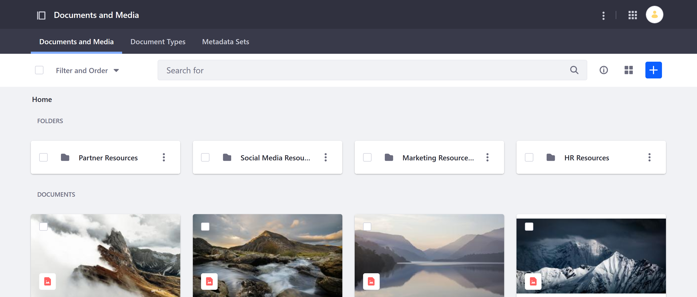
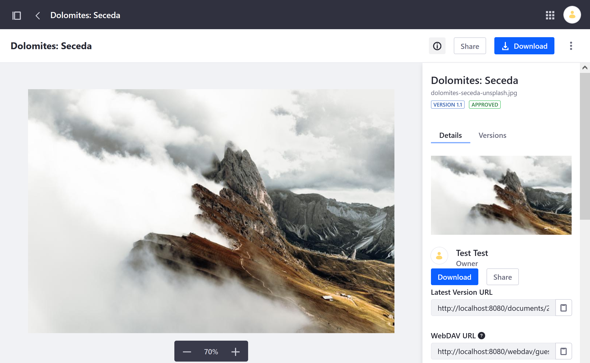

# Documents and Media Overview

The Documents and Media application stores and manages files in your Liferay instance. This includes files uploaded directly to Documents and Media, as well as those uploaded in applications that support file attachments.

This application is available in all Sites and can be enabled in [Asset Libraries](../asset-libraries/asset-libraries-overview.md). It serves as a virtual, shared drive for users and can store any type of file.

```{tip}
Files have different scopes depending on whether they're uploaded to Documents and Media in a Site or Asset Library. Files uploaded to a Site are scoped to that Site and cannot be readily accessed by other Sites in your DXP instance. Files uploaded to an Asset Library are available globally and can be linked to multiple Sites for ready access.
```



All uploaded files are stored in your designated [file store](../../system-administration/file-storage.md). By default, Documents and Media uses the [Simple File System Store](../../system-administration/file-storage/other-file-store-types/simple-file-system-store.md), but you can configure your instance to use an alternate file store (e.g., [DBStore](../../system-administration/file-storage/other-file-store-types/dbstore.md), [Google Cloud Store](../../system-administration/file-storage/other-file-store-types/google-cloud-storage.md), or [Amazon S3 Store](../../system-administration/file-storage/other-file-store-types/amazon-s3-store.md)).

Once uploaded, you can search, filter, and organize digital assets via the Liferay UI or use [WebDAV](./publishing-and-sharing/accessing-documents-with-webdav.md) to access your documents via your system's file manager. You can also integrate Documents and Media with [Microsoft Office 365](./devops/enabling-document-creation-and-editing-with-microsoft-office-365.md), [OpenOffice](./devops/enabling-openoffice-libreoffice-integration.md), [Google Drive](./devops/google-drive-integration/enabling-links-to-google-drive-documents.md), and other applications to provide additional functionality in the Liferay UI.

Enable Liferay [Workflow](../../process-automation/workflow/using-workflows/activating-workflow.md#activating-workflow-for-specific-applications) for Documents and Media to help manage asset publishing and version updates. When enabled, documents must be reviewed before they are published.

You can configure Documents and Media integrations to [automatically generate previews](./devops/configuring-documents-and-media-previews.md) for files when uploaded or updated.



Files added to Documents and Media can be displayed in applications that support attachments (e.g., Web Content, Message Boards), as well as Page Fragments and widgets (e.g., [Media Gallery](./publishing-and-sharing/publishing-documents.md#using-the-media-gallery-widget.md)).

If desired, you can [export](../../site-building/building-sites/importing-exporting-pages-and-content.md) Documents and Media assets as Liferay Archive (`LAR`) files. These files can be used as backups or to import your assets into another Site or Asset Library.

## Additional Information

* [Documents and Media UI Reference](./documents-and-media-ui-reference.md)
* [Creating Folders](./uploading-and-managing/creating-folders.md)
* [Uploading Files](./uploading-and-managing/uploading-files.md)
* [Configuring File Storage](../../system-administration/file-storage.md)
