# Documents and Media UI Reference

The Documents and Media application is used to store, view, and manage files for your Liferay DXP instance. It's available in all Sites and can be enabled for [Asset Libraries](../asset-libraries/asset-libraries-overview.md).

To access Documents and Media in a Site, open the *Site Menu* () and go to *Content & Data* &rarr; *Documents and Media*.

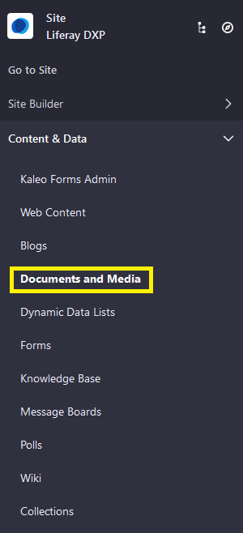

To access Documents and Media in an Asset Library, navigate to any Library where it's enabled, and click on *Documents and Media*.

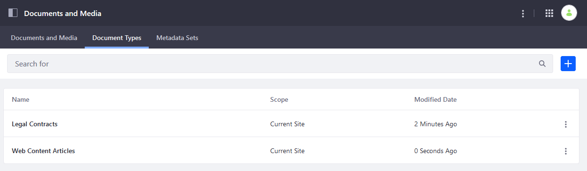

The Documents and Media application has three main tabs: [*Documents and Media*](#documents-and-media-tab), [*Document Types*](#document-types-tab), and [*Metadata Sets*](#metadata-sets-tab).

You can access additional settings by clicking on the *Actions* button () in the [Application Bar](#application-bar-settings).

```{note}
The Documents and Media UI is the same for Asset Libraries and Sites.
```

## Documents and Media Tab

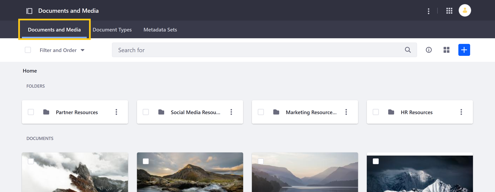

The *Documents and Media* tab provides access to the application's primary features. Here you can view, search, add, and manage all digital assets, folders, and connected repositories.

```{note}
The Home folder serves as the root folder for the Documents and Media application.
```

Click the *Add* button () to access these actions: File Upload, Multiple Files Upload, Folder, Repository, Shortcut, External Video Shortcut. See [Creating Folders](./uploading-and-managing/creating-folders.md) and [Uploading Files](./uploading-and-managing/uploading-files.md) for more information.

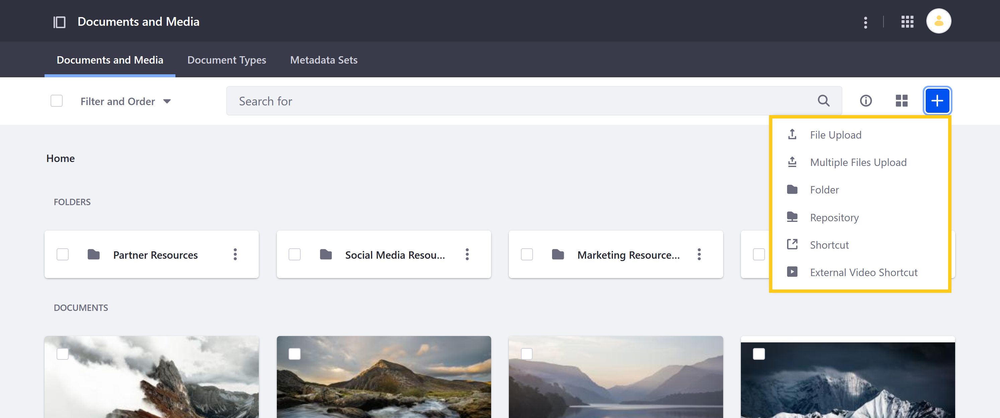

If you've created any custom [Document Types](#document-types-tab), they are listed here as available options.

Click the *Actions* button () for any file or folder to download, edit, move, or remove it. You can also *Checkout* or *Checkin* files to create file versions.

## Document Types Tab

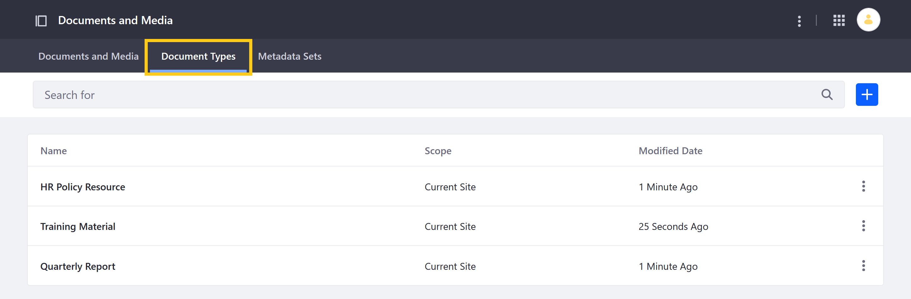

Here you can create and manage custom templates used for adding new files to Documents and Media. These templates are created using metadata fields and provide additional, searchable information for uploaded files.

To compose a new Document Type, drag and drop configurable metadata fields into the drop zone. You can also add a description, include custom [Metadata Sets](#metadata-sets-tab), and manage permissions.

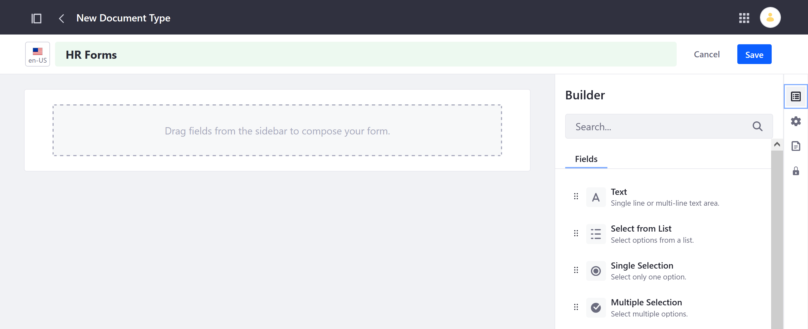

Once created, you can use a template to add new digital assets in the Documents and Media tab. See [Defining Document Types](./uploading-and-managing/managing-metadata/defining-document-types.md) for more information.

## Metadata Sets Tab

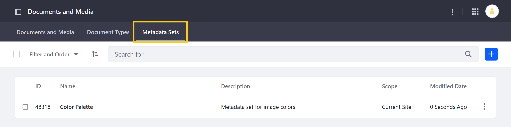

Here you can define reusable groups of metadata fields that can be added to custom Document Types. These Metadata Sets are composed in the same way as Document Types, by dragging and dropping metadata fields into the designated drop zone.

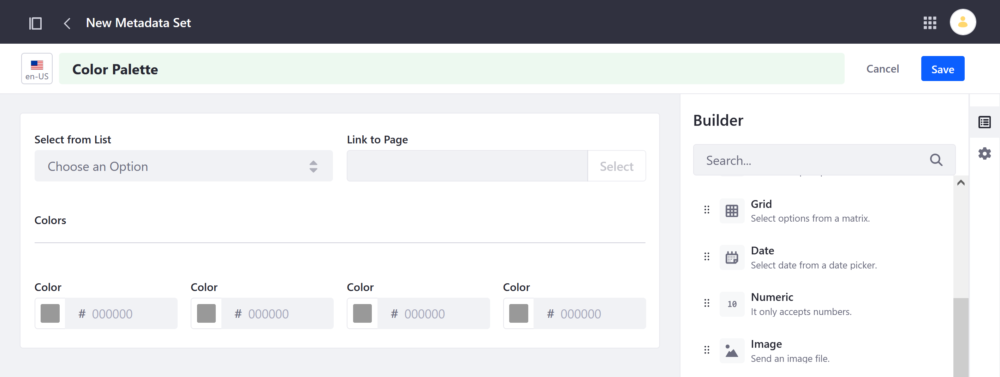

Once created, Metadata Sets can be added to custom Document Types. See [Defining Metadata Sets](./uploading-and-managing/managing-metadata/defining-metadata-sets.md) for more information.

## Application Bar Settings

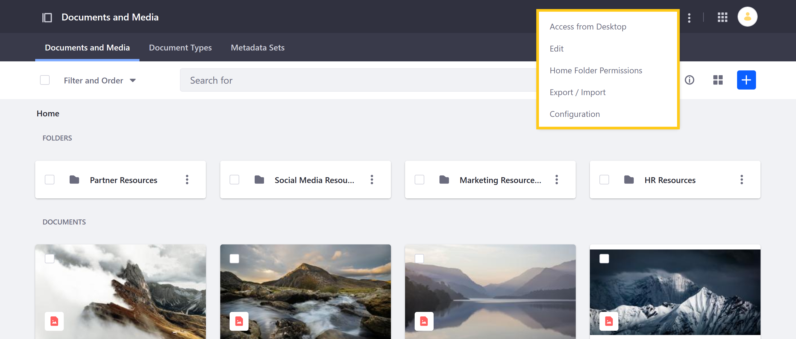

You can access the following Documents and Media settings in the Application Bar.

### Access from Desktop

Generate a WebDAV URL for accessing *Documents and Media* resources in your file explorer.

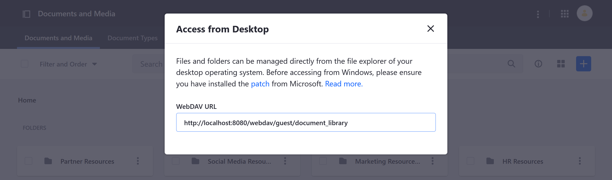

### Edit

Enable or disable [Workflow](../../process-automation/workflow/using-workflows/activating-workflow.md) for all Document Types. To learn more about Workflows in general, see [Introduction to Workflow](../../process-automation/workflow/introduction-to-workflow.md).

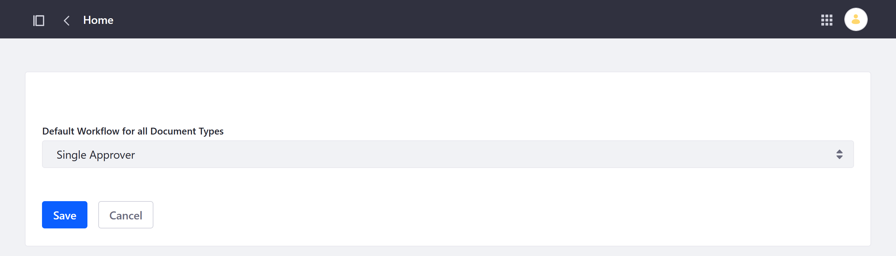

### Home Folder Permissions

Manage permissions for the Documents and Media *Home folder*. To learn more about permissions in general, see [Understanding Roles and Permissions](../../users-and-permissions/roles-and-permissions/understanding-roles-and-permissions.md).

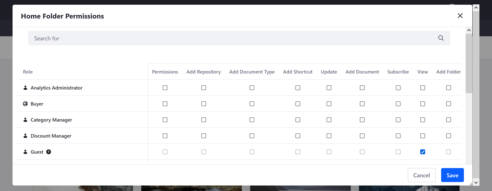

### Export/Import

Initiate [Export or Import](../../site-building/building-sites/importing-exporting-pages-and-content.md) operations for Documents and Media content. Content is exported as an `LAR` (Liferay Archive) file. You can also view current and previous exports.

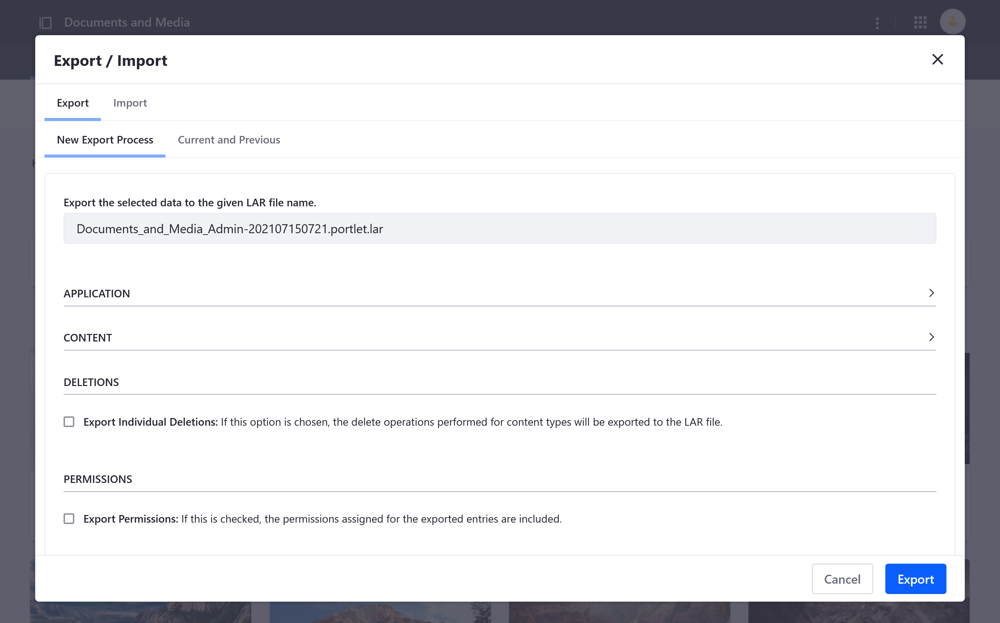

### Configuration

Configure email notifications for Documents and Media. When configuring email notifications, you can use default placeholders for parsing information (e.g., `[$COMPANY_ID$]`, `[$DOCUMENT_TYPE$]`, `[$TO_NAME$]`). Available placeholders appear in each tab under *Definition of Terms*.

```{note}
Using email notifications requires a connected mail server. See `Configuring Mail <../../installation-and-upgrades/setting-up-liferay/configuring-mail.md>`_ for more information.
```

**Email From Tab**: Enter a name and email address to use for the email's sender.

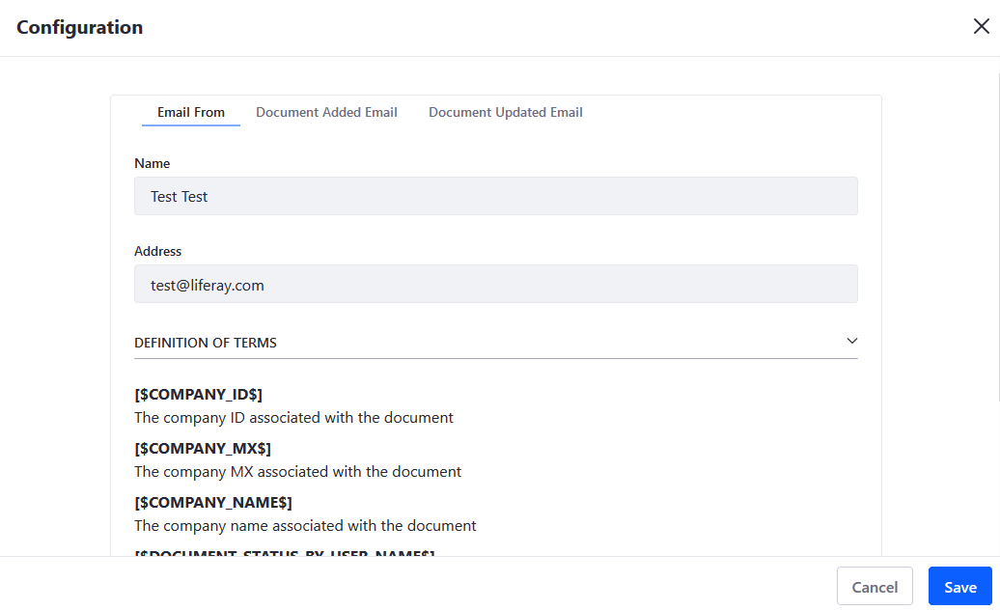

**Document Added Email**: Enable/Disable email notifications for when documents are added, and compose the email used.

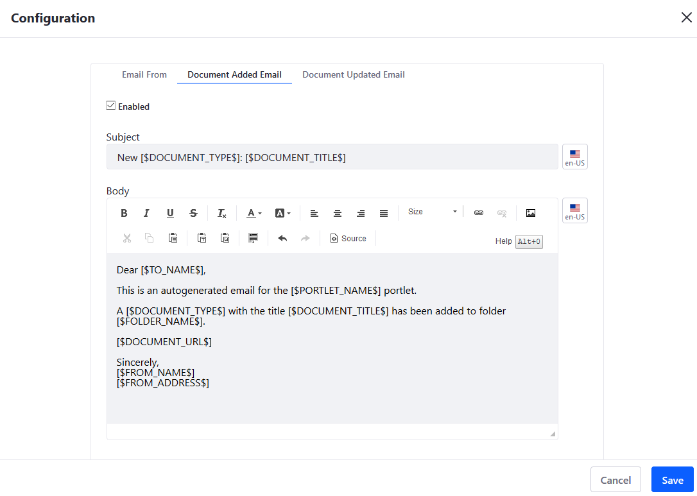

**Document Updated Email**: Enable/Disable email notifications for when existing documents are updated, and compose the email used.

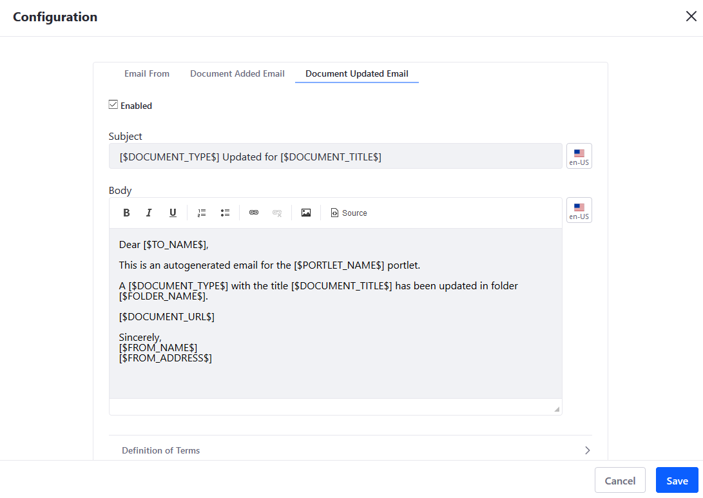

## Additional Information

* [Documents and Media Overview](./documents-and-media-overview.md)
* [Importing/Exporting Sites and Contents](../../site-building/building-sites/importing-exporting-pages-and-content.md)
