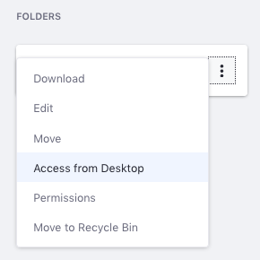

# Accessing Documents with WebDAV

You can access the Document Library from your desktop file manager via [WebDAV](https://en.wikipedia.org/wiki/WebDAV). WebDAV is a protocol based on HTTP for managing files stored on web servers. WebDAV is supported by most major operating systems and desktop environments, including Linux, macOS, and Windows.

To access the Document Library folder from a file browser, you must use your log-in credentials and the WebDAV URL of the folder you want to access. Follow these steps:

1. Navigate to the Documents and Media app that contains the folder you want to access. Click the folder's Actions icon () and select _Access from Desktop_.

    

1. Copy the WebDAV URL and follow the instructions for your operating system:

    * **Windows:** Map a network drive drive to the WebDAV URL. Enter your credentials when prompted. The Document Library folder appears in the network drive. From your file browser, you can now add, edit, move, or delete files in this folder.

    * **macOS:** In the Finder, select *Go* &rarr; *Connect to Server*. In the Server Address field, enter the WebDAV URL of the folder you want to access, then click *Connect* and enter your credentials when prompted.

    * **Linux:** In your file manager, you must slightly modify the Document Library folder's WebDAV URL. For KDE Dolphin, change the URL's protocol to `webdav://` instead of `http://`. For GNOME Files, change the URL's protocol to `dav://` instead of `http://`. Then press *Enter* and enter your credentials when prompted.

Now you can access the Document Library folder from your desktop file system. If you edit a file in this folder on your file system, the change also appears in the same Document Library folder in the portal. What's more, the file's minor version is incremented due to the edit.

## Additional Information

* [Enabling and Configuring Document Sharing](./managing-document-access/enabling-and-configuring-sharing.md)
* [Sharing Documents with Other Users](./managing-document-access/sharing-documents-with-other-users.md)
* [Creating Folders](../uploading-and-managing/creating-folders.md)
* [Documents and Media UI Reference](../documents-and-media-ui-reference.md)
