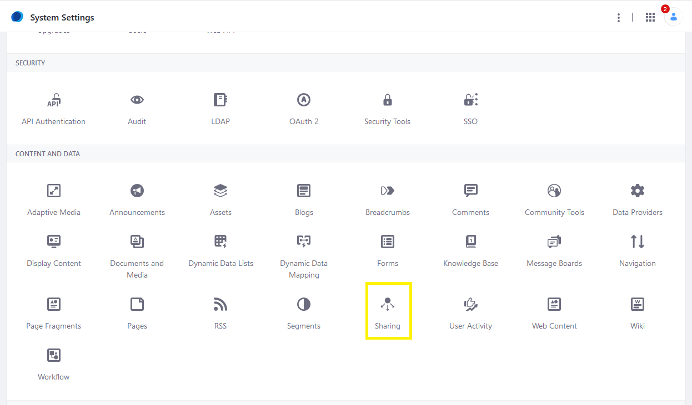
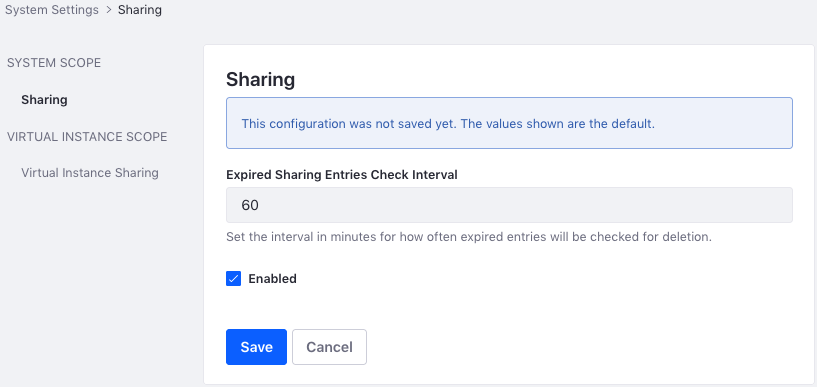
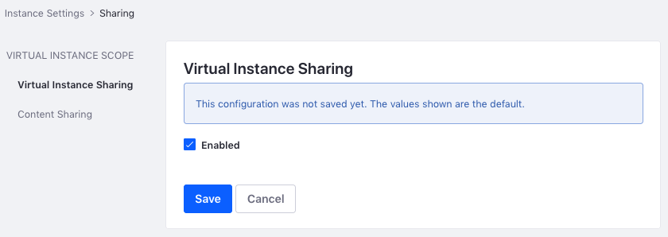

# Enabling and Configuring Sharing

The Sharing configuration allows users to [share files](./sharing-documents-with-other-users.md) with each other. You can enable file sharing at the Global, Virtual Instance, and Site scopes.

```{note}
Sharing is enabled globally by default.
```

## Global Sharing Configuration

1. Click the *Global Menu* () and click *Control Panel*.
1. Click *System Settings*.
1. Under the *Content and Data* section, click *Sharing*.

    

1. Under *System Scope*, select *Sharing*.
1. Configure the following options:

    - **Expired Sharing Entries Check Interval:** The interval in minutes for how often expired sharing entries are checked for deletion.

    - **Enabled:** Check this box to enable sharing globally.

1. Under *Virtual Instance Scope*, select *Sharing*.
1. Check the *Enable* box to enable sharing for all the Virtual Instances on your system. Leaving it unchecked means configuring sharing on each Virtual Instance.

    ```{note}
    When you enable sharing at the System scope, you enable sharing for all the Virtual Instances on your system. To change this behavior and enable sharing on a per-instance basis, uncheck the Sharing option under the Virtual Instance scope section.
    ```

    

1. Click *Save*.

## Virtual Instance Sharing Configuration

1. Click the *Global Menu* () and click *Control Panel*.
1. Click *Instance Settings*.
1. Under *Content and Data*, click *Sharing*.

    ```{note}
    The Sharing option is unavailable when Sharing is disabled at the System Scope. See [Global Sharing Configuration](#global-sharing-configuration) to modify the System Scope settings.
    ```

1. Under *Virtual Instance Scope*, select *Sharing*.
1. Check the *Enabled* box to enable sharing on this Virtual Instance.

   

1. Click *Save*.

## Site Sharing Configuration

```{note}
The Site Sharing option is unavailable when Sharing is disabled at the System or Virtual Instance scopes. See [Global Sharing Configuration](#global-sharing-configuration) and [Virtual Instance Sharing Configuration](#virtual-instance-sharing-configuration) to modify these settings.
```

1. Access the Site Sharing setting.

   - In Liferay DXP 7.4+

      1. From the Site Menu, go to *Configuration* &rarr; *Site Settings*.
      1. In the Content and Data section, click *Sharing*.

   - In previous Liferay DXP versions

      1. From the Site Menu, go to *Configuration* &rarr; *Settings*.
      1. Under the Advanced area, expand the *Content Sharing* section.

1. Toggle the *Enable Sharing* option to enable or disable sharing files for your site.

1. Click *Save* when finished.

## Related Information

- [Sharing Documents with Other Users](./sharing-documents-with-other-users.md)
- [Site Settings UI Reference](../../../../site-building/site-settings/site-settings-ui-reference.md)
