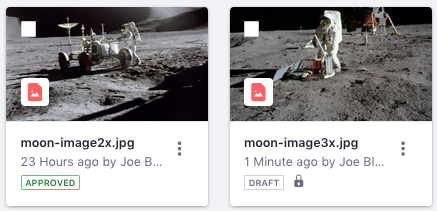
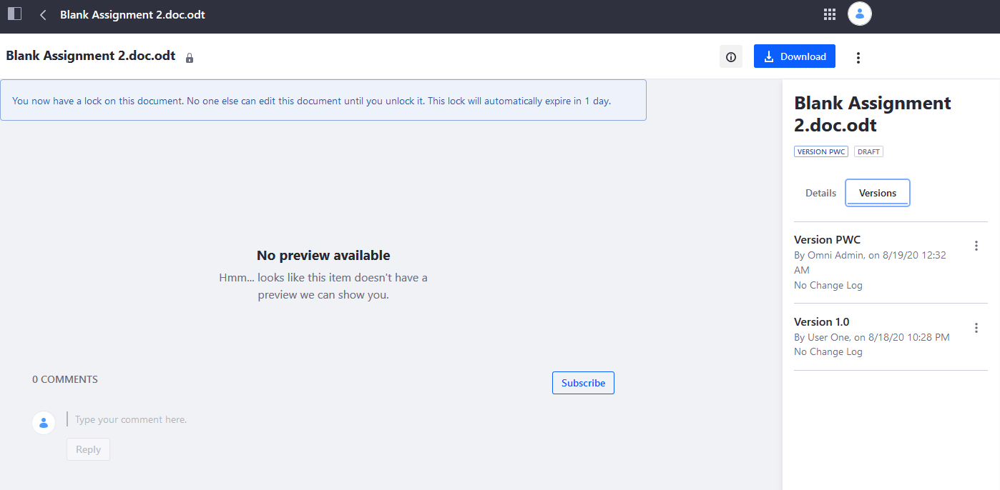

# Managing Document Changes with Checkout

When you check out a document in the Document Library, only you can make changes to it until you check it back in. This prevents conflicting edits on the same document by multiple users. When you check out a file, you can download it, replace it, move it to another Document Library folder, check it in, or cancel the checkout. Checking in a file also increments its version, which tracks changes.

Follow these steps to checkout and then check-in a Document Library file:

1. Checkout the file by clicking its Actions icon () &rarr; *Checkout*. Upon checkout, the file's status changes to Draft and a lock icon appears on the file.

    

2. Download the file by clicking its Actions icon () &rarr; *Download*.
3. Edit the file locally.
4. Return to the Documents and Media Library and click the file's Actions icon () &rarr; *Edit*. The file's edit screen appears.
5. From the file's Edit screen, select the edited local file for upload.
6. Click *Save and Check In*. In the pop-up that appears, select whether your change is a major or minor version, add any version notes that you need, and click *Save*.

```tip::
   If you edit a file without checking it out, the file's edit screen displays a toggle for *Customize the Version Number Increment and Describe My Changes*. Setting this to *YES* lets you specify the version increment's type and description.
```

## Viewing the File's Version History

Follow these steps to access a file's version history:

1. Click the file in the Documents and Media Library.
1. Click the file's *Info* button () at the top-right of the screen. This opens the file's info panel.
1. Select the *Versions* tab in the info panel.

    

Each file version has an Actions menu () that you can use to perform the following actions on that file version:

| Action | Description |
| --- | --- |
| **Download** | Download the selected version of the file to your machine. |
| **View** | View the file entry screen for the selected version of the file. |
| **Revert** | Restores the selected file version as a new major file version. Note that this option isn't available for the newest file version. |
| **Delete Version** | Remove the file version from the Document Library. All other file versions remain intact. |

## Using WebDAV

You can manage files using WebDAV and continue to track version history. To learn more, see [Accessing Documents with WebDAV](../accessing-documents-with-webdav.md).

## Using Liferay Sync

You can manage files using Liferay Sync and continue to track version history. To learn more, see [Setting up on DXP](../liferay-sync/setting-up-on-dxp/installation.md).

## Additional Information

* [Permissions and Documents](./permissions-and-documents.md)
* [Sharing Documents with Other Users](./sharing-documents-with-other-users.md)
