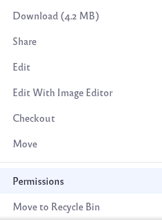
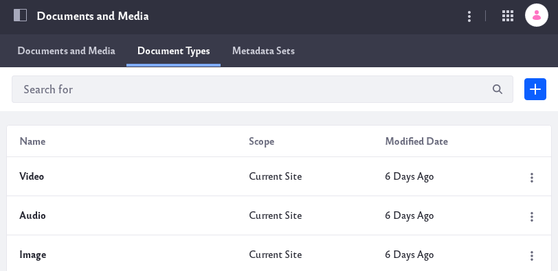

# Permissions and Documents

You can give permissions to an individual file, to an entire folder, or to a specific file type. See [Understanding Roles and Permissions](../../../../users-and-permissions/roles-and-permissions/understanding-roles-and-permissions.md) to learn more about how Roles and Permissions work in a Liferay installation.

## Permissions for an Individual File

1. Navigate to the *Documents and Media* application. 

1. Click the options icon () on the file whose permissions should change and select Permissions.

   

1. Set your desired permissions and click _Save_. 

## Permissions for an Entire Folder

1. Navigate to the *Documents and Media* application. 

1. Click the options icon () on the folder whose permissions should change and select Permissions. See [Creating Folders](../../uploading-and-managing/creating-folders.md) to learn more about folders.

   

1. Set your desired permissions and click _Save_. 

## Permissions for a Specific File Type

1. Navigate to the *Documents and Media* application. Click on the *Document Types* tab. 

   

1. Click the options icon () on the document type whose permissions should change and select Permissions. See [Defining Document Types](../../uploading-and-managing/managing-metadata/defining-document-types.md) to learn more about document types. 

   

1. Set your desired permissions and click _Save_. 
