# Publishing Documents

Liferay makes it easy to publish and showcase documents and other types of media files. As you begin [uploading media files](../uploading-and-managing/uploading-files.md), you probably want to start sharing them on your site.

The available widgets can highlight your documents and media files: *Media Gallery*, *Documents and Media*, and *Asset Publisher*. You can choose an appropriate widget based on your use case. 

You can embed and display Documents and Media files on other assets such as Web Content, Blogs, or Wiki pages.

## Using the Media Gallery Widget

This widget publishes your media in a simple gallery-like style. It shows a large thumbnail of each file, offers file downloads, and has slideshow capabilities. A common way to use the Media Gallery is to have a separate page for displaying media and add a Media Gallery widget to it. The widget displays only audio or video files. 

To use the Media Gallery widget,

1. From the Content Management category of widgets, add the Media Gallery widget to a page. 

    

1. Once the widget appears, any media files previously uploaded should already be visible. If you wish to [add additional media files](../uploading-and-managing/uploading-files.md), they can be uploaded from Documents and Media.

The Media Gallery widget has several options you can configure by clicking *Options* () &rarr; _Configuration_: 

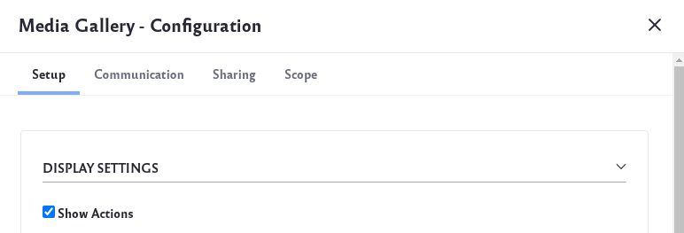

**Display Settings:** Show each file's actions, filter the media types to display, and choose a display template for your media.

**Folders Listing:** Select a Document Library folder to serve as the root folder from which to display files. This folder becomes the highest-level folder the widget can access. 

In the widget, clicking on any media file automatically starts a slideshow of all the files.

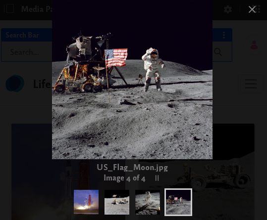

On each file is an *Options* () icon: 

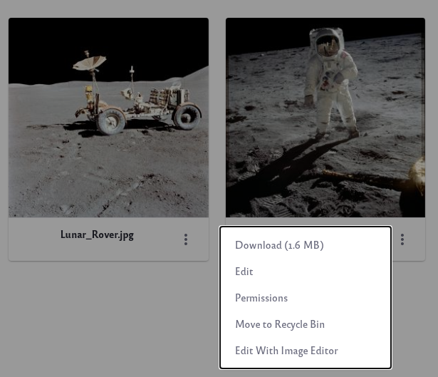

 * Download
 * Edit
 * Permissions
 * Move to Recycle Bin
 * Edit With Image Editor (for image files)

## Using the Documents and Media Widget 

This widget provides a way to publish all types of files. Unlike the Media Gallery widget, you can publish documents and other types of media.

1. From the Content Management section, add the *Documents and Media* widget to a page.

    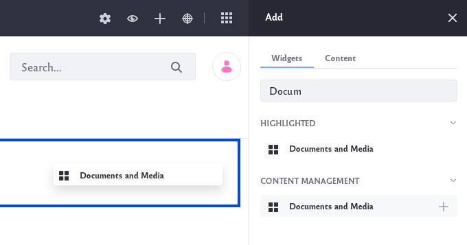

1. If you wish to [add additional media files](../uploading-and-managing/uploading-files.md), they can be uploaded from the Documents and Media application.

You can configure Documents and Media via its *Options* button (): 

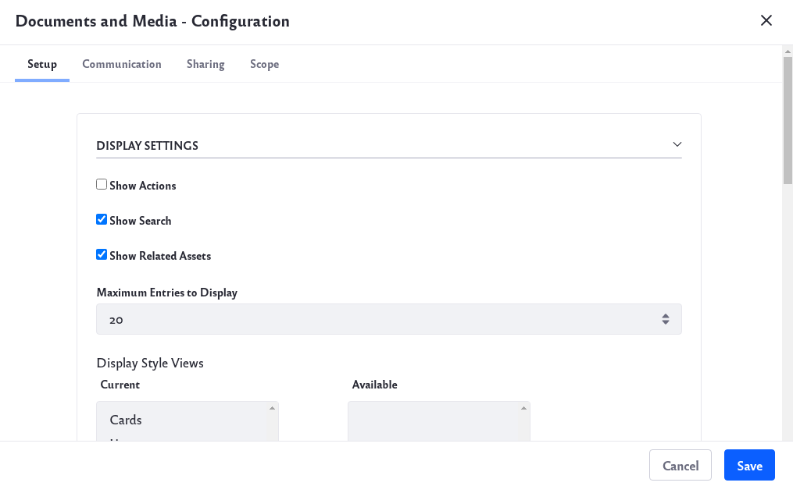

**Display Settings:** Show each file's actions, show the search bar, show related assets, set maximum number of files per page, and enable different view options.

**Folders Listing:** Select a Document Library folder to serve as the root folder from which to display files. This folder becomes the highest-level folder the widget can access. 

**Entries listing for table display style:** Set what type of file information to display when the user selects Table view.

**Ratings:** Enable or disable the [ratings system](../../../collaboration-and-social/social-tools/user-guide/using-the-ratings-system.md).

The toolbar at the top of Documents and Media provides these functions: 

**Checkbox:** Select all the media files.

**Filter and Order:** Filter files by document type. You can also sort your files by different parameters.

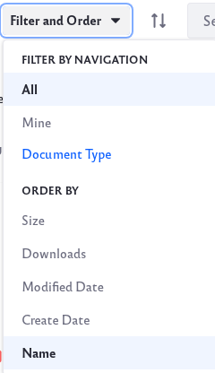

**Reverse:** The *Reverse* icon () reverses the direction of the sorting. 

**Search:** Search through your media files by keyword.

**Information:** The *Information* icon () provides details about the media files within the folder.

**Display Style:** The *Display Style* icon () switches between three display types: Cards, List and Table view. 

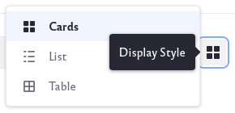
 
Users can choose the display type of their choice.

Selecting a file reveals several options:

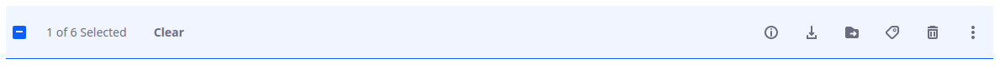

**Clear:** Clear your current selection.

**Information:** The *Information* icon () shows detailed information about the file.

**Download:** The *Download* icon () downloads the file.

**Move:** Click the *Move* icon () to move the file to a different folder.

**Edit Tags:** Click on the *Edit Tags* icon () to edit the existing tags of a file.

**Move to Recycle Bin:** Click on the *Recycle Bin* icon () to delete a file.

**Actions:** The *Actions* icon () has options, including *Checkin* and *Checkout*. See [Google Drive Integration](../devops/google-drive-integration/enabling-document-creation-and-editing-with-google-drive.md), [Office 365 Integration](../devops/enabling-document-creation-and-editing-with-microsoft-office-365.md), and [LibreOffice Integration](../devops/enabling-openoffice-libreoffice-integration.md). 

## Using the Asset Publisher Widget

The [Asset Publisher](../../../site-building/displaying-content/using-the-asset-publisher-widget/displaying-assets-using-the-asset-publisher-widget.md) widget can publish different assets and collections based on criteria. You can use it to display content from your Documents and Media library. 

## Using Documents in Other Assets

It is easy to add your documents or media files to other types of assets: 

### Web Content

1. To be able to add documents or media to your Web Content, first [create a Structure](../../web-content/web-content-structures/creating-structures.md) that contains a field for documents and media.

1. Go to the Structures tab of the Web Content application to create a new Structure. Drag and drop the Documents and Media field onto the Structure.

    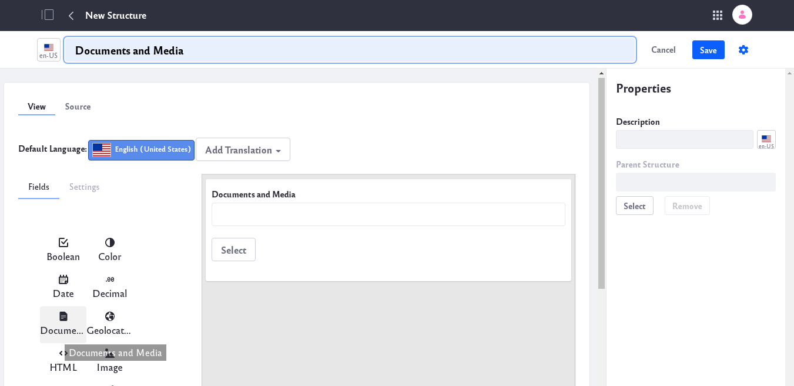

1. Under the Web Content tab, click on the Add icon () to create new Web Content. Select the Structure you just created as your template.

    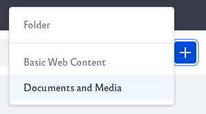

1. You can now select documents or media files and add them to your Web Content.

### Blogs

1. To add documents and media to your blog, first navigate to the Blog application.

1. Click the Add icon () to add a new blog entry. 

1. Under Related Assets, click the *Select* button to select your documents and media to be added to your blog post.

   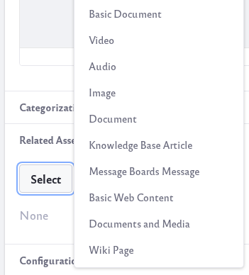

### Wikis

1. Navigate to the Wiki node. 

1. Under Related Assets, click on the *Select* button and to select your documents and media to be added to your Wiki page.

   
