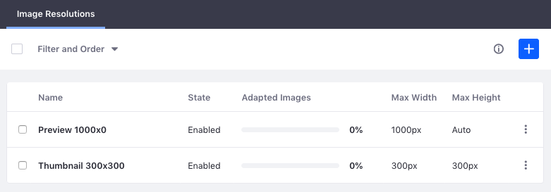
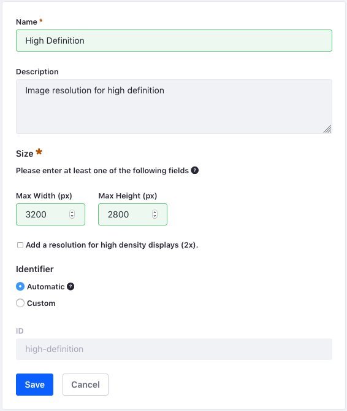

# Adding Image Resolutions

By default, DXP contains two Image Resolutions: a Preview and Thumbnail. You can always add more Image Resolutions, such as resolutions to cover common device sizes like mobile phones, tablets, laptops, and desktops. For example, if most users use one device (e.g., all Intranet users have the same company mobile phone), you can create a resolution to target that device. Note that generating more images requires additional computational resources and storage space.

Here you'll learn how to define the resolutions for the images delivered to users' devices. Once the resolutions are defined, Adaptive Media then generates new images scaled to fit those resolutions and maintains the original aspect ratio.

Images uploaded before you create a resolution are _not_ affected and must be adapted separately (see [Generating Missing Adapted Images](./managing-image-resolutions.md#generating-missing-adapted-images)).



## Adding a New Image Resolution

1. Navigate to the _Global Menu_ &rarr; _Control Panel_ &rarr; _Adaptive Media_.
1. Click the *Add* icon () on the Adaptive Media configuration page and provide the information below. 
1. Click _Save_ when finished.

**Name**: Enter a unique name. This can be updated if a custom `Identifier` is defined.

**Max Width**: The generated image's maximum width. If a *Max Height* is given, this field is optional. This value must be at least `1`.

**Maximum Height**: The generated image's maximum height. If a *Max Width* is given, this field is optional. This value must be at least `1`.

**Add a resolution for high density displays (2x):** Defines a scaled up resolution for HIDPI displays. Selecting this option creates a new resolution double the size of the original with the same name and the suffix `-2x`. For example, if the original resolution is `400px` by `300px` (max width by max height), the high density resolution is `800px` by `600px`.

**Identifier:** The resolution's ID. By default, this is automatically generated from the name. You can specify a custom identifier by selecting the _Custom_ option and entering a new _ID_. Third party applications can use this ID to obtain images for the resolution via Adaptive Media's APIs.



```tip::
   Image resolutions and their identifiers cannot be updated if the resolution has been used to adapt images. This prevents inconsistencies in generated images.
```

## Additional Information

* [Managing Image Resolutions](./managing-image-resolutions.md)
* [Adaptive Media Configuration Reference](./adaptive-media-configuration-reference.md)
