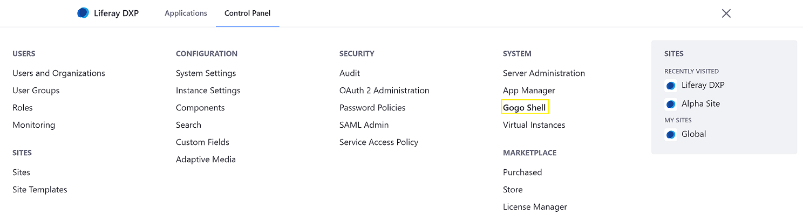
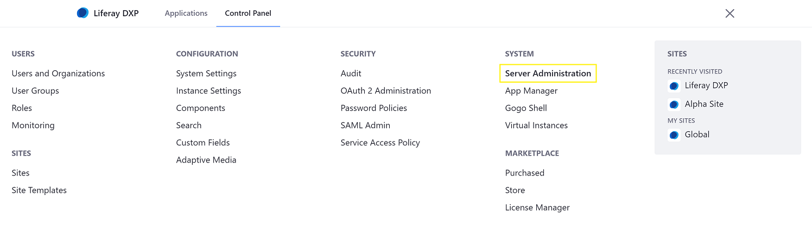
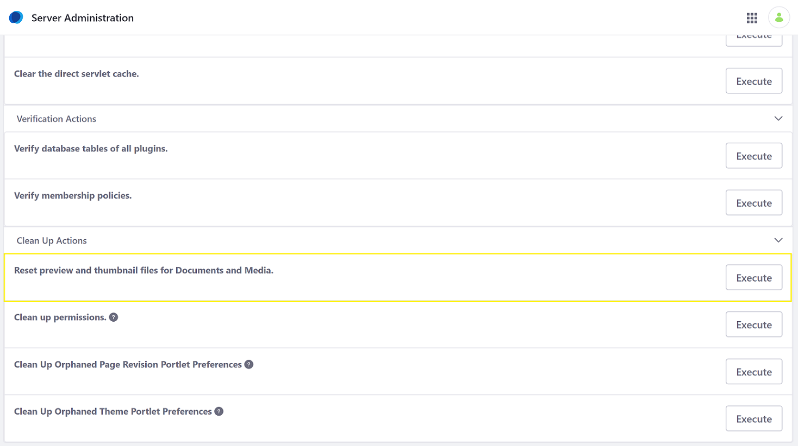

# Migrating Documents and Media Thumbnails to Adaptive Media

DXP automatically generates thumbnails for images in Documents and Media using Adaptive Media. This functionality is installed by default beginning in DXP 7.1+. However, if you were using a legacy version that did not support Adaptive Media, have upgraded to the latest DXP version, and want to use Adaptive Media to manage your Documents and Media thumbnails, read on to learn the migration process.

```note::
   You must be a Portal Administrator to perform the actions described here.
```

## Adding the Replacement Image Resolutions

To migrate the existing Documents and Media thumbnails, you must add new image resolutions in Adaptive Media that have maximum height and maximum width values that match the values specified in the following portal properties:

* `dl.file.entry.thumbnail.max.height`
* `dl.file.entry.thumbnail.max.width`
* `dl.file.entry.thumbnail.custom1.max.height`
* `dl.file.entry.thumbnail.custom1.max.width`
* `dl.file.entry.thumbnail.custom2.max.height`
* `dl.file.entry.thumbnail.custom2.max.width`

Some of these properties may not be enabled. You need only create image resolutions in Adaptive Media for the enabled properties.

To create the new Image Resolutions, see [Adding Image Resolutions](./adding-image-resolutions.md).

## Creating the Adaptive Media Images

Once the required image resolutions exist, you can convert the Documents and Media thumbnails to Adaptive Media images. 

There are two different ways to migrate the Documents and Media thumbnails to Adaptive Media:

* Adapt the images for the thumbnail image resolution: This scales the existing thumbnails to the values in the Adaptive Media image resolutions, which can take time depending on the number of images. This is recommended only for a small number of images or if you prefer to generate your images from scratch. This approach is covered in more detail in [Generating Missing Adapted Images](./managing-image-resolutions.md#generating-missing-adapted-images).

* Execute a migrate process that reuses the existing thumbnails: This copies the existing thumbnails to Adaptive Media, which performs better because it avoids the computationally expensive scaling operation. 

### Running the Migration Process

The migration process is a set of [Gogo console commands](../../../../liferay-internals/fundamentals/using-the-gogo-shell/gogo-shell-commands.md). 

1. Navigate to the _Global Menu_ &rarr; _Control Panel_ &rarr; _Gogo Shell_.

   

1. Execute the `thumbnails:check` command. For each instance, this lists how many thumbnails are pending migration.
1. Execute the `thumbnails:migrate` command. This executes the migration process, which may take a while to finish depending on the number of images.
1. Execute the `thumbnails:cleanUp` command. This deletes all the original Documents and Media thumbnails and updates the count returned by `thumbnails:check`. Therefore, you should **only** run `thumbnails:cleanUp` after running the migrate command and ensuring that the migration ran successfully and no images are pending migration.

## Troubleshooting

If you undeploy Adaptive Media at some point after running the migration process, you must regenerate the Documents and Media thumbnails: 

1. Navigate to the _Global Menu_ &rarr; _Control Panel_ &rarr; _Server Administration_.

   

1. Click _Execute_ next to _Reset preview and thumbnail files for Documents and Media_.

   

## Additional Information

* [Managing Image Resolutions](./managing-image-resolutions.md)
* [Adaptive Media Configuration Reference](./adaptive-media-configuration-reference.md)
