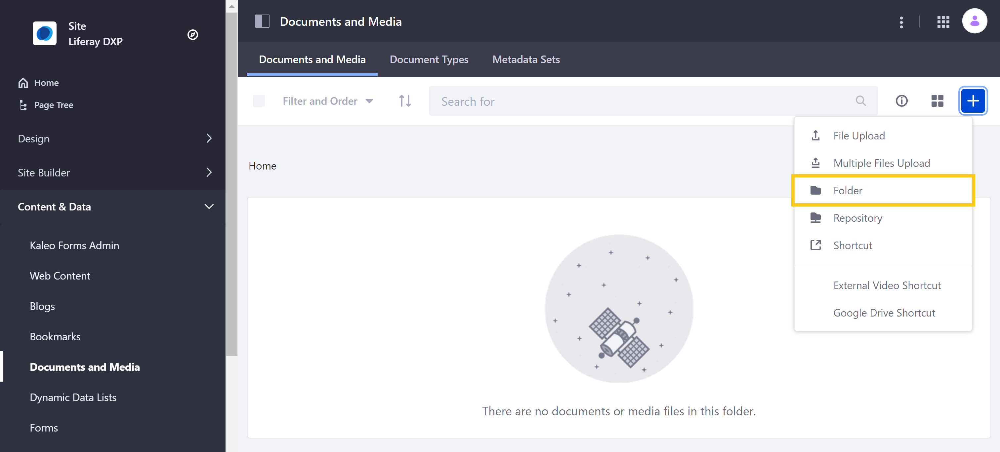
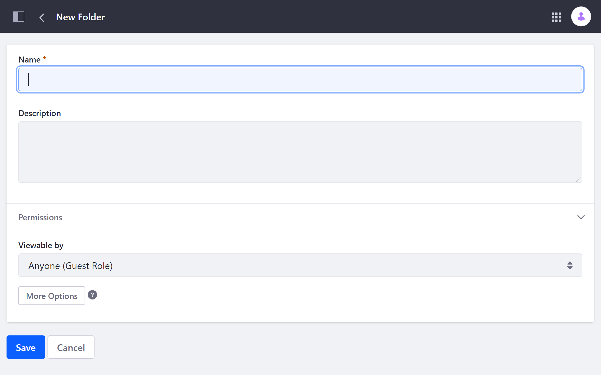
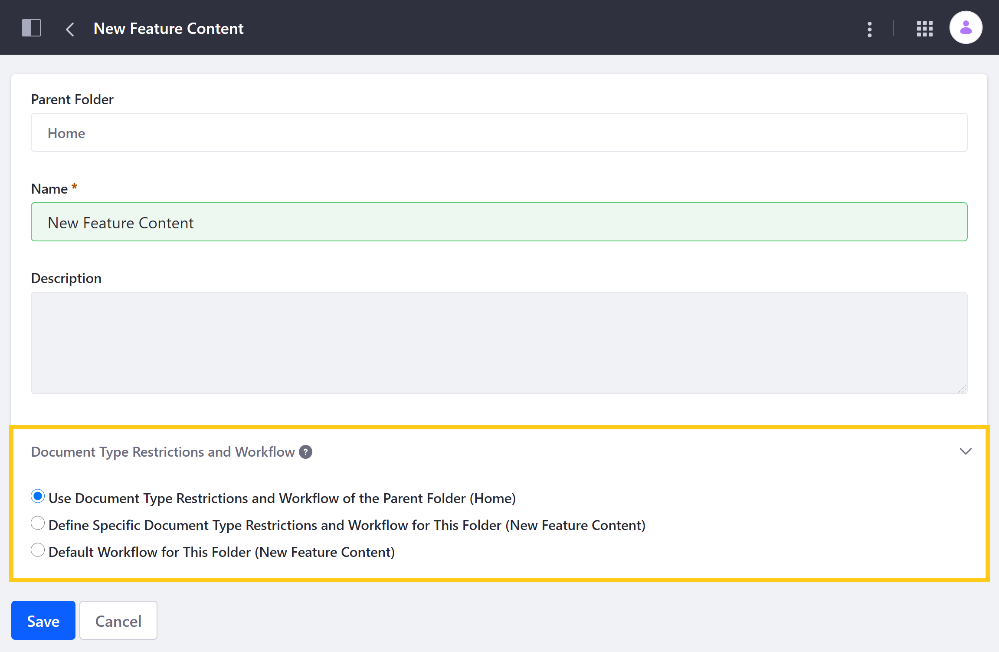

# Creating Folders

In the Documents and Media application, you can create folders to organize your digital assets. Only authenticated Users with the required permissions can manage a folder. See the [Documents and Media Permissions Reference](../publishing-and-sharing/managing-document-access/documents-and-media-permissions-reference.md) and [Roles and Permissions](../../../users-and-permissions/roles-and-permissions/understanding-roles-and-permissions.md) for more information.

## Adding a Folder

1. Open the *Site Menu*, and go to *Content & Data* &rarr; *Documents and Media*.

1. Click *Add* () and select *Folder*.

    

1. Enter a name for your new folder.

1. Optionally, you can enter a folder description and configure folder permissions.

    

1. Click *Save* to create your new folder.

Once created, the folder appears in the *Documents and Media* application. You can create subfolders by opening the desired folder and repeating the above process.

## Document Type Restrictions and Workflow

After creating a folder, you can restrict it to allow only certain document types, as well as add a custom [workflow](../../../process-automation/workflow/introduction-to-workflow.md) to determine the approval process for all additions and edits made to the folder's content:

1. Open the *Site Menu* and go to *Content & Data* &rarr; *Documents and Media*.

1. Click _Actions_ () for the folder you want to configure and select _Edit_.

1. Under *Document Type Restrictions and Workflow*, select the desired configuration:

   * **Use Document Type Restrictions and Workflow of the Parent Folder (parent-folder)**: Set your current folder to use its parent folder's configurations.

   * **Define Specific Document Type Restrictions and Workflow for this Folder (current-folder)**: Select one or more document types to restrict the current folder's content and select a custom Workflow.

   * **Default Workflow for This Folder (current-folder)**: Select a default Workflow for the current folder without restricting document types.

      

1. Click *Save* when finished.

## Additional Information

* [Activating Workflow](../../../process-automation/workflow/using-workflows/activating-workflow-workflow.md#documents-and-media-folders)
* [Uploading Files](./uploading-files.md)
* [Publishing Documents](../publishing-and-sharing/publishing-documents.md)
* [Enabling Xuggler and ImageMagick for previews](../../../system-administration/using-the-server-administration-panel/configuring-external-services.md)
