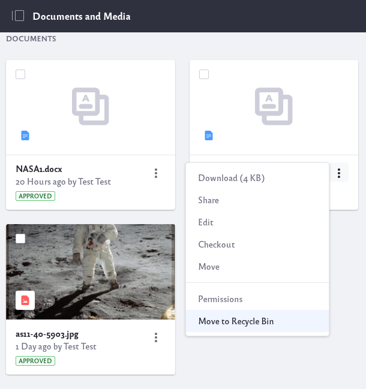
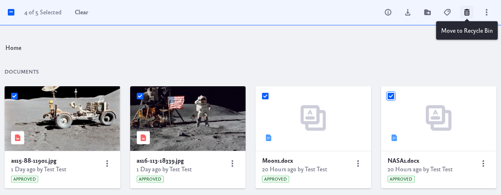

# Deleting Files

The *Documents and Media* application allows for easy deletion of files.

## Deleting a Single File

1. Locate the file you wish to delete.
2. Click on the file's Actions icon () and select *Move to Recycle Bin*.

## Deleting Multiple Files

1. Check the checkbox for every file you wish to delete.
2. Click on the recycle bin icon () at the top menubar for files to *Move to Recycle Bin*.

