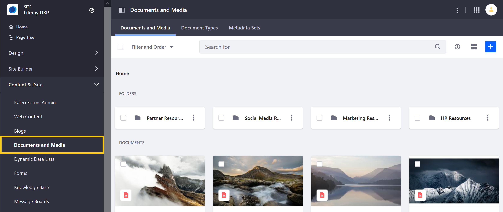
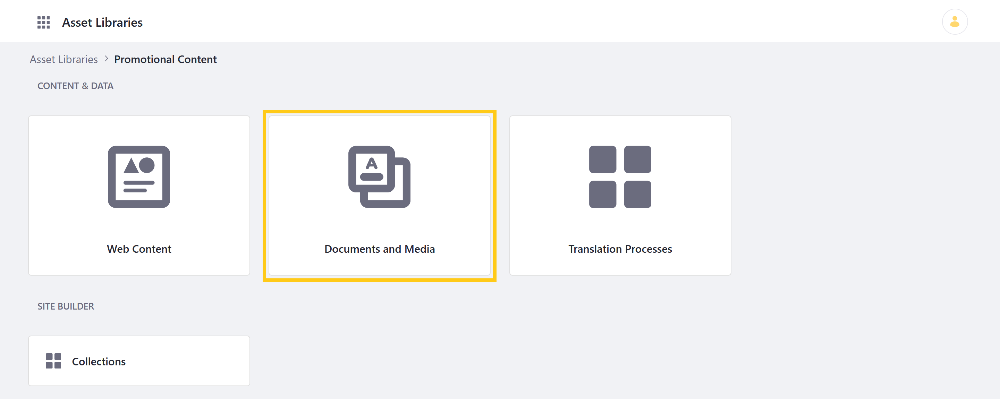
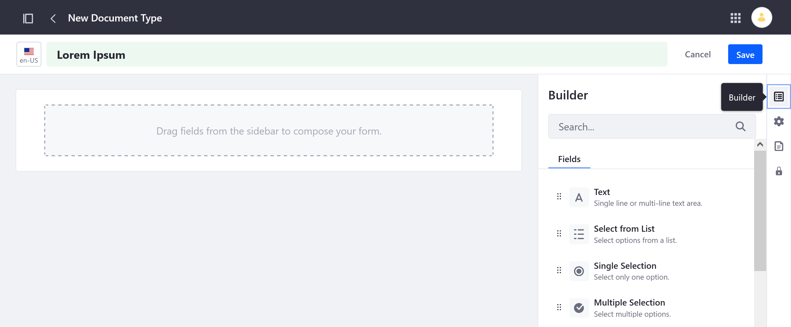
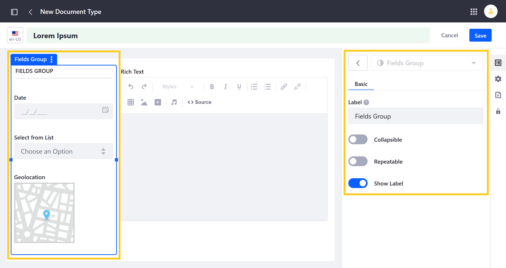
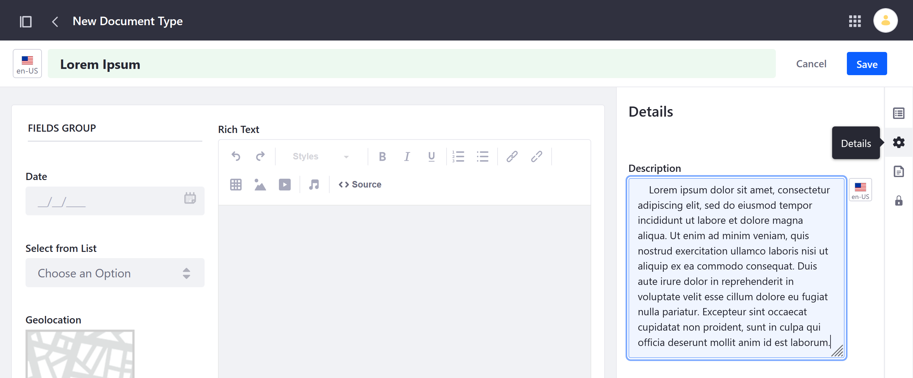
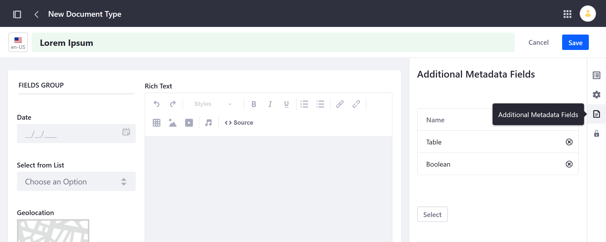
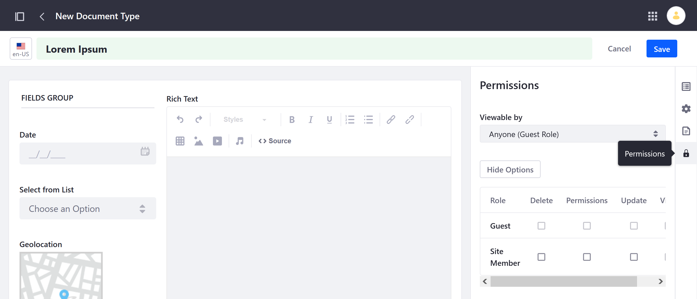
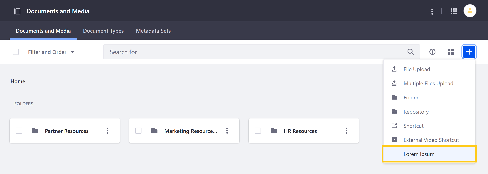

# Defining Document Types

In Liferay, Document Types are templates used for uploading files and categorizing them in Documents and Media. These templates are created using metadata fields and provide additional, searchable information for uploaded files. They also can help when integrating files with [Workflow](../../../../process-automation/workflow/introduction-to-workflow.md).

Follow these steps to create a custom Document Type.

1. Navigate to the Documents and Media application in a Site or Asset Library.

   To access Documents and Media in a Site, open the *Site Menu* () and go to *Content & Data* &rarr; *Documents and Media*.

   

   To access Documents and Media in an Asset Library, simply navigate to any Library where it's enabled, and click on *Documents and Media*.

   

1. Click on the *Document Types* tab.

1. Click the *Add* button () to access the New Document Type form.

1. Enter a *name* for the Document Type.

1. In the *Builder* tab, add the desired fields.

   

   Each field is highly configurable, with Basic and Advanced options.

   

   If desired, you can create field groups by dragging and dropping fields on top of one another. Each group can also be configured.

   

   ```note::
      All custom Document Types have the following fields: Upload File, Title, File Name, and Description. Fields added to a custom Document Type are listed in addition to these default fields.
   ```

1. (Optional) Click on the *Details* tab, and enter a *description*.

   

1. (Optional) Click on the *Additional Metadata Fields* tab, and select any existing [Metadata Sets](./defining-metadata-sets.md) you want to add to the new Document Type.

   

1. (Optional) Click on the *Permissions* tab, and configure who can view, edit, and manage the new Document Type.

   

1. Click on *Save*.

Once saved, the new Document Type can now be accessed in the Documents and Media tab, where you can use it to start a new upload.



When the Document Type is selected, users are presented with your configured metadata fields. See [Uploading Files](../uploading-files.md) for more information.

## Additional Information

* [Documents and Media Overview]()
* [Using Metadata Sets](./using-metadata-sets.md)
