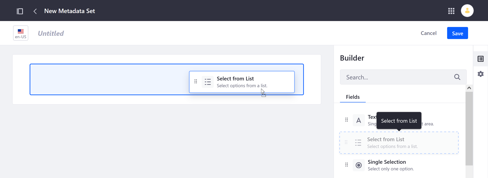
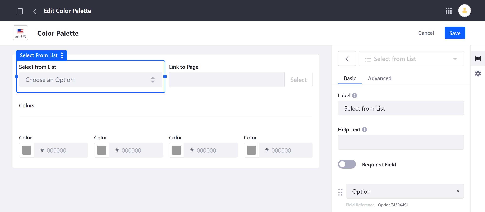
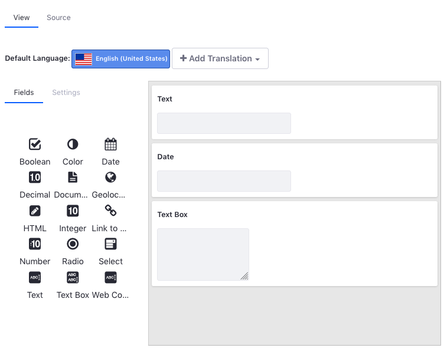
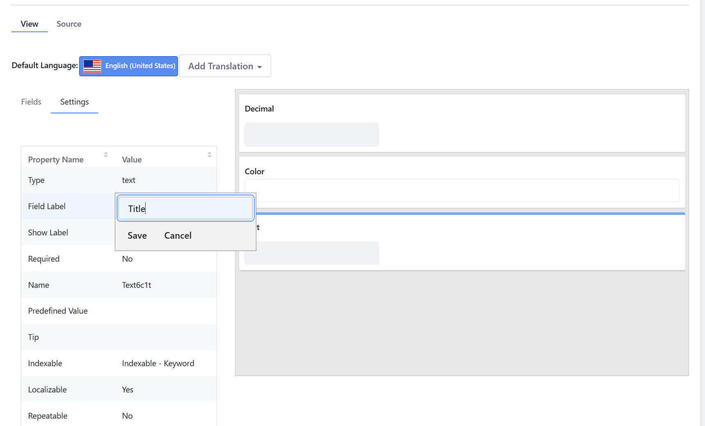
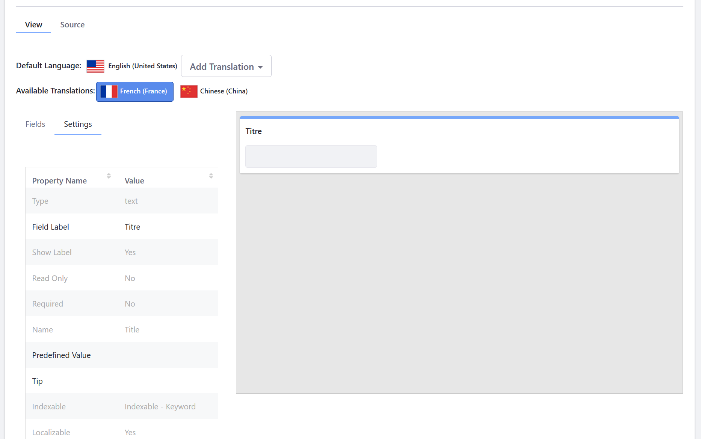

# Defining Metadata Sets

With Documents and Media, you can define reusable groups of metadata fields that can be added to custom Document Types. Once created, these Metadata Sets can be selected while [creating or editing a Document Type](./defining-document-types.md) and are added after any fields defined directly in the Document Type form.

Follow these steps to define a new Metadata Set.

1. Navigate to the Documents and Media application in a Site or Asset Library.

   To access Documents and Media in a Site, open the *Site Menu* () and go to *Content & Data* &rarr; *Documents and Media*.

   

   To access Documents and Media in an Asset Library, navigate to any Library where it's enabled and click on *Documents and Media*.

   

1. Click on the *Metadata Sets* tab.

1. Click the *Add* button () to access the New Metadata Sets form.

1. Enter a *name* for the Metadata Set.

1. In the *Builder* tab, drag and drop the desired fields into the designated drop zone.

   

   Each field is highly configurable, with Basic and Advanced options. If desired, you can create field groups by dragging and dropping fields on top of one another. These groups can also be configured.

   

1. (Optional) Click on the *Properties* tab, and enter a *description*.

1. Click on *Save*.

Once saved, the new Metadata Set can be accessed and selected when creating or editing Document Types. See [Defining Document Types](./defining-document-types.md) or more information.

## For 7.3.x and Earlier Versions

### Creating Metadata Sets

1. Open the _Product Menu_ () then click the compass icon () on the _Site Administration_ menu.
1. Select the site where the form will be created.
1. Click _Content & Data_  &rarr; _Documents and Media_.
1. Click the _Metadata Sets_ tab.
1. Click the _Add_ button (). The New Metadata Set form appears.
1. Enter a name.
1. Expand the _Details_ section.
1. Enter a description for the new Metadata Set.
1. Leave the **Parent Metadata** field blank if this is a parent. To select a Metadata Set to extend, click the _Select_ button for _Parent Metadata Set_ and then select the desired Metadata Set.
1. Drag and drop the metadata fields into the editor.

    

1. Click _Save_.

The following metadata fields are available:

| Metadata Field Type | Description |
| --- | --- |
| Boolean | Check the check box |
| Color | Specify a color. |
| Date | Enter a date. |
| Decimal | Enter a decimal number up to 2 decimal points. |
| Documents and Media | Select a file from a Documents and Media library. |
| Geolocation | Specify a location to associate with the document. |
| HTML | Use a WYSIWYG editor to enter HTML to enhance the content. |
| Integer | Enter an integer |
| Link to Page | Link to another page in the same site. |
| Number | Enter a decimal number or an integer. |
| Radio | Displays several clickable options but only one option can be selected at a time. |
| Select | This is just like the radio field except that the options are hidden and must be accessed from a drop-down menu. |
| Text | Enter a single line of text. |
| Text Box | Enter multiple lines of text or separate paragraphs. |
| Web Content | Select a Web Content article. |

### Editing Metadata Sets

You can edit your fields to reflect their intended metadata. For example, a text field's default label is *Text*. If you want to use the text field as a title, for instance, then you should change the field's label to *Title*. Besides the Label field, you can also configure the default values, variable names, mouse-over tips, widths, and other settings. Some fields have a *Required* setting for specifying whether users must populate the field. If a field's *Repeatable* setting is *Yes*, users can add multiple consecutive instances of the field to the document's metadata.

1. Click on the field on the canvas. This automatically selects the *Settings* tab on the left.
1. To edit a setting value, double-click it in the Settings table and enter the new value.

    

1. Click _Save_ when finished.

### Translating a Metadata Set

You can translate each of a metadata set's field values to any supported locales.

1. Click _Add Translation_.
1. Click on the language (for example: _French (France)_). Repeat to add another locale.

    

1. Once added to the Available Translations section, click on the flag representing the language.
1. Modify the desired values.

   

1. Click _Save_ when finished.

## Additional Information

* [Creating Document Types](./defining-document-types.md)
