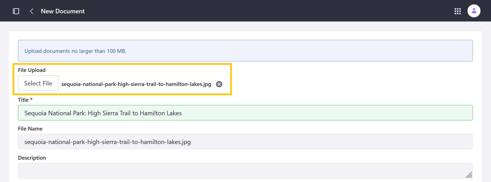
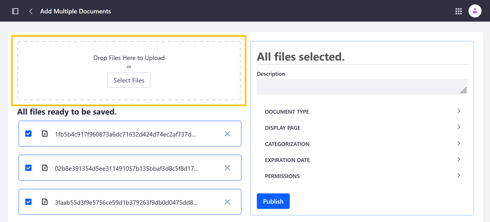

# Uploading Files

With Documents and Media, you can upload any type of file to your Liferay instance's [file store](../../../system-administration/file-storage.md) or connected repositories. Once uploaded, Users with the requisite [permissions](../publishing-and-sharing/managing-document-access/documents-and-media-permissions-reference.md) can view, edit, download, or share uploaded files.

```{note}
Users can configure Liferay to tag supported assets automatically when uploaded. See [Configuring Asset Auto Tagging](../../tags-and-categories/auto-tagging/configuring-asset-auto-tagging.md) to learn more. 
```

```{important}
You can enable automatic antivirus scanning to scan files on upload. For details, please see [Enabling Antivirus Scanning for Uploaded Files](../../../system-administration/file-storage/enabling-antivirus-scanning-for-uploaded-files.md).
```

In order to upload files, first navigate to the Documents and Media application in a Site or Asset Library.

To access Documents and Media in a Site, open the *Site Menu* () and go to *Content & Data* &rarr; *Documents and Media*.


To access Documents and Media in an Asset Library, navigate to any Library where it's enabled and click on *Documents and Media*.


Once you've opened the application, the quickest way to upload files is to drag and drop them into the desired folder. This immediately begins uploading your files without prompting you to configure your upload before they're published. Once a file finishes uploading, you can edit its details by clicking its *Actions* button and selecting *Edit*.


However, if you would like to define file details before uploading them, follow these steps:

1. Click the *Add* button () and select either *File Upload*, or *Multiple Files Upload*.

   

1. Drag and drop files into the designated drop-zone or use the file selector to browse for your files.

   If you've selected *File Upload*, the upload screen appears as follows.

   

   If you've selected *Multiple Files Upload*, the upload screen appears as follows.

   

1. Configure file details before upload. See [Configuring File Upload Reference](#configuring-file-upload-reference) for more details.

1. When finished, click *Publish* to begin the upload process.

## Configuring File Upload Reference

| Field | For Single File Upload | For Multiple File Upload | Description |
| --- | --- | --- | --- |
| File/Files | &#10004; | &#10004; | Select the file/files for upload. By default, individual file uploads cannot exceed 100MB. |
| Title | &#10004; |  | Set a display title used for the file after upload. By default this field is populated with the selected file's original name, but you can change it during or after upload. |
| File Name | &#10004; |  | Set a new name for the uploaded file. By default this field is populated with the selected file's original name, but you can change it during or after upload. |
| Description | &#10004; | &#10004; | Add a file description for your uploaded file/files. |
| Display Page | &#10004; | &#10004; | Select a [Display Page Template](../../../site-building/displaying-content/using-display-page-templates/about-display-page-templates-and-display-pages.md) for the uploaded file/files. |
| Categorization | &#10004; | &#10004; | Apply tags and public or internal Categories to the uploaded file/files. |
| Expiration Date | &#10004; | &#10004; | Determine if and when the file/files expire or should be reviewed. By default, files are set to never expire or require review. If enabled, you the date when the file expires or should be reviewed. See [Using File Expiration and Review Dates](./using-file-expiration-and-review-dates.md) for more information. |
| Related Assets | &#10004; |  | Select related assets or the file from the Site or connected Asset Library. |
| Permissions | &#10004; | &#10004; | Set permissions for the uploaded file/files. These settings determine which user roles can view the file and perform other actions related to it (e.g., update, delete). |

## Additional Information

* [Creating Folders](./creating-folders.md)
* [Using the Media Gallery](../publishing-and-sharing/publishing-documents.md#using-the-media-gallery-widget)
* [Enabling Xuggler and ImageMagick for Previews](../../../system-administration/using-the-server-administration-panel/configuring-external-services.md#enabling-document-previews)
