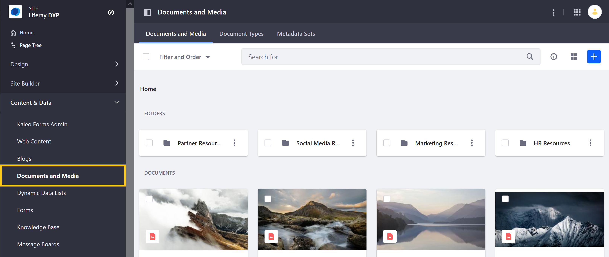
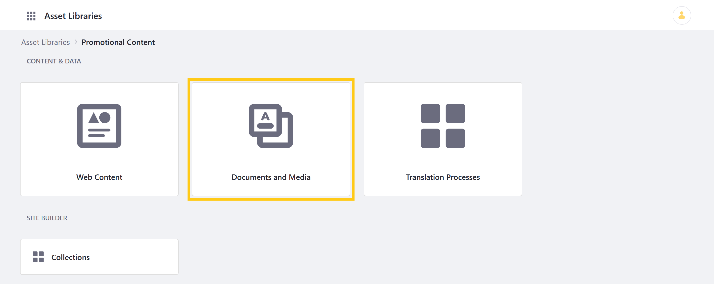
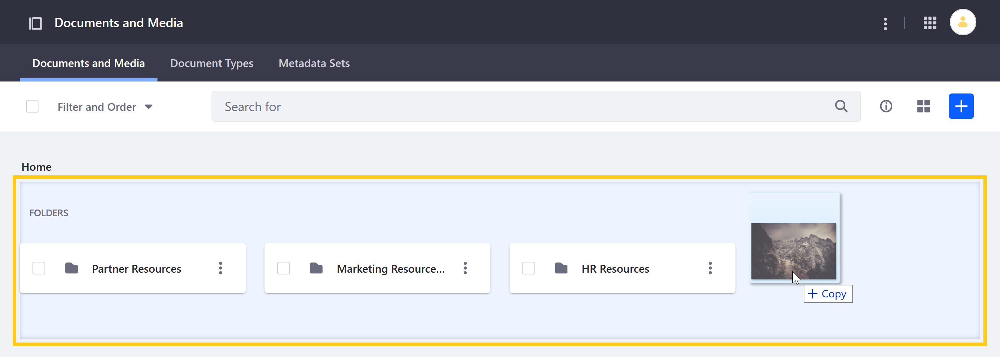
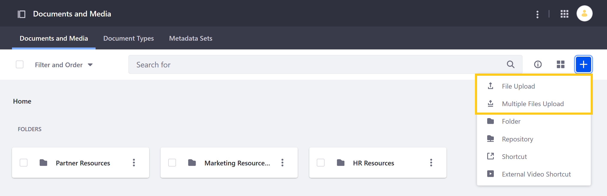

# Uploading Files

Documents and Media provides native storage on your Liferay server for digital assets: documents, images, or videos. You can upload files by dragging and dropping them into a Documents and Media folder or by using the application's *Add* button to manually configure file details prior to upload.

```note::
   Users can also configure Liferay to tag supported assets automatically when uploaded. See `Configuring Asset Auto Tagging <../../tags-and-categories/auto-tagging/configuring-asset-auto-tagging.md>`__ to learn more. 
```

Once uploaded, Users with the requisite permissions can view, edit, download, or share your uploaded files. See the [Documents and Media Permissions Reference](../publishing-and-sharing/managing-document-access/documents-and-media-permissions-reference.md) and [Roles and Permissions](../../../users-and-permissions/roles-and-permissions/understanding-roles-and-permissions.md) for more information.

```important::
   You can enable automatic antivirus scanning to scan files on upload. For details, please see `Enabling Antivirus Scanning for Uploaded Files <../../../system-administration/file-storage/enabling-antivirus-scanning-for-uploaded-files.md>`_.
```

## Quickly Uploading Files

The quickest way to upload one or more files is to drag and drop them into the Documents and Media root folder, or an existing sub-folder.

1. Open the *Site Menu* and go to Content & Data &rarr; *Documents and Media*.

1. Drag and drop files into the desired folder. This immediately begins the upload process.

   

Once a file finishes uploading, you can edit its details by clicking its *Actions* Button () and selecting *Edit*.

```note::
   You can also follow these steps to upload files to Documents and Media in an Asset Library. See `Asset Library Content <../../asset-libraries/asset-library-content.md>`__ for more information.
```

## Configuring File Details at Upload

1. Open the *Site Menu* and go to Content & Data &rarr; *Documents and Media*.

1. Click the *Add* button () and select either *File Upload*, or *Multiple Files Upload*.

   

1. Drag and drop files into the designated drop-zone or use the file selector to browse for your files.

1. Once you've selected your files, you can determine their details before upload.

   If you've selected *File Upload*, you can set the file's *Title*, *File Name*, *Description*, *Display Page Template*, *Public Categories*, *Related Assets*, and *Permissions* used for your selected file.

   

   If you selected *Multiple Files Upload*, you can set the *Description*, *Display Page Template*, *Public Categories*, and *Permissions* for all of the selected files.

   

1. When finished, click *Publish* to immediately begin the upload process.

```note::
   You can also follow these steps to upload files to Documents and Media in an Asset Library. See `Asset Library Content <../../asset-libraries/asset-library-content.md>`__ for more information.
```

## Additional Information

* [Creating Folders](./creating-folders.md)
* [Using the Media Gallery](../publishing-and-sharing/publishing-documents.md#using-the-media-gallery-widget)
* [Enabling Xuggler and ImageMagick for Previews](../../../system-administration/using-the-server-administration-panel/configuring-external-services.md#enabling-document-previews)
