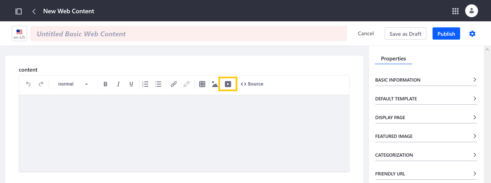
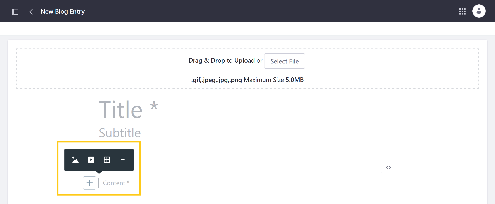

# Embedding Videos Into Liferay Assets and Pages

With Liferay, you can use URLs and [video shortcuts](./creating-external-video-shortcuts.md) to embed videos into Web Content, Knowledge Base articles, Forms, Blog entries, and Site Pages.

## Embedding Videos Into Assets

1. Navigate to the desired asset and click the *Video* button ().

   For Web Content, Knowledge Base, and Forms, this button is located in the toolbar.

   

   For Blogs, click on the *Add* button () in the Content field to access the Video button.

   

   A window opens for entering a video URL or selecting video files and external video shortcuts in Documents and Media.

1. (Video URL tab) To embed a video using a URL, click the *Video URL* tab, enter a YouTube, Vimeo, Facebook, or Twitch link, and click *Add*.

   Unlike external video shortcuts, videos embedded in this way are not saved in Documents and Media for later use.

1. (Documents and Media tab) To embed a video using an external video shortcut, click the *Documents and Media* tab and select the desired video file or external video shortcut.

1. When finished, click *Publish*.

## Embedding Videos Into Pages

Liferay provides two out-of-the-box fragments specifically for embedding videos into Pages.

**Video URL**: Use the Video URL fragment to display internal video files or external YouTube videos. Once a URL is added to the fragment, you can configure the following settings:

   * **Autoplay:** Determine whether the video plays automatically when the page is loaded.

   * **Loop:** Determine whether the video restarts once it's finished.

   * **Mute:** Determine whether the video is muted by default.

   * **Hide Video Controls:** Determine whether users can access video controls.

**External Video**: Use the eternal video shortcut to embed YouTube, Vimeo, Facebook, and Twitch videos into a page. Adding a video opens a window for entering a video URL or selecting videos and external video shortcuts in Documents and Media.

## Additional Information

* [Creating External Video Shortcuts](./creating-external-video-shortcuts.md)
<!-- * [Creating Custom Video Shortcut Providers](./creating-custom-video-shortcut-providers.md) -->
