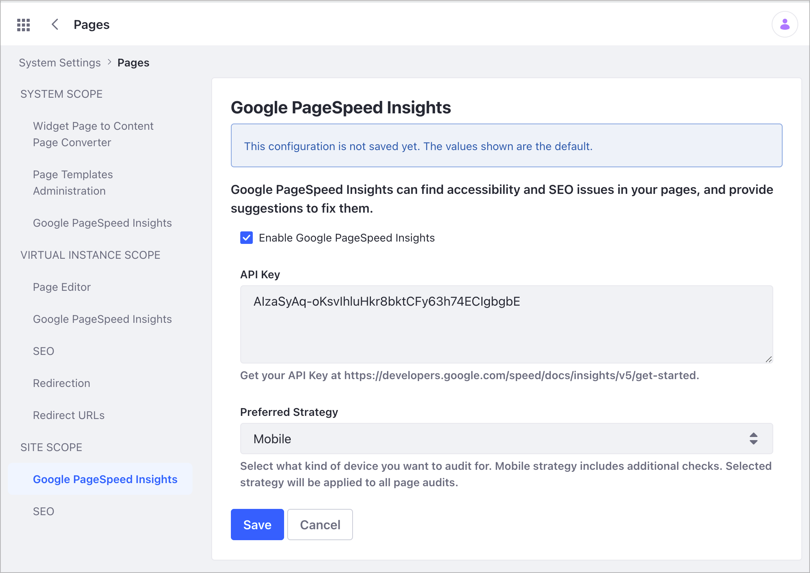
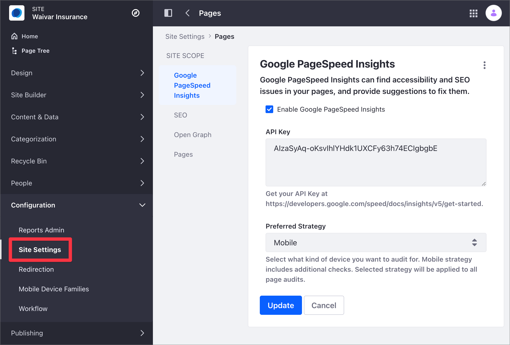
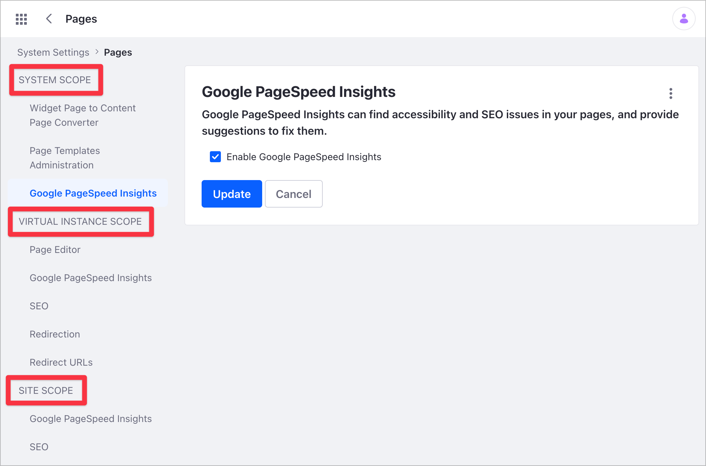
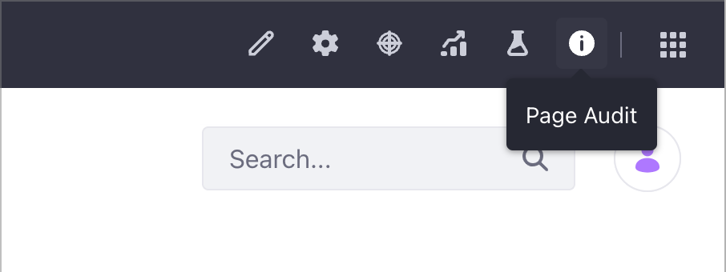
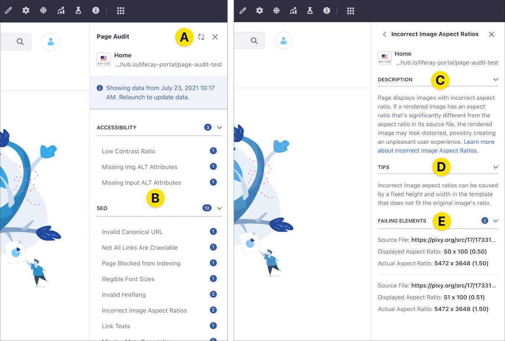
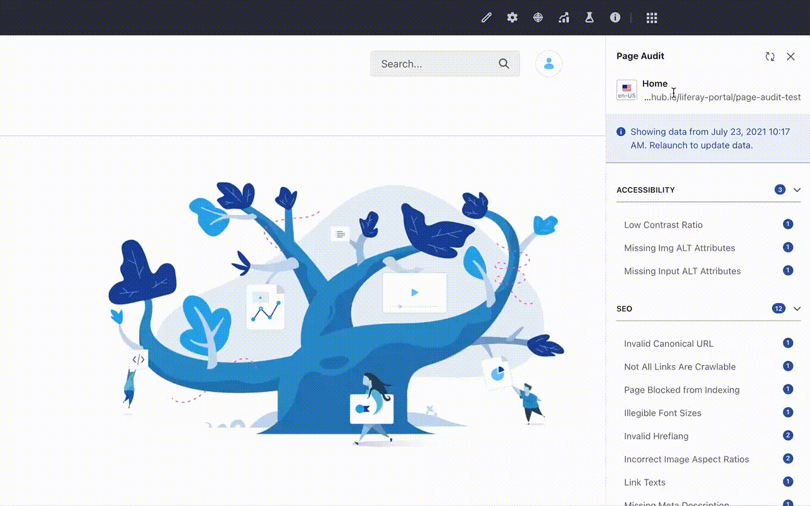

# Analyze SEO and Accessibility on Pages

Starting with Liferay DXP 7.4, you can use the Page Audit tool to examine your Pages' SEO and accessibility. The Page Audit tool uses the [Google PageSpeed Insights](https://developers.google.com/speed/pagespeed/insights/) service, providing specific recommendations for Liferay DXP. Using this tool, content authors can

- Verify that Pages are optimized for search engine indexing and visibility, so Pages rank better in search results and reach the right audience.
- Check the Page's compliance with best accessibility practices, improving the usability and overall experience for all individuals.
- Use actionable information to correct the SEO and Accessibility issues affecting the Page.

```{important}
Since the Page Audit tool uses PageSpeed Insights, it only works with publicly accessible Pages. You cannot use the tool with Private Pages if they're enabled for your Liferay system.
```

## SEO and Accessibility Checks

The Page Audit tool in Liferay DXP evaluates the following elements:

SEO issues:

- Incorrect image aspect ratio
- Missing meta-description
- Link text
- Page blocked from indexing
- Invalid `hreflang`
- Invalid canonical URL
- Illegible font size
- Small tap targets
- Missing `<title>` elements
- Not all links are crawlable

Accessibility issues:

- Low contrast ratio
- Missing `img-alt` attribute
- Missing `input-alt` attribute

After running a Page audit, you can review a description for each issue, along with actionable information to fix the issue. For more information about each one of these elements, see the [Google Lighthouse documentation](https://web.dev/learn/#lighthouse).

## Configuring the Page Audit Tool

```{note}
Configuring the Page Audit tool requires administrative access to Liferay DXP.
```

The Page Audit tool is enabled by default, but you need to complete the tool configuration before running a Page audit. This configuration requires:

- Your PageSpeed Insights API key. Google requires this key to use PageSpeed Insights in an automated way and for running multiple queries per second. To create this API key, see [Get Started with the PageSpeed Insights API](https://developers.google.com/speed/docs/insights/v5/get-started) in the Google documentation.
- A Preferred Strategy for page audits. By default, the Page Audit tool uses a mobile strategy, but you can also configure a desktop strategy to analyze your Pages. The mobile strategy includes additional rules for auditing your content on small screens. The strategy you choose applies to every Page audit, so if you wish to audit the mobile and desktop versions of your Page, you must run each audit strategy separately.



To configure the Page Audit tool, you configure the Google PageSpeed Insights setting in Liferay DXP. As with other settings in Liferay DXP, you can enable or disable the Page Audit tool at different scopes. To access these configuration settings you must have administrative privileges. For more information, see [Understanding Configuration Scope](../../system-administration/configuring-liferay/understanding-configuration-scope.md).

### Configuring the Page Audit Tool for Your Current Site

1. Select the Site Menu () and go to Configuration &rarr; Site Settings.
1. In the Content and Data section, click *Pages*.
1. Under the Site Scope section, click *Google PageSpeed Insights*.

   

   ```{note}
   The Google PageSpeed Insights setting is available at the Site Scope only when the setting is enabled as a higher scope. For more information, read [Understanding Configuration Scope](../../system-administration/configuring-liferay/understanding-configuration-scope.md).
   ```

1. Verify that the Enable Google PageSpeed Insights box is checked.
1. Copy your Google PageSpeed Insights API key and paste this key under the API Key field.
1. Choose your Preferred Strategy for the PageSpeed Insights tests. The selected Strategy applies to all Page audits.
1. Click *Save*.

### Configuring the Page Audit Tool for the Liferay DXP System

1. Click the Liferay DXP Global Menu ().
1. Select the *Control Panel* tab and, under Configuration, click *System Settings*.
1. In the Content and Data section, click *Pages*.
1. Under the desired Scope (System, Virtual Instance, or Site), click *Google PageSpeed Insights*.
1. Check or uncheck the *Enable Google PageSpeed Insights* box to enable or disable the Page Audit tool.

   

1. Click *Update*.

To disable the Page Audit tool globally, uncheck the Enable Google PageSpeed Insights option at the System scope.

## Accessing the Page Audit Tool and Running Page Audits

1. Access the Page you want to audit and click the *Page Audit* () button in the Applications bar.

   

   ```{note}
   If you have not configured Page Audit yet, the Page Audit panel prompts you to complete the configuration. In this case, click *Configure* and [complete the configuration](#configuring-the-page-audit-tool).
   ```

1. The Page Audit panel shows the Launch Page Audit button.
1. Click *Launch Page Audit* to connect your Page to Google PageSpeed Insights and start the audit process.

After running a test, you can always review the last audit results by opening the Page and clicking the Page Audit () button.

## Analyzing SEO and Accessibility Issues in the Page Audit Tool

After running an audit, the Page Audit tool shows the Page issues, according to the Google PageSpeed Insights rules. The number next to the test name shows the total number of errors for that particular test (or `+100` when there are more than 100 errors in a test.)

When you click on an issue, you see three sections:

**Description (C):** Provides general information about the selected audit test.

**Tips (D):** Includes more specific information about the error source and how to fix or mitigate the error in Liferay DXP.

**Failing Elements (E):** Lists the Page elements that didn't pass the test using the PageSpeed Insight rules.



Consider this information when using the Page Audit tool:

- If you have run previous audit tests in the Page, the Page Audit tool shows the execution time and test results for the last test. To update the Page Audit results, run a new test by clicking on the Relaunch () icon (A).
- The Page Audit tool analyzes your Page for SEO and accessibility issues at a given time. If your Page or Page's content changes (for example, when you show dynamic content), your test results may vary.
- Page Audit shows results for the [Default Experience](../../site-building/personalizing-site-experience/experience-personalization/creating-and-managing-experiences.md) only.
- If your Page is localized, you can run a Page Audit test for each language. Before running the test, click the _flag_ button in the Page Audit tool and choose the language.

  

- If you're publishing your Pages using [Remote Live Staging](../../site-building/publishing-tools/staging.md) and your Staging environment is not connected to the internet, you can use the Page Audit tool in the Live environment, but you can only fix the issues in the Staging environment.

## Troubleshooting Page Audit Panel Errors

To avoid errors when auditing your Pages, ensure that you have [configured a valid Google PageSpeed Insights API Key](#configuring-the-page-audit-tool) and the Page you want to audit is accessible from to the internet.

### Common Errors

| Error | Description |
| :--- | :--- |
| The API key is invalid | The Google PageSpeed Insights API key is invalid. Click the *Set API Key* button on the error message to configure a valid API Key. </br>To obtain your API key, see [Get Started with the PageSpeed Insights API](https://developers.google.com/speed/docs/insights/v5/get-started) in the Google documentation. |
| This Page cannot be audited | The Page you are trying to audit is not publicly accessible. |
| An unexpected error occurred | This is a generic error. Verify that the Page Audit tool is configured correctly and that the Page you want to audit is accessible from the internet. |

## Additional Information

- [Google PageSpeed Insights](https://developers.google.com/speed/pagespeed/insights/)
- [Get Started with the PageSpeed Insights API](https://developers.google.com/speed/docs/insights/v5/get-started)
- [Understanding Configuration Scope](../../system-administration/configuring-liferay/understanding-configuration-scope.md)
