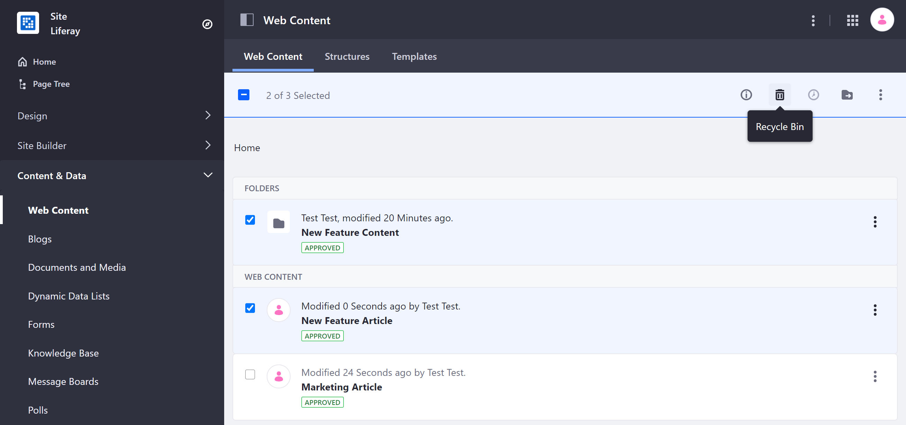
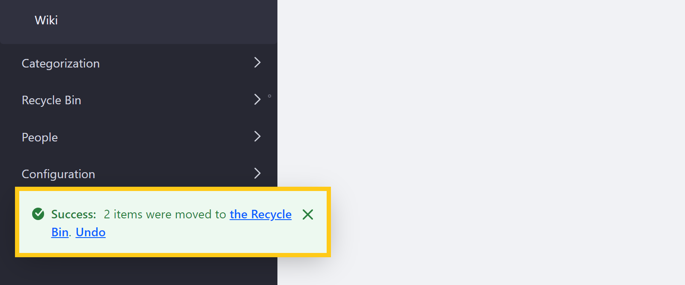
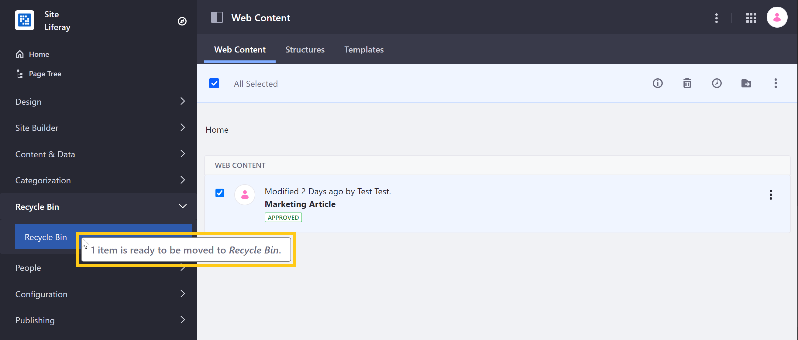
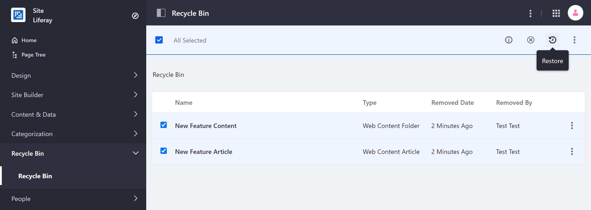
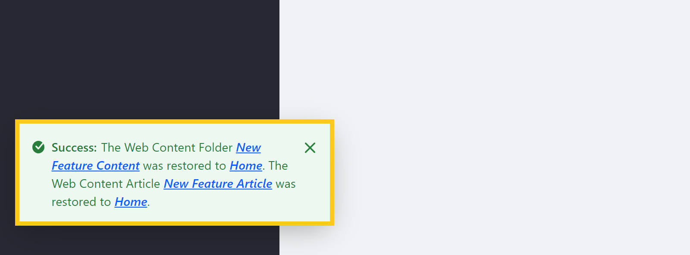
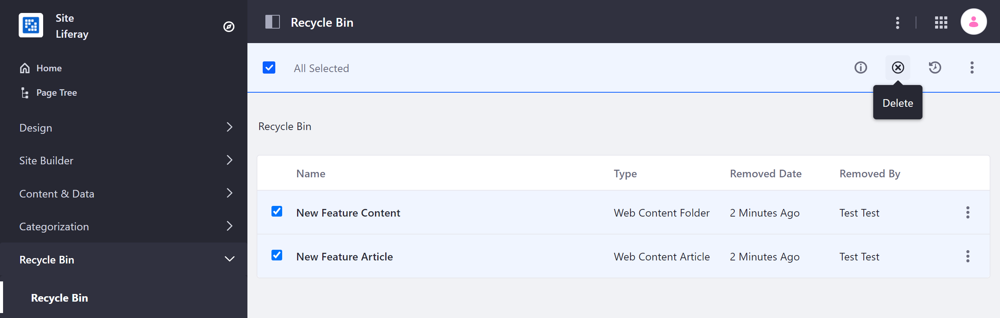
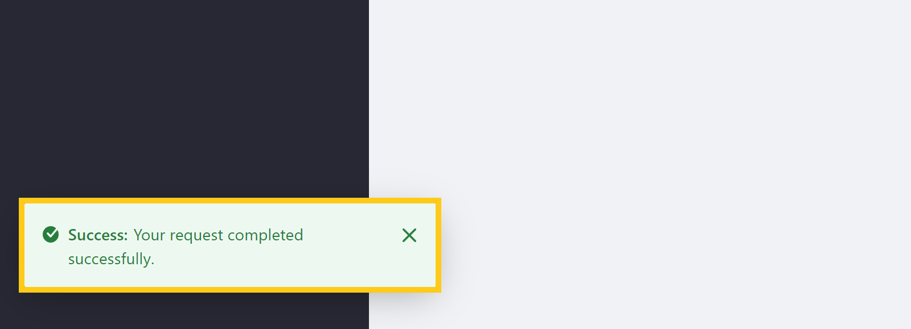

# Using the Recycle Bin

Recycle Bin functionality is available for the following assets:

* Blogs
* Bookmarks
* Documents and Media
* Folders
* Message Boards (and attachments)
* Web Content
* Wiki (and attachments)

```note::
   Attachments added to Wiki and Message Board entries do not go to the Recycle Bin when they are deleted. They can be restored in a similar fashion from the *Removed Attachments* menu within the application.
```

## Moving Items to the Recycle Bin

1. Open the *Site Menu* () &rarr; *Content & Data* &rarr; *Web Content*.

1. Use the checkboxes to select the folders and assets you want to recycle, and then click the *Recycle Bin* button ().

   Alternatively, you can click the *Actions* button () for individual folders or assets and select *Move to the Recycle Bin*.

   

1. Click *OK* in the confirmation window.

A status message appears indicating how many items have been moved to the Recycle Bin along with a quick access link and an Undo button to restore the recycled assets.

   

### Drag and Drop

You can also drag and drop items into the Recycle Bin:

1. Use the checkboxes to select the folders or assets you want to recycle.

1. Drag and drop the selected assets into the Recycle Bin in the Site menu. As you do this, a message appears near your cursor indicating the number of files you're moving.

   

## Restoring Items from the Recycle Bin

1. Open the *Site Menu* &rarr; *Recycle Bin*.

1. Use the checkboxes to select the folders and assets you want to restore, and then click the *Restore* button ().

   Alternatively, you can click on the *Actions* button () for individual folders or assets and select *Restore*.

   

A status message appears indicating which items have been restored, along with quick access links to view them in your Site.



## Deleting Items Permanently

1. Open the *Site Menu* &rarr; *Recycle Bin*.

1. Use the checkboxes to select the recycled folders and assets you want to delete permanently from you instance and click the *Delete* button ().

   Alternatively, you can click on the *Actions* button () for individual folders or assets and select *Delete*.

   

```important::
   Deleting your content is the permanent and cannot be undone. Deleted files cannot be retrieved and are gone forever.
```

A status message appears indicating whether your request was successful.



To delete all recycled items, click on the *Actions* button () in the Application bar, and select *Empty the Recycle Bin*.

## Additional Information

* [Recycle Bin Overview](./recycle-bin-overview.md)
* [Configuring the Recycle Bin](./configuring-the-recycle-bin.md)
