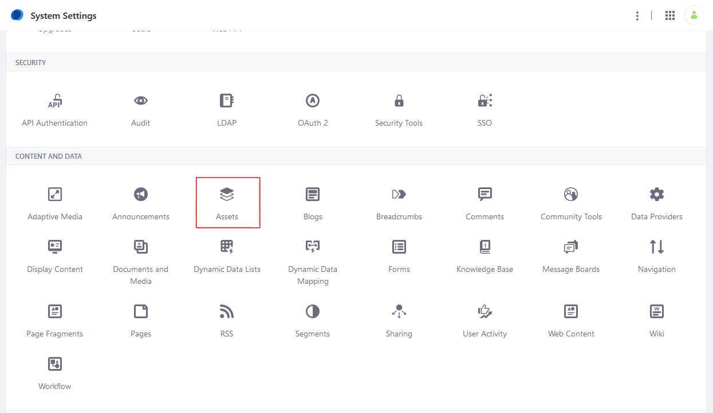
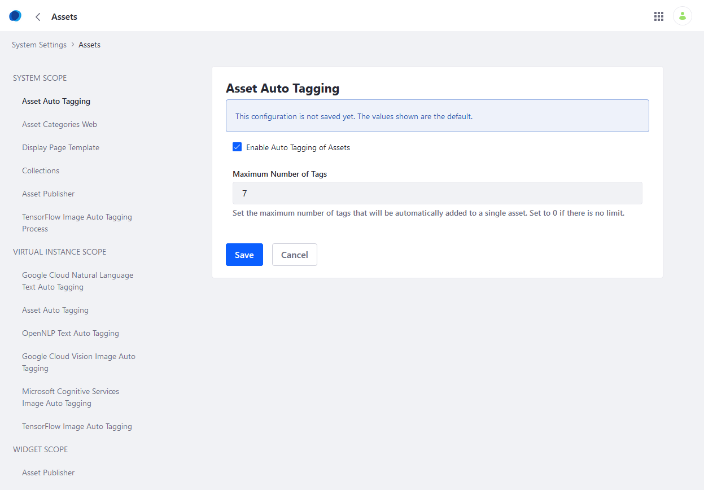
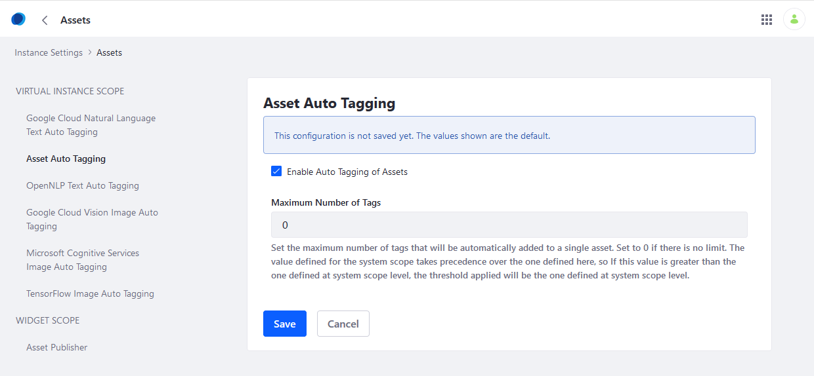
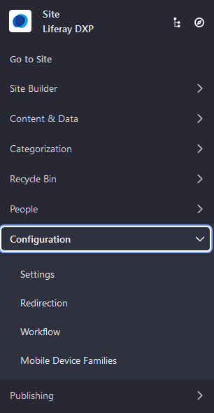
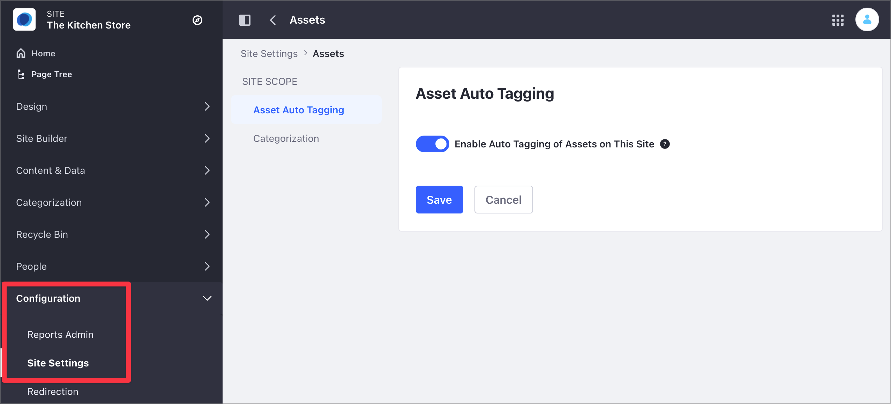

# Configuring Asset Auto Tagging

[Tagging assets](../tagging-content-and-managing-tags.md) is a great way to organize content. Typically, the content creator applies tags while creating the content. You can also tag content automatically. For example, you can scan an image on upload and apply tags that describe the image's content. This lets you leverage tags without requiring content creators to apply them manually.

```note::
   Auto-tagging currently works only for images, text-based documents, text-based web content, and blog entries.
```

Configuring auto-tagging for specific asset types is documented separately:

* [Auto Tagging Images](./auto-tagging-images.md)
* [Auto Tagging Assets](./auto-tagging-assets.md)

Auto-tagging is enabled by default. You can configure it at three levels:

* **Global (System):** For auto-tagging to function on any level, it must be enabled globally. You can also set the default auto-tagging configuration for every portal instance.

* **Instance:** When enabled globally, auto-tagging is also enabled by default for each portal instance. However, you can override the global auto-tagging configuration on a per-instance basis.

* **Site:** When enabled for an instance, auto-tagging is also enabled by default for all that instance's Sites. You can disable it for specific Sites.

## Global Configuration

Follow these steps to configure auto tagging globally:

1. Navigate to the _Control Panel_ &rarr; _System Settings_.
1. Click _Assets_ in the _Content and Data_ section.

   

1. Click _Asset Auto Tagging_ under System Scope.
1. Check the box to keep Asset Auto Tagging enabled.

   

1. Enter a value for **Maximum Number of Tags**. The default value of `0` means that there is no limit.
1. Click _Save_ when finished.

To set the default auto-tagging configuration for all instances, select *Asset Auto Tagging* under *VIRTUAL INSTANCE SCOPE*. The available settings are exactly the same as those in the SYSTEM SCOPE.

## Instance-level Configuration

When enabled globally, auto-tagging is also enabled by default for each instance. You can, however, disable or configure it for each instance.

Follow these steps to configure auto tagging on the instance level:

1. Navigate to the _Control Panel_ &rarr; _Instance Settings_.
1. Click _Assets_.
1. Click _Asset Auto Tagging_ under Virtual Instance Scope.

   

1. The settings here are identical to those in the global configuration, but apply only to the current instance.
1. Click _Save_ when finished.

Auto Tagging had been enabled at the instance level.

## Site-level Configuration

1. Open the _Menu_ (), click your Site's name, and navigate to _Configuration_ &rarr; _Settings_.

    .

1. In the *General* tab, expand the *Asset Auto Tagging* section. Use the toggle to enable or disable auto tagging for the site.

   

1. Click *Save* to save your changes.

## Additional Information

* [Tagging Content and Managing Tags](../tagging-content-and-managing-tags.md)
