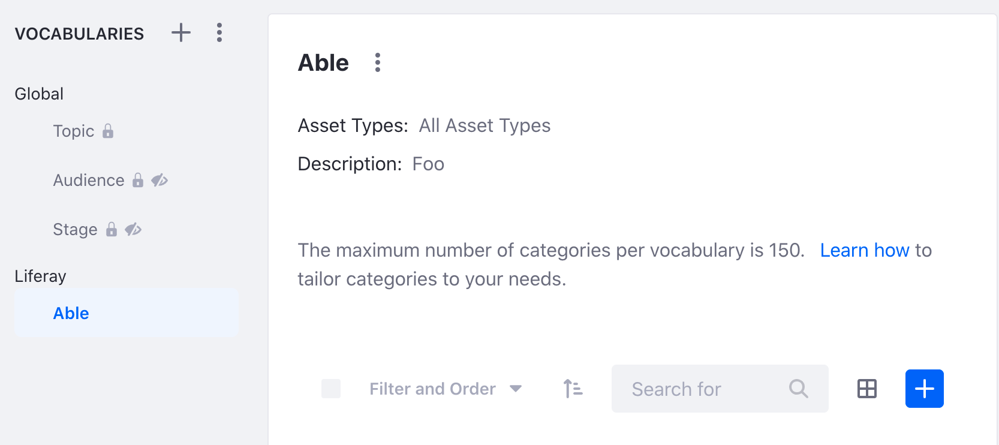

# Categories and Vocabulary API Basics

Liferay's REST APIs provide services for Liferay's categories and vocabularies functionality. You can create and edit vocabularies with the API. You can also associate and edit categories with the API. Start by seeing an example of adding a new vocabulary.

## Adding a Vocabulary

1. Start Liferay DXP. If you don't already have a docker container, use

   ```bash
   docker run -it -m 8g -p 8080:8080 [$LIFERAY_LEARN_DXP_DOCKER_IMAGE$]
   ```

1. Download and unzip [Categories and Vocabulary API Basics](./liferay-f5w3.zip).

   ```bash
   curl https://learn.liferay.com/dxp/latest/en/content-authoring-and-management/tags-and-categories/developer-guide/liferay-f5w3.zip -O
   ```

   ```bash
   unzip liferay-f5w3.zip
   ```

2. [Find your Site's ID](../../../headless-delivery/consuming-apis/consuming-rest-services.md#identify-the-site-containing-the-data). You'll use this in different service calls below.

3. Use the cURL script to add a new vocabulary to your Site. On the command line, navigate to the `curl` folder. Execute the `TaxonomyVocabulary_POST_ToSite.sh` script with your Site ID as a parameter.

    ```bash
    ./TaxonomyVocabulary_POST_ToSite.sh 1234
    ```

    The JSON response shows a new vocabulary has been added:

    ```bash
  "availableLanguages" : [ "en-US" ],
  "creator" : {
    "additionalName" : "",
    "contentType" : "UserAccount",
    "familyName" : "Test",
    "givenName" : "Test",
    "id" : 20129,
    "name" : "Test Test",
    "profileURL" : "/web/test"
  },
  "dateCreated" : "2021-09-09T21:03:15Z",
  "dateModified" : "2021-09-09T21:03:15Z",
  "description" : "Foo",
  "id" : 40126,
  "name" : "Able",
  "numberOfTaxonomyCategories" : 0,
  "siteId" : 20125
    ```

4. Go to the Categories application by navigating to *Administration Menu* &rarr; *Categorization* &rarr; *Categories*. See that a new vocabulary has been added.

    

5. The REST service can also be called using the Java client. Navigate out of the `curl` folder and into the `java` folder. Compile the source files with the following command:

    ```bash
    javac -classpath .:* *.java
    ```

6. Run the `TaxonomyVocabulary_POST_ToSite` class with the following command. Replace the `siteId` value with your Site's ID:

    ```bash
    java -classpath .:* -DsiteId=1234 TaxonomyVocabulary_POST_ToSite
    ```

## Examine the cURL Command

The `TaxonomyVocabulary_POST_ToSite.sh` script calls the REST service with a cURL command.

```{literalinclude} ./categories-and-vocabulary-api-basics/resources/liferay-f5w3.zip/curl/TaxonomyVocabulary_POST_ToSite.sh
    :language: bash
```

Here are the command's arguments:

| Arguments | Description |
| --------- | ----------- |
| `-H "Content-Type: application/json"` | Indicates that the request body format is JSON. |
| `-X POST` | The HTTP method to invoke at the specified endpoint |
| `"http://localhost:8080/o/headless-admin-taxonomy/v1.0/sites/${1}/taxonomy-vocabularies"` | The REST service endpoint |
| `-d "{\"description\": \"Foo\", \"name\": \"Able\"}"` | The data you are requesting to post |
| `-u "test@liferay.com:test"` | Basic authentication credentials |

```{note}
Basic authentication is used here for demonstration purposes. For production, you should authorize users via [OAuth2](../../../headless-delivery/using-oauth2.md).
```

The other cURL commands use similar JSON arguments.

## Examine the Java Class

The `TaxonomyVocabulary_POST_ToSite.java` class adds a vocabulary by calling the vocabulary related service.

```{literalinclude} ./categories-and-vocabulary-api-basics/resources/liferay-f5w3.zip/java/TaxonomyVocabulary_POST_ToSite.java
   :dedent: 1
   :language: java
   :lines: 9-26
```

This class invokes the REST service using only three lines of code:

| Line (abbreviated) | Description |
| :----------------- | :---------- |
| `TaxonomyVocabularyResource.Builder builder = ...` | Gets a `Builder` for generating a `TaxonomyVocabularyResource` service instance. |
| `TaxonomyVocabularyResource taxonomyVocabularyResource = builder.authentication(...).build();` | Specifies basic authentication and generates a `TaxonomyVocabularyResource` service instance. |
| `TaxonomyVocabulary taxonomyVocabulary = taxonomyVocabularyResource.postSiteTaxonomyVocabulary(...);` | Calls the `postSiteTaxonomyVocabulary` method and passes the data to post. |

```{note}
The `main` method's comment demonstrates running the class.
```

The other example Java classes are similar to this one, but call different `TaxonomyVocabularyResource` methods.

```{important}
See [TaxonomyVocabularyResource](https://github.com/liferay/liferay-portal/blob/[$LIFERAY_LEARN_PORTAL_GIT_TAG$]/modules/apps/headless/headless-admin-taxonomy/headless-admin-taxonomy-client/src/main/java/com/liferay/headless/admin/taxonomy/client/resource/v1_0/TaxonomyVocabularyResource.java) for service details.
```

Below are examples of calling other `TaxonomyVocabulary` REST services using cURL and Java.

## Get Vocabularies from Site

You can list a Site's vocabularies by executing the following cURL or Java command. As above, replace `1234` with your Site's ID.

### TaxonomyVocabularies_GET_FromSite.sh

Command:

```bash
./TaxonomyVocabularies_GET_FromSite.sh 1234
```

Code:

```{literalinclude} ./categories-and-vocabulary-api-basics/resources/liferay-f5w3.zip/curl/TaxonomyVocabularies_GET_FromSite.sh
   :language: bash
```

### TaxonomyVocabularies_GET_FromSite.java

Command:

```bash
java -classpath .:* -DsiteId=1234 TaxonomyVocabularies_GET_FromSite
```

Code:

```{literalinclude} ./categories-and-vocabulary-api-basics/resources/liferay-f5w3.zip/java/TaxonomyVocabularies_GET_FromSite.java
   :dedent: 1
   :language: java
   :lines: 11-23
```

The Site's `TaxonomyVocabulary` objects are listed in JSON.

## Get a Vocabulary

Get a specific vocabulary with the following cURL or Java command. Replace `1234` with the vocabulary's ID.

```{tip}
Use `TaxonomyVocabularies_GET_FromSite.[java|sh]` to get `Vocabulary` IDs.
```

### TaxonomyVocabulary_GET_ById.sh

Command:

```bash
./TaxonomyVocabulary_GET_ById.sh 1234
```

Code:

```{literalinclude} ./categories-and-vocabulary-api-basics/resources/liferay-f5w3.zip/curl/TaxonomyVocabulary_GET_ById.sh
   :language: bash
```

### TaxonomyVocabulary_GET_ById.java

Command:

```bash
java -classpath .:* -DtaxonomyVocabularyId=1234 TaxonomyVocabulary_GET_ById
```

Code:

```{literalinclude} ./categories-and-vocabulary-api-basics/resources/liferay-f5w3.zip/java/TaxonomyVocabulary_GET_ById.java
   :dedent: 1
   :language: java
   :lines: 9-23
```

The `TaxonomyVocabulary` fields are listed in JSON.

## Patch a Vocabulary

Do a partial edit of an existing vocabulary with the following cURL and Java commands. Note, replace `1234` with your vocabulary's ID.

### TaxonomyVocabulary_PATCH_ById.sh

Command:

```bash
./TaxonomyVocabulary_PATCH_ById.sh 1234
```

Code:

```{literalinclude} ./categories-and-vocabulary-api-basics/resources/liferay-f5w3.zip/curl/TaxonomyVocabulary_PATCH_ById.sh
   :language: bash
```

### TaxonomyVocabulary_PATCH_ById.java

Command:

```bash
java -classpath .:* -DtaxonomyVocabularyId=1234 TaxonomyVocabulary_PATCH_ById
```

Code:

```{literalinclude} ./categories-and-vocabulary-api-basics/resources/liferay-f5w3.zip/java/TaxonomyVocabulary_PATCH_ById.java
   :dedent: 1
   :language: java
   :lines: 9-25
```

In this example the description is changed from Foo to Bar.

## Put a Vocabulary

Overwrite an existing vocabulary with the following cURL and Java commands. Note, replace `1234` with your vocabulary's ID.

### TaxonomyVocabulary_PUT_ById.sh

Command:

```bash
./TaxonomyVocabulary_PUT_ById.sh 1234
```

Code:

```{literalinclude} ./categories-and-vocabulary-api-basics/resources/liferay-f5w3.zip/curl/TaxonomyVocabulary_PUT_ById.sh
   :language: bash
```

### TaxonomyVocabulary_PUT_ById.java

Command:

```bash
java -classpath .:* -DtaxonomyVocabularyId=1234 TaxonomyVocabulary_PUT_ById
```

Code:

```{literalinclude} ./categories-and-vocabulary-api-basics/resources/liferay-f5w3.zip/java/TaxonomyVocabulary_PUT_ById.java
   :dedent: 1
   :language: java
   :lines: 9-29
```

## Delete a Vocabulary

Delete an existing vocabulary with the following cURL and Java commands. Note, replace `1234` with your vocabulary's ID.

### TaxonomyVocabulary_DELETE_ById.sh

Command:

```bash
./TaxonomyVocabulary_DELETE_ById.sh 1234
```

Code:

```{literalinclude} ./categories-and-vocabulary-api-basics/resources/liferay-f5w3.zip/curl/TaxonomyVocabulary_DELETE_ById.sh
   :language: bash
```

### TaxonomyVocabulary_DELETE_ById.java

Command

```bash
java -classpath .:* -DtaxonomyVocabularyId=1234 TaxonomyVocabulary_DELETE_ById
```

Code:

```{literalinclude} ./categories-and-vocabulary-api-basics/resources/liferay-f5w3.zip/java/TaxonomyVocabulary_DELETE_ById.java
   :dedent: 1
   :language: java
   :lines: 8-17
```

## Taxonomy Category Services

The cURL commands and Java classes for taxonomy categories work similarly to taxonomy vocabularies. Note that some services require the taxonomy vocabulary ID.

| Files | Description |
| :---- | :---------- |
| `TaxonomyCategories_GET_FromTaxonomyVocabulary.[java|sh]` | Get a list of categories from a vocabulary. |
| `TaxonomyCategory_DELETE_ById.[java|sh]` | Delete a category. |
| `TaxonomyCategory_GET_ById[java|sh]` | Get a specific category by ID. |
| `TaxonomyCategory_PATCH_ById.[java|sh]` | Patch a category. |
| `TaxonomyCategory_POST_ToTaxonomyVocabulary.[java|sh]` | Post a category to a vocabulary.  |
| `TaxonomyCategory_PUT_ById.[java|sh]` | Put a category. |

The [API Explorer](../../../headless-delivery/consuming-apis/consuming-rest-services.md) lists all of the `TaxonomyVocabulary` and `TaxonomyCategory` services and schemas and has an interface to try out each service.
