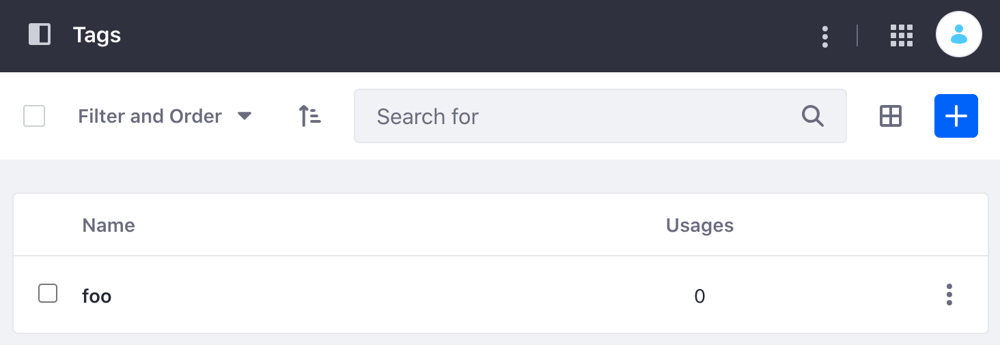

# Tags API Basics

Liferay's REST APIs provide services for Liferay DXP/Portal's tags. You can create and edit tags with the API. Start by seeing an example of adding a new tag. Note that in Liferay's codebase, tags are called keywords.

## Adding a Tag

1. Start Liferay DXP. If you don't already have a docker container, use

   ```bash
   docker run -it -m 8g -p 8080:8080 [$LIFERAY_LEARN_DXP_DOCKER_IMAGE$]
   ```

1. Download and unzip [Tags API Basics](./liferay-r7u9.zip).

   ```bash
   curl https://learn.liferay.com/dxp/latest/en/content-authoring-and-management/tags-and-categories/developer-guide/liferay-r7u9.zip -O
   ```

   ```bash
   unzip liferay-r7u9.zip
   ```

2. [Find your Site's ID](../../../headless-delivery/consuming-apis/consuming-rest-services.md#identify-the-site-containing-the-data). You'll use this in different service calls below.

3. Use the cURL script to add a new tag to your Site. On the command line, navigate to the `curl` folder. Execute the `Keyword_POST_ToSite.sh` script with your site ID as a parameter.

    ```bash
    ./Keyword_POST_ToSite.sh 1234
    ```

    The JSON response shows a new tag has been added:

    ```bash
   "creator" : {
    "additionalName" : "",
    "contentType" : "UserAccount",
    "familyName" : "Test",
    "givenName" : "Test",
    "id" : 20129,
    "name" : "Test Test",
    "profileURL" : "/web/test"
   },
   "dateCreated" : "2021-09-09T21:15:46Z",
   "dateModified" : "2021-09-09T21:15:46Z",
   "id" : 40130,
   "keywordUsageCount" : 0,
   "name" : "foo",
   "siteId" : 20125
    ```

4. Go to the Tags application by navigating to *Administration Menu* &rarr; *Categorization* &rarr; *Tags*. See that a new tag has been added.

    

5. The REST service can also be called using the Java client. Navigate out of the `curl` folder and into the `java` folder. Compile the source files with the following command:

    ```bash
    javac -classpath .:* *.java
    ```

6. Run the `Keyword_POST_ToSite` class with the following command. Replace the `siteId` value with your Site's ID:

    ```bash
    java -classpath .:* -DsiteId=1234 Keyword_POST_ToSite
    ```

## Examine the cURL Command

The `Keyword_POST_ToSite.sh` script calls the REST service with a cURL command.

```{literalinclude} ./tags-api-basics/resources/liferay-r7u9.zip/curl/Keyword_POST_ToSite.sh
    :language: bash
```

Here are the command's arguments:

| Arguments | Description |
| --------- | ----------- |
| `-H "Content-Type: application/json"` | Indicates that the request body format is JSON. |
| `-X POST` | The HTTP method to invoke at the specified endpoint |
| `"http://localhost:8080/o/headless-admin-taxonomy/v1.0/sites/${1}/keywords"` | The REST service endpoint |
| `-d "{\"name\": \"Foo\"}"` | The data you are requesting to post |
| `-u "test@liferay.com:test"` | Basic authentication credentials |

```{note}
Basic authentication is used here for demonstration purposes. For production, you should authorize users via [OAuth2](../../../headless-delivery/using-oauth2.md).
```

The other cURL commands use similar JSON arguments.

## Examine the Java Class

The `Keyword_POST_ToSite.java` class adds a tag by calling the keyword related service.

```{literalinclude} ./tags-api-basics/resources/liferay-r7u9.zip/java/Keyword_POST_ToSite.java
   :dedent: 1
   :language: java
   :lines: 9-26
```

This class invokes the REST service using only three lines of code:

| Line (abbreviated) | Description |
| :----------------- | :---------- |
| `KeywordResource.Builder builder = ...` | Gets a `Builder` for generating a `KeywordResource` service instance. |
| `KeywordResource keywordResource = builder.authentication(...).build();` | Specifies basic authentication and generates a `KeywordResource` service instance. |
| `Keyword keyword = keywordResource.postSiteKeyword(...);` | Calls the `keywordResource.postSiteKeyword` method and passes the data to post. |

```{note}
The `main` method's comment demonstrates running the class.
```

The other example Java classes are similar to this one, but call different `KeywordResource` methods.

```{important}
See [KeywordResource](https://github.com/liferay/liferay-portal/blob/[$LIFERAY_LEARN_PORTAL_GIT_TAG$]/modules/apps/headless/headless-admin-taxonomy/headless-admin-taxonomy-client/src/main/java/com/liferay/headless/admin/taxonomy/client/resource/v1_0/KeywordResource.java) for service details.
```

Below are examples of calling other `Keyword` REST services using cURL and Java.

## Get Keyword Posts from Site

You can list a Site's tags by executing the following cURL or Java command. As above, replace `1234` with your Site's ID.

### Keywords_GET_FromSite.sh

Command:

```bash
./Keywords_GET_FromSite.sh 1234
```

Code:

```{literalinclude} ./tags-api-basics/resources/liferay-r7u9.zip/curl/Keywords_GET_FromSite.sh
   :language: bash
```

### Keywords_GET_FromSite.java

Command:

```bash
java -classpath .:* -DsiteId=1234 Keywords_GET_FromSite
```

Code:

```{literalinclude} ./tags-api-basics/resources/liferay-r7u9.zip/java/Keywords_GET_FromSite.java
   :dedent: 1
   :language: java
   :lines: 11-23
```

The Site's `Keyword` objects are listed in JSON.

## Get a Keyword

Get a specific tag with the following cURL or Java command. Replace `1234` with the tag's ID.

```{tip}
Use ``Keywords_GET_FromSite.[java|sh]`` to get site ``Keyword`` IDs.
```

### Keyword_GET_ById.sh

Command:

```bash
./Keyword_GET_ById.sh 1234
```

Code:

```{literalinclude} ./tags-api-basics/resources/liferay-r7u9.zip/curl/Keyword_GET_ById.sh
   :language: bash
```

### Keyword_GET_ById.java

Command:

```bash
java -classpath .:* -DkeywordId=1234 Keyword_GET_ById
```

Code:

```{literalinclude} ./tags-api-basics/resources/liferay-r7u9.zip/java/Keyword_GET_ById.java
   :dedent: 1
   :language: java
   :lines: 9-20
```

The `Keyword` fields are listed in JSON.

## Put a Keyword

Completely overwrite an existing tag with the following cURL and Java commands. Note, replace `1234` with your tag's ID.

### Keyword_PUT_ById.sh

Command:

```bash
./Keyword_PUT_ById.sh 1234
```

Code:

```{literalinclude} ./tags-api-basics/resources/liferay-r7u9.zip/curl/Keyword_PUT_ById.sh
   :language: bash
```

### Keyword_PUT_ById.java

Command:

```bash
java -classpath .:* -DkeywordId=1234 Keyword_PUT_ById
```

Code:

```{literalinclude} ./tags-api-basics/resources/liferay-r7u9.zip/java/Keyword_PUT_ById.java
   :dedent: 1
   :language: java
   :lines: 9-25
```

## Delete a Keyword

Delete an existing tag with the following cURL and Java commands. Note, replace `1234` with your tag's ID.

### Keyword_DELETE_ById.sh

Command:

```bash
./Keyword_DELETE_ById.sh 1234
```

Code:

```{literalinclude} ./tags-api-basics/resources/liferay-r7u9.zip/curl/Keyword_DELETE_ById.sh
   :language: bash
```

### Keyword_DELETE_ById.java

Command

```bash
java -classpath .:* -DkeywordId=1234 Keyword_DELETE_ById
```

Code:

```{literalinclude} ./tags-api-basics/resources/liferay-r7u9.zip/java/Keyword_DELETE_ById.java
   :dedent: 1
   :language: java
   :lines: 8-17
```

The [API Explorer](../../../headless-delivery/consuming-apis/consuming-rest-services.md) lists all of the `Keyword` services and schemas and has an interface to try out each service.
