# Geolocating Assets

Geolocation adds the geographic coordinates where an asset was created as metadata to an asset. This feature is provided as an optional field which can be included in a [Web Content structure](../web-content/web-content-structures/understanding-web-content-structures.md), Dynamic Data List field, or a Documents and Media [Document Type](../documents-and-media/uploading-and-managing/managing-metadata/defining-document-types.md) or a [Metadata Set](../documents-and-media/uploading-and-managing/managing-metadata/using-metadata-sets.md).

## Geolocating Web Content

To use geolocation in your web content, you must create a [structure and template](../web-content/web-content-structures/understanding-web-content-structures.md) that includes a Geolocation field.

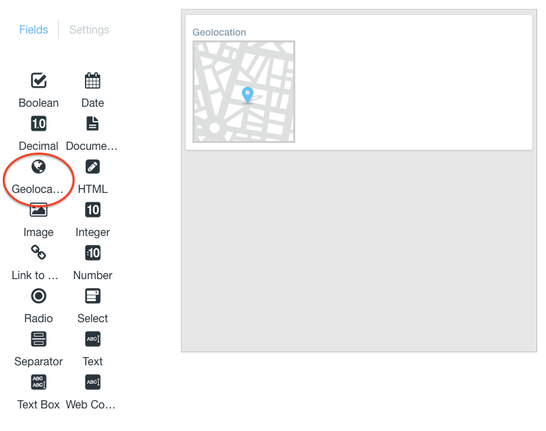

1. Create a structure with a Geolocation field like in the image above.
1. Create a new template and select the structure you just created with the geolocation field.
1. Scroll down to the _Script_ heading and locate the _Fields_ section. Here are _Content_ and _Geolocation_ snippets.
1. Click on the snippets to add them to the template.

    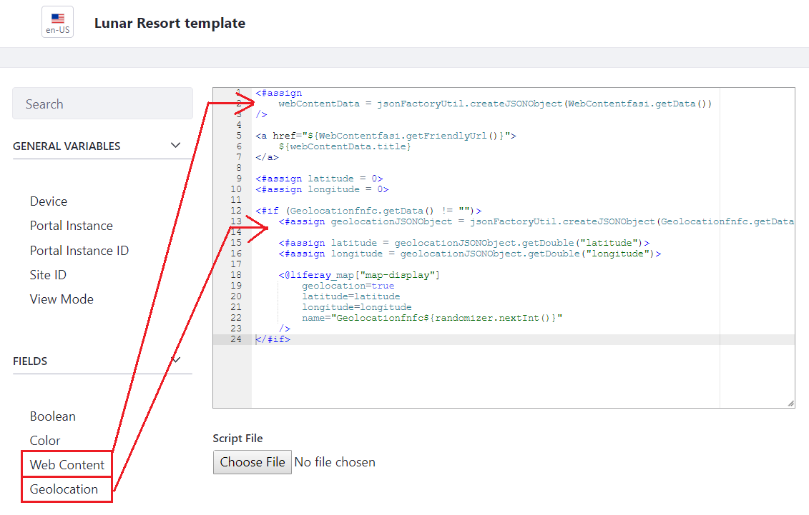

1. Click _Save_ when finished.

To set your location for the web content, you can share your location with the browser, type a specific address into the address bar on the map, or even drag the indicator and drop it in any point in the map and the address is automatically updated to reflect the new point. Once the web content is saved, the location is added as metadata to the web content.

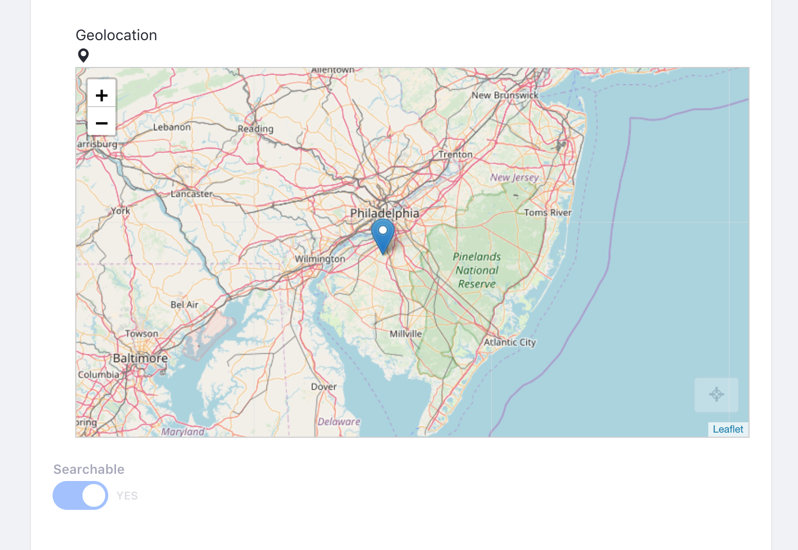

```note::
   Depending on your browser settings, you may need to configure it to share your location.
```

## Geolocating Data Lists

To use geolocation in your Dynamic Data Lists, you must first create a data definition that includes a geolocation field.

### Creating a New Data List Definition

1. Open the Product Menu and navigate to your site.
1. Click _Content & Data_ &rarr; _Dynamic Data Lists_.

    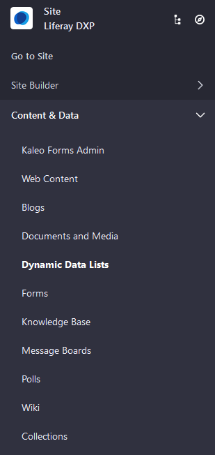

1. Click the _Options_ () menu and select _Manage Data Definitions_.

    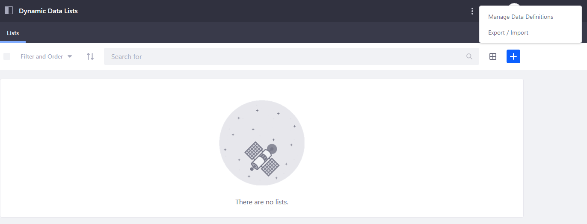

1. Click the _Add_ () button to create a new data definition.
1. Enter a name, optional description, and parent data definition if you have one.
1. Scroll down and add a *Geolocation* field to the data definition, along with any other fields you wish to add.

    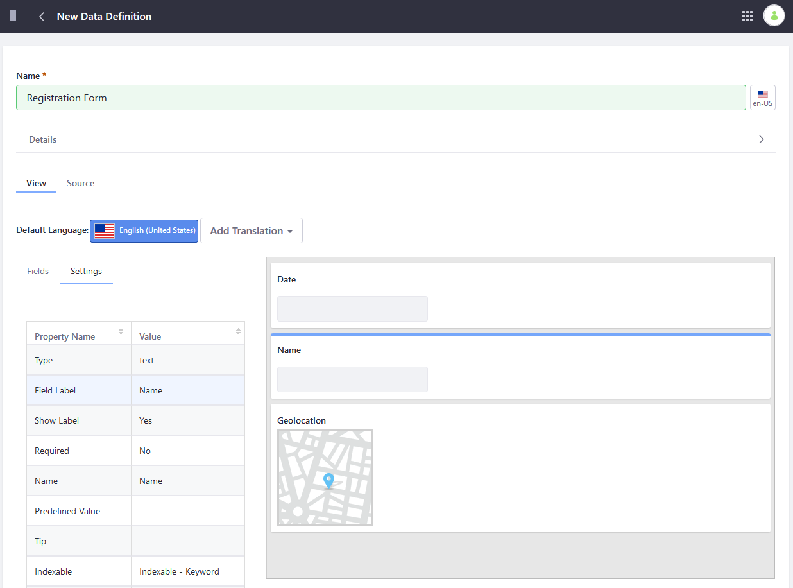

1. Click _Save_ when finished.

Now that the Data Definition has been created, create a new Data List using this definition.

### Creating a New Data List

To create a data list that uses the new data definition:

1. Navigate back to the Dynamic Data Lists screen and click the _Add_ button () to create a new list.
1. Enter a name and optional description.
1. Click the _Select_ button and choose the newly created data definition.
1. Select whether this form has a Workflow.

    

1. Click _Save_ when finished.

Now that your data list is complete, you can use the [Data List Display portlet](../../process-automation/forms/dynamic-data-lists/getting-started-with-dynamic-data-lists.md) to display it.

## Geolocating Documents and Media

To enable geolocation in Documents and Media, you must first create a [Document Type](../documents-and-media/uploading-and-managing/managing-metadata/defining-document-types.md) that includes geolocation metadata. Alternately, you can add geolocation metadata as part of a [Metadata Set](../documents-and-media/uploading-and-managing/managing-metadata/using-metadata-sets.md). Once you have created that Metadata Set, it can be included as part of a Document Type.

### Adding Geolocation in a Metadata Set

Follow the steps below:

1. Open the Product Menu and navigate to your site.
1. Click _Content & Data_ &rarr; _Documents and Media_.
1. Click the _Metadata Sets_ tab.

    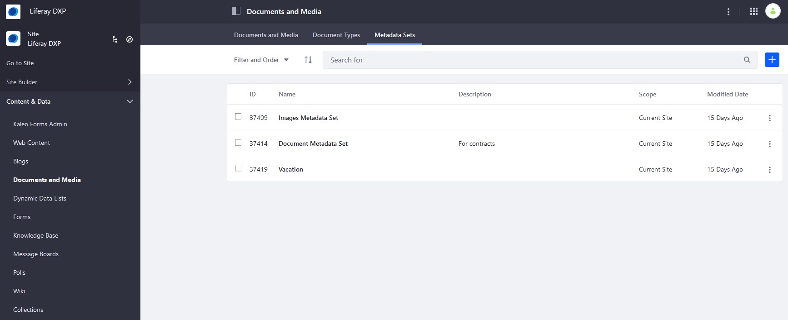

1. Click the _Add_ () button and enter a name, optional description, and Parent Metadata Set if you have one.
1. Scroll down and add a *Geolocation* field, along with any additional fields you wish to have.

    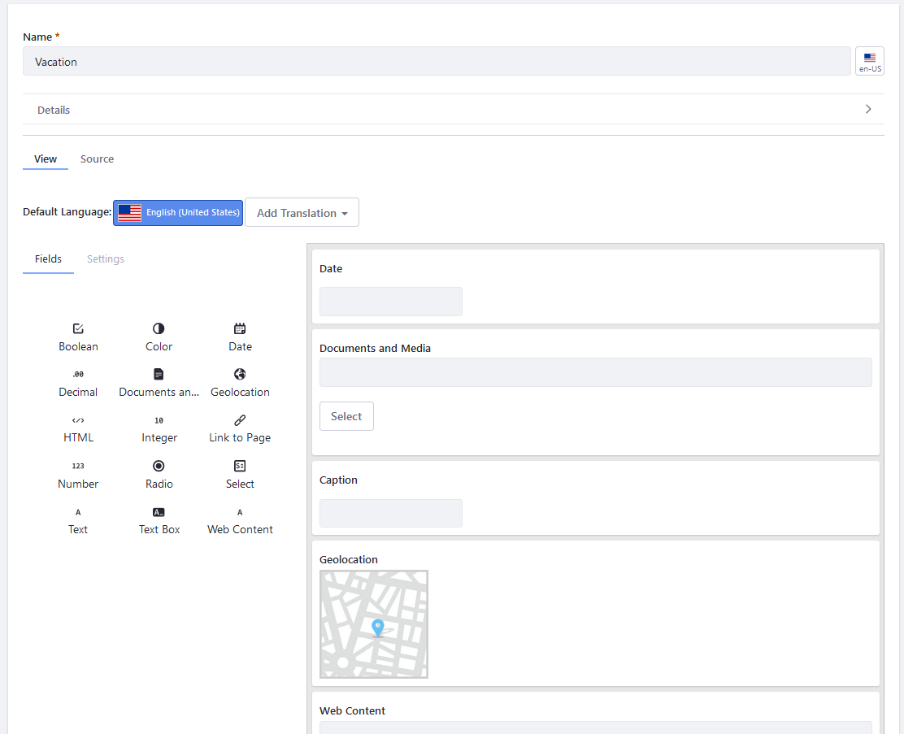

1. Click _Save_ when finished.

### Adding a Geolocation Field in a Document Type

Follow the steps below:

1. Open the Product Menu and navigate to your site.
1. Click _Content & Data_ &rarr; _Documents and Media_.
1. Click the _Document Types_ tab.

    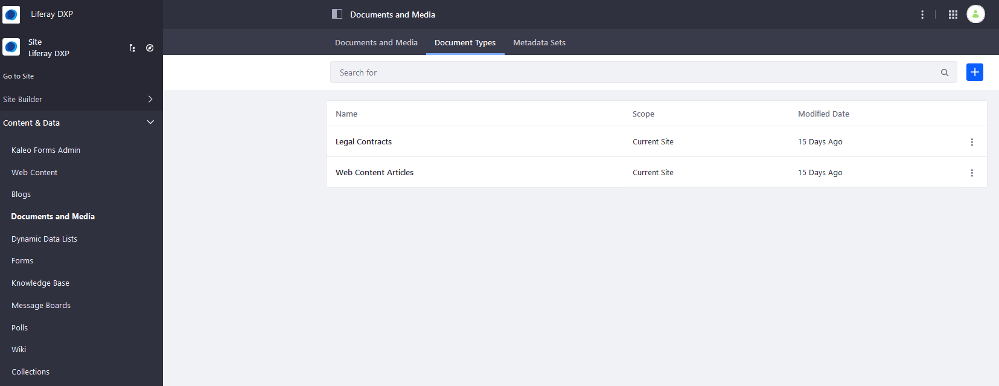

1. Click the _Add_ button () and enter a name and optional description.
1. Scroll down to the Main Metadata Fields heading and add a _Geolocation_ field along with any other fields you wish to have for the document type.

    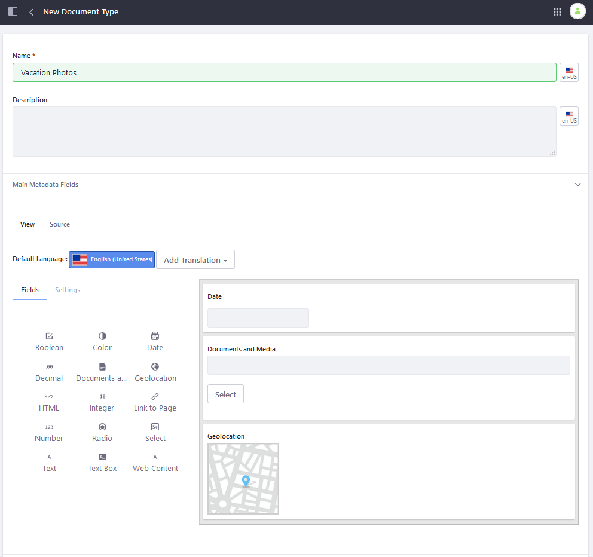

1. If you are using a Metadata Set, scroll down to the Additional Metadata Fields heading, click the _Select Metadata Set_ button.
1. Choose your Metadata Set with the geolocation metadata.
1. Click  *Save*.

### Adding Geolocation to a Document

Follow the steps below:

1. Navigate to the _Documents and Media_ tab.

    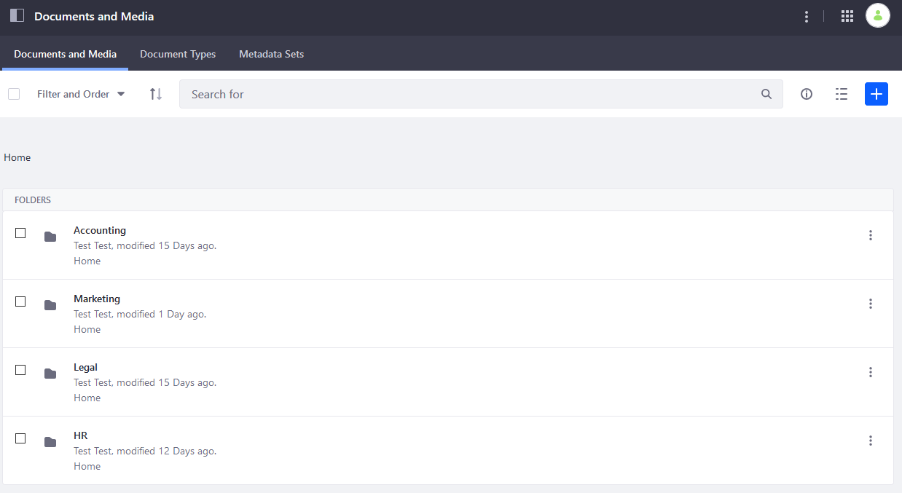

1. Click the _Add_ button () and select your newly created document type.

   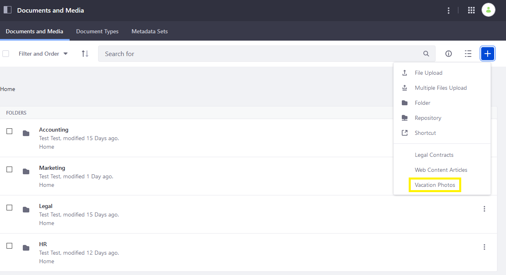

1. Fill out the information for the document and your location is automatically obtained from the browser and added to your document.

    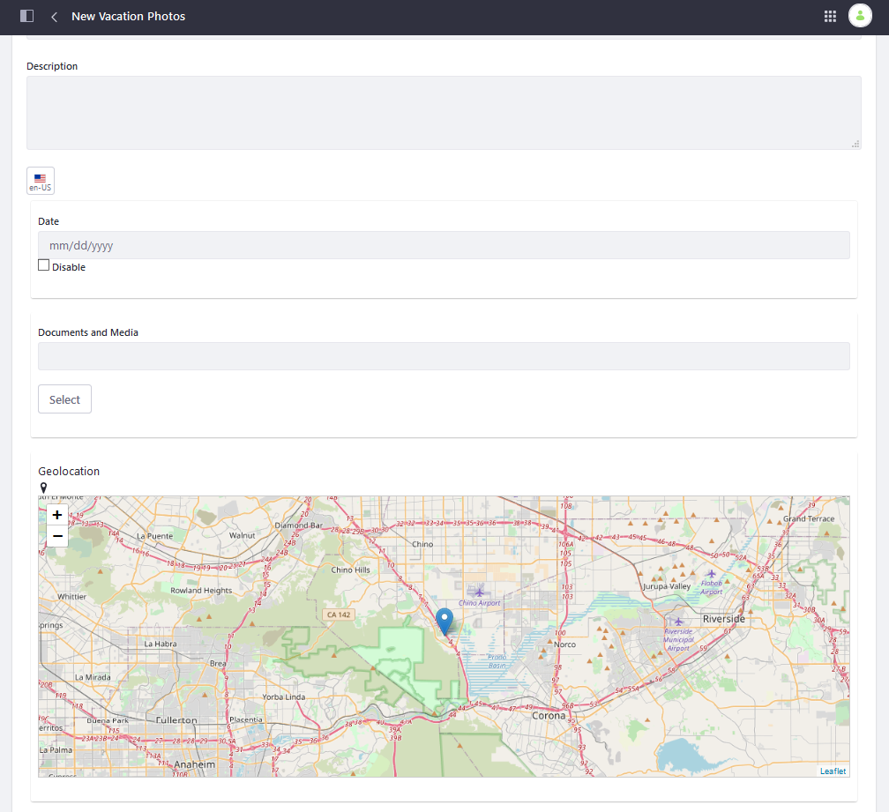

1. Click _Publish_ when finished.

Once your assets are geolocation enabled, you can use the [Asset Publisher](../../site-building/displaying-content/using-the-asset-publisher-widget/displaying-assets-intro.md) to display the location of the assets on a map, using the map display template. Check out the [Configuring Display Settings](../../site-building/displaying-content/using-the-asset-publisher-widget/configuring-display-settings.md) section to learn more.

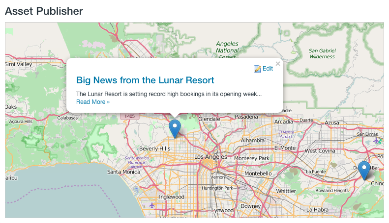

## Additional Information

* [Configuring Asset Auto Tagging](./auto-tagging/configuring-asset-auto-tagging.md)
* [Tagging Content and Managing Tags](./tagging-content-and-managing-tags.md)
* [Defining Document Types](../documents-and-media/uploading-and-managing/managing-metadata/defining-document-types.md)
* [Using Metadata Sets](../documents-and-media/uploading-and-managing/managing-metadata/using-metadata-sets.md)
