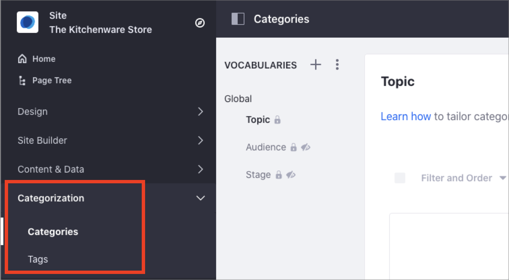
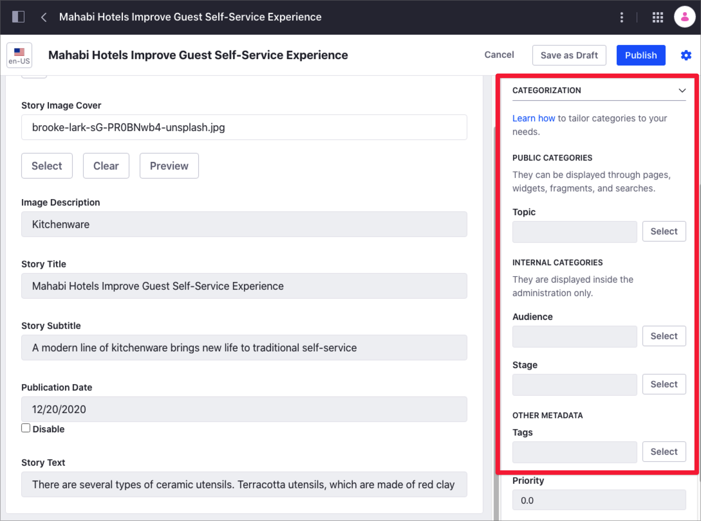
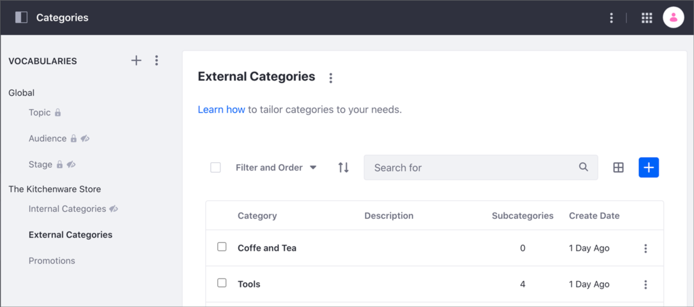
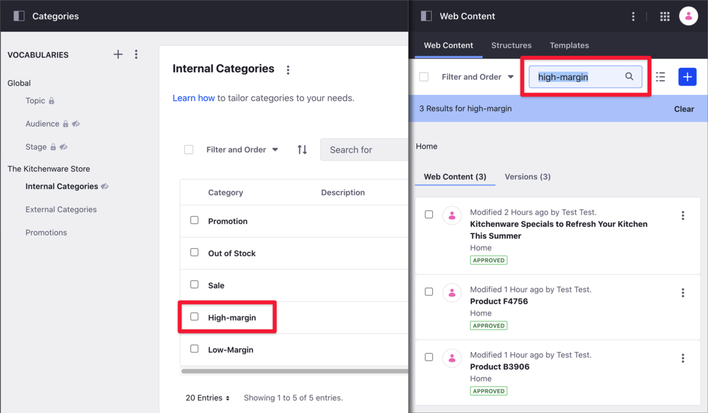
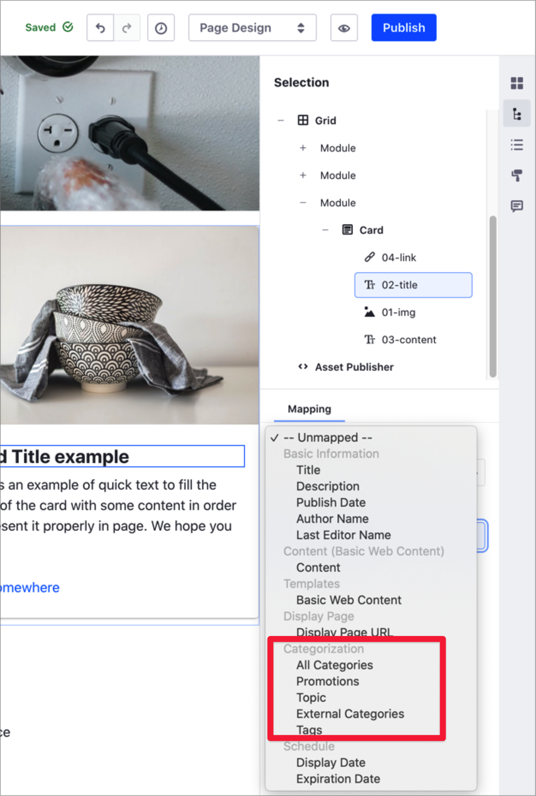

# Organizing Content with Categories and Tags

Categories and Tags are two essential tools for helping users find content through search or navigation.

Using Categories, you can group similar assets and organize your content. For example, you can create a _Success Stories_ Category and group all customer success articles website under this Category. You can also create a hierarchy of Categories. For example, the Success Stories categories can have Finance and Healthcare Subcategories. To start using Categories, see [Defining Categories and Vocabularies for Content](./defining-categories-and-vocabularies-for-content.md).

You can group Categories using Vocabularies, which can be either internal or public. The Marketing department may want to use Categories based on different customer segments, while the Human Resources department may want to use Categories based on the company organization. For more information, see [Vocabulary Visibility](#vocabulary-visibility). Liferay DXP includes [built-in Vocabularies](#default-vocabularies) that you can use to audit your content in the [Content Dashboard](../content-dashboard/about-the-content-dashboard.md).

Tags are keywords for organizing your assets. Tags tell visitors of your website what the content is about, so they can find relevant information through search or navigation. For example, a Kitchenware Store might have different tags describing the store items, like _glass_, _clay_, or _dishwasher-safe_. Using these Tags in your content, visitors interested in clay kitchenware can quickly find relevant articles. Tags are not hierarchical, so you cannot group tags inside other tags. To start using Tags, see [Tagging Content and Managing Tags](./tagging-content-and-managing-tags.md).

The following table summarizes the main differences between Categories and Tags:

| Categories | Tags |
| --- | --- |
| Managed by administrators | Managed by administrators and non-administrators |
| Grouped in Vocabularies | Cannot be grouped |
| Hierarchical categorization | Non-hierarchical categorization |
| Global site Categories are instance-wide | Particular to each site |

You can find Categories and Tags under the Categorization panel in the Site Navigation menu. From here, you can create new Categories and Tags or customize the existing ones. You create Tags and Categories at the Site level.

```note::
   Only Site administrators can manage Categories and Tags in the Categorization panel.
```



In addition to the Categorization panel, you can tag or categorize an asset at creation time or edit an existing asset using the Categorization section. Each Vocabulary is represented as a separate entry.



## Vocabulary Visibility

> Available: Liferay 7.3+.

When you [create a new Vocabulary](./defining-categories-and-vocabularies-for-content.md#defining-vocabularies), you define its visibility and the visibility of the Categories included:

- *Public Visibility*: Visitors can use Public categories to find the content through search or navigation. Public Categories are exposed to everyone.
- *Internal Visibility*: You can use Internal categories to organize and search your content internally. Internal Categories are only exposed to Site members.

    In the Categories panel, Internal Vocabularies show a *Hidden* icon () next to their name. Vocabularies with a *Locker* icon () can only be edited at the Global site.

    

The visibility option is useful when you need to separate internal and external categorization. For example, your Marketing department may want to create Internal categories for organizing web content according to a specific target audience or criteria (for example, "USA visitors", or "High-Margin"), without exposing these categories to consumers. At the same time, you may want to use public categories to provide relevant search results.

The following video shows and overview of the Vocabularies visibility and the built-in [Global Vocabularies](#default-vocabularies):

<video width="100%" height="100%" controls>
    <source src="./organizing-content-with-categories-and-tags/images/10.mp4" type="video/mp4">
</video>

Before configuring your vocabulary's visibility, consider these things:

- Existing vocabularies from upgraded Liferay installations default to public visibility.
- Content editors and administrators can use public or internal categories for asset categorization and search.

    

- Website visitors can use and discover only public categories in Pages, Widgets, Fragments, and Searches.
- Search widgets in Content Pages don't consider or expose internal vocabularies.
- Custom widgets using a Category selector only show public categories by default.
- When you map existing content using Fragments, only internal vocabularies are available.
- If you select All Categories when mapping existing content, only public categories are displayed.

    

## Default Vocabularies

> Available: Liferay 7.3+.

In addition to the *Topic* Vocabulary from previous Liferay releases, there are two new vocabularies: *Audience* and *Stage*. These vocabularies are industry standards that Content Authors, Content Strategists, and Marketers can use in combination with the [Content Dashboard](../content-dashboard/about-the-content-dashboard.md) to address common content strategy topics:

- Determine content areas with enough content as well as content gaps
- Audit of existing content
- Discover trends or insights to create or adapt the content strategy

You edit the Audience and Stage vocabularies in the Global Site. You can use these vocabularies with Web Content Articles only.


```note::
   In previous Liferay versions, the *Topic* vocabulary exists on each Site. For 7.3+, the *Topic* vocabulary exists now at the Global Site.
```

## Related Information

- [Defining Categories and Vocabularies for Content](./defining-categories-and-vocabularies-for-content.md)
- [Tagging Content and Managing Tags](./tagging-content-and-managing-tags.md)
- [Content Dashboard](../content-dashboard/about-the-content-dashboard.md)
