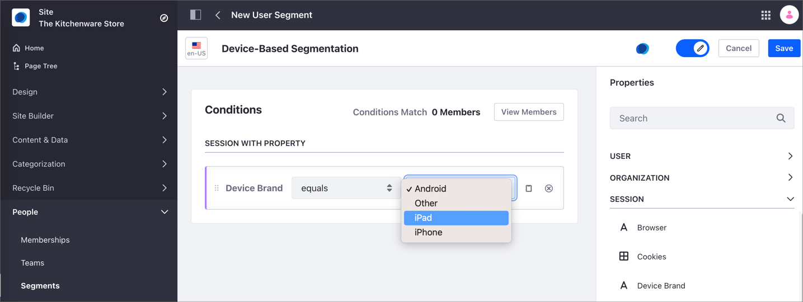
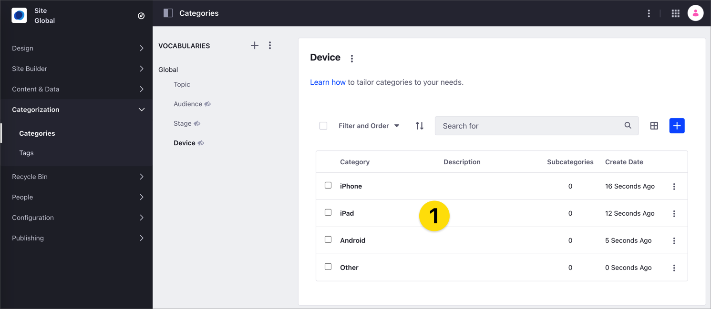
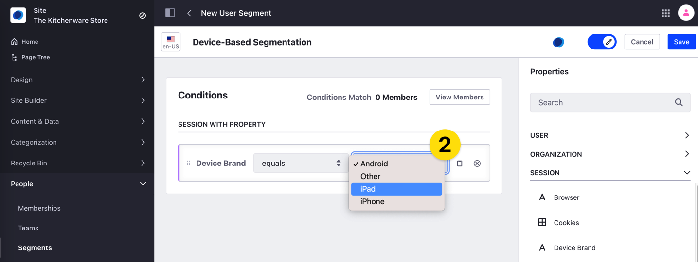
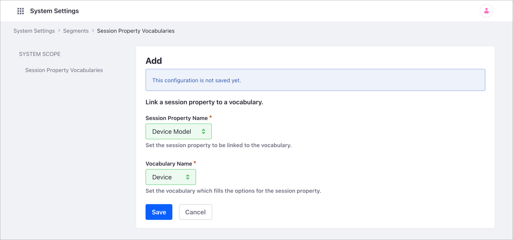
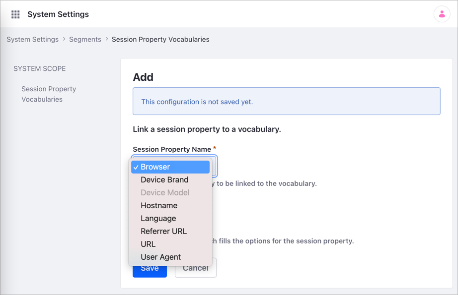
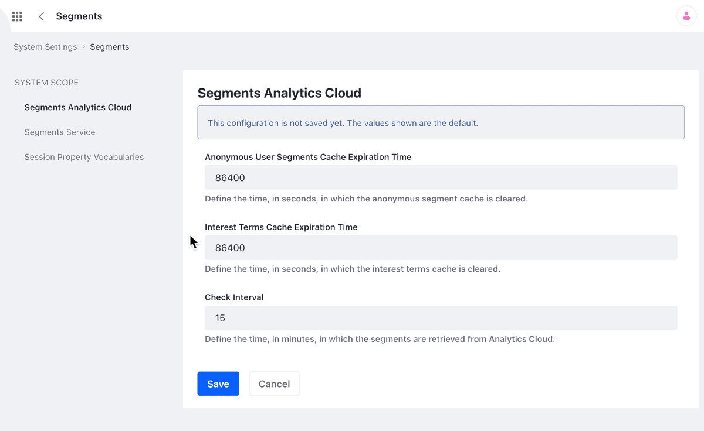
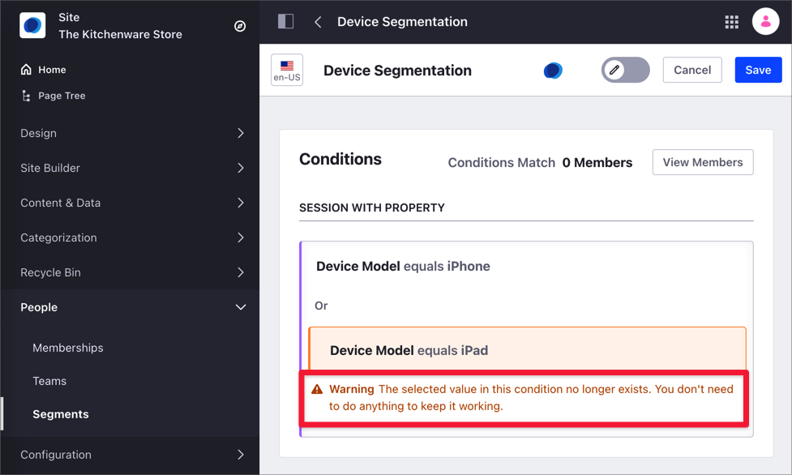

# Session Property Vocabularies

With a *Session Property Vocabulary*, you can create [session-based Segment properties](../../site-building/personalizing-site-experience/segmentation/segments-editor-ui-reference.md#session-properties) using predefined values. This option is useful when you don't want the Segment editor to enter the properties' values manually while creating a new Segment; instead, you want the user to select them from a list of predefined values. Session Property Vocabularies facilitate the task of defining Segments and eliminate manual entry errors.

For example, your Marketing team may use a device's brand information to target different content to your website visitors, like the promotion of a new app for Apple devices. To facilitate the process of the Marketing team, you can create a Session Property Vocabulary that includes the different device brands and link this Vocabulary to the [user Segment](../../site-building/personalizing-site-experience/segmentation/creating-and-managing-user-segments.md). This way, when the Marketing team makes a Segment using the "Device Brand" [session property](../../site-building/personalizing-site-experience/segmentation/segments-editor-ui-reference.md#session-properties), they don't need to type the different Device Brand options. The list of possible options is now predefined for them.



You work with Session Property Vocabularies in three steps:

1. [Configure the Vocabulary for the session-based Segment](#configure-the-vocabulary-for-the-session-based-segment).
1. [Define the Session Property Vocabulary](#defining-the-session-property-vocabulary).
1. [Create the session-based Segment](#creating-the-session-based-segment).

## Configuring the Vocabulary for the Session-Based Segment

The categories you define on this Vocabulary (1) are the ones you can choose when you create a Segment using the [session properties](../../site-building/personalizing-site-experience/segmentation/segments-editor-ui-reference.md#session-properties) (2).





You can create a new global Vocabulary or use an existing one. To create a new Vocabulary or update the Categories on an existing one, see [Defining Categories and Vocabularies for Content](./defining-categories-and-vocabularies-for-content.md). You can use vocabularies with [Public or Internal Visibility](./organizing-content-with-categories-and-tags.md#vocabulary-visibility). Session Property Vocabularies only work with global vocabularies.

```note::
   You can only create and edit global vocabularies in the global Site.
```

## Defining the Session Property Vocabulary

After [configuring the Vocabulary for the session-based Segment](#configuring-the-vocabulary-for-the-session-based-segment), you must link the Vocabulary to one of the available session properties in a new Session Property Vocabulary.



1. Click the global Menu and click the *Control Panel* tab.
1. Under the Configuration section, click *System Settings*.
1. In the Content and Data section, click *Segments*.
1. Click *Session Property Vocabularies*.
1. Click *Add* to create a new Session Property Vocabulary.
1. Select the property in the Selection Property drop-down menu.

    

    ```note::
       You cannot select properties that belong to another Session Property Vocabulary. These properties are grayed-out and unavailable.
    ```

1. Select the _Vocabulary_ in the Vocabulary Name drop-down menu.
1. Click *Save*.



## Creating the Session-Based Segment

After [configuring the Vocabulary](#configuring-the-vocabulary-for-the-session-based-segment) and [defining the Session Property Vocabulary](#defining-the-session-property-vocabulary), you can create the Segment. For information on creating segments, see [Creating and Managing User Segments](../../site-building/personalizing-site-experience/segmentation/creating-and-managing-user-segments.md#creating-user-segments).

When you define the Segment's conditions and you use one of the session properties linked to the global Vocabulary, the conditions for the session property are now predefined and you can select them from a drop-down menu. This drop-down menu corresponds the list of categories for [the Vocabulary you define](#defining-the-session-property-vocabulary) in the Session Property Vocabulary.

```important::
   When you delete one of the categories or the Vocabulary that is linked to a User Segment in a Session Property Vocabulary, the Segment keeps working based on your definiton. Liferay alerts you of this situation in the Segment editor.
```



## Related Information

- [Defining Categories and Vocabularies for Content](./defining-categories-and-vocabularies-for-content.md)
- [Creating and Managing User Segments](../../site-building/personalizing-site-experience/segmentation/creating-and-managing-user-segments.md#creating-user-segments)
- [Segments Editor UI Reference](../../site-building/personalizing-site-experience/segmentation/segments-editor-ui-reference.md)
