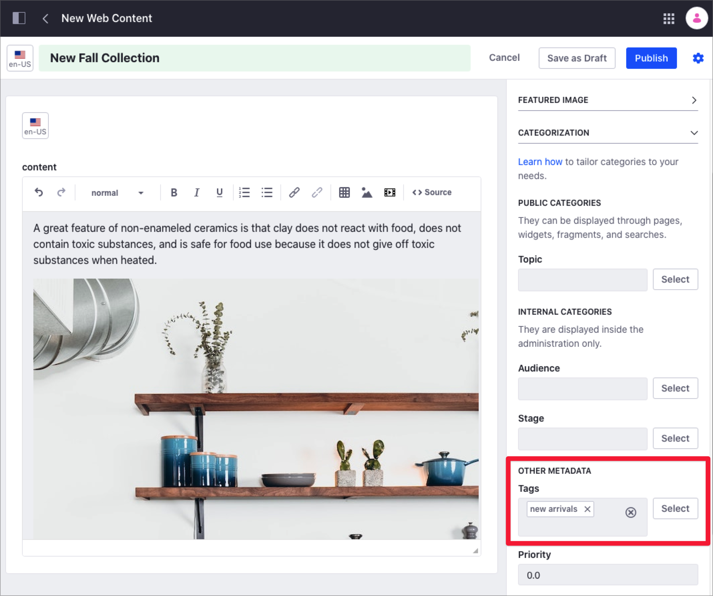
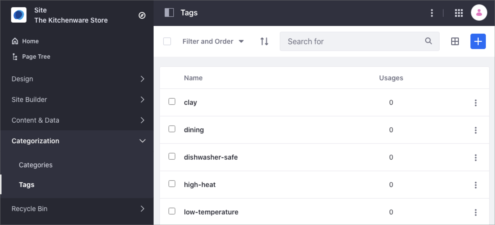
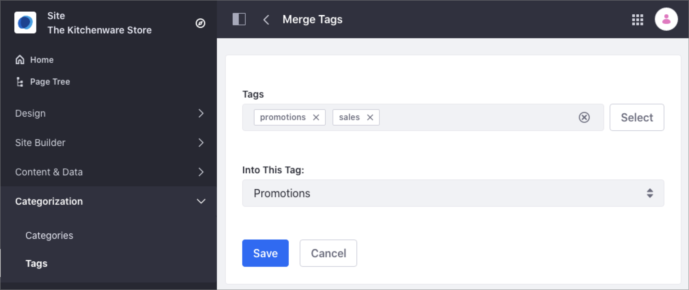

# Tagging Content and Managing Tags

Tags are keywords you can use to organize your assets and describe specific information about its content. Tags tell website visitors what the content is about so they can find relevant information through search or navigation. For more information about Tags in Liferay DXP and the different usage scenarios, see [Organizing Content with Categories and Tags](./organizing-content-with-categories-and-tags.md).

## Tagging Content

Use the Categorization section in the sidebar panel to tag assets as you create new content.

1. Create or edit the content you want to tag.
1. In the sidebar panel, select the *Properties* tab.
1. Under the Categorization section and Other Metadata subsection, click *Select* next to *Tags*.

    

1. Select the tags you want to use from the list of existing tags and click *Done*.
1. If you want to create new tags for the content, type the new tag in the *Tags* field and press Enter.

## Managing Tags

You can manage Tags under the Categorization panel in the Site Navigation menu. From here, you can create new Tags or customize the existing ones.



```note::
   Only Site administrators can manage Tags in the Tags panel.
```

1. Open the Product Menu and under the Site Menu, go to *Categorization* &rarr; *Tags*.
1. To create a new tag, click *Add Tag* ().
1. Type your new tag and click *Save*.

    ```note::
       Tags are all-lowercase.
    ```

1. To edit an existing tag, click the *Actions* () menu next to the tag's name and select *Edit*.
1. If you want to merge one or more tags,

    1. Check the box next to the tags you want to merge and click *Merge* ().
    1. Select the Tag where you want to merge in the *Into This Tag* dropdown menu.
    1. Click *Save*.

       

## Related Information

- [Organizing Content with Categories and Tags](./organizing-content-with-categories-and-tags.md)
- [Defining Categories and Vocabularies for Content](./defining-categories-and-vocabularies-for-content.md)
