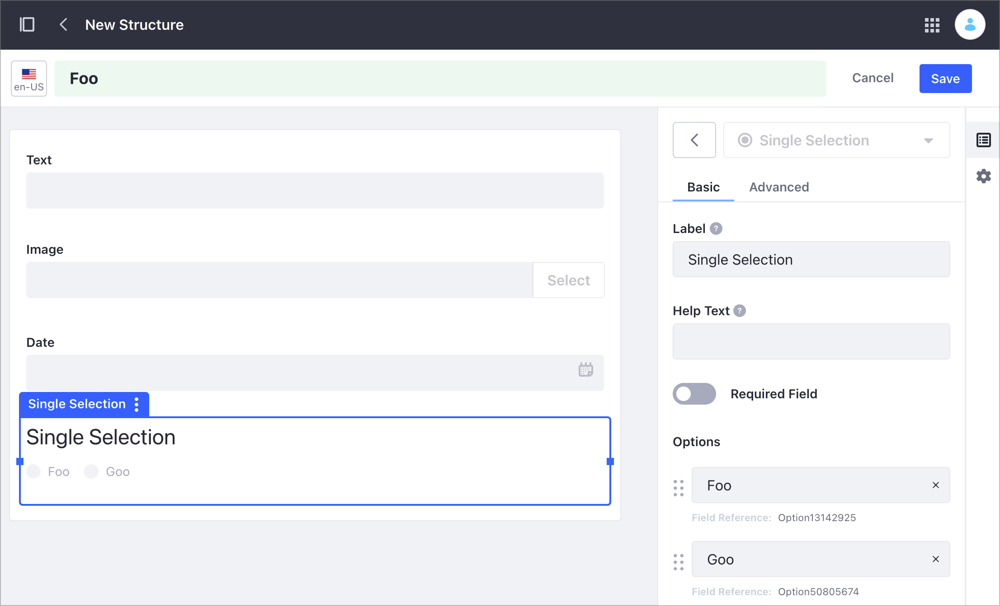
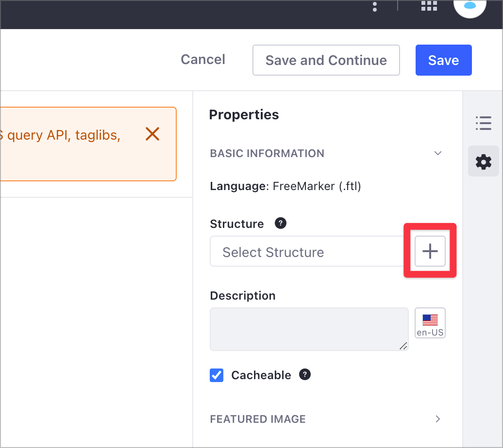
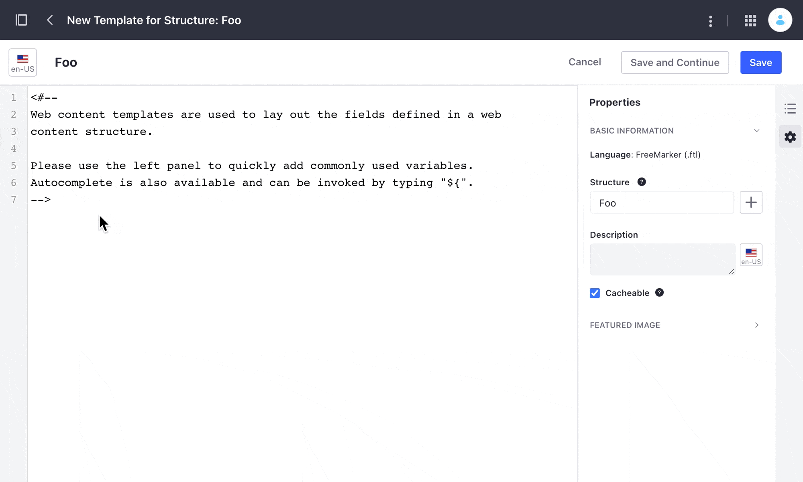
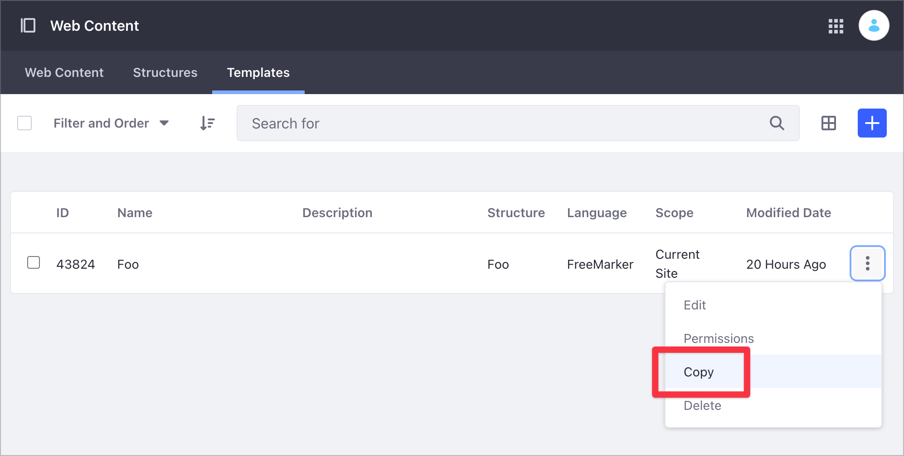
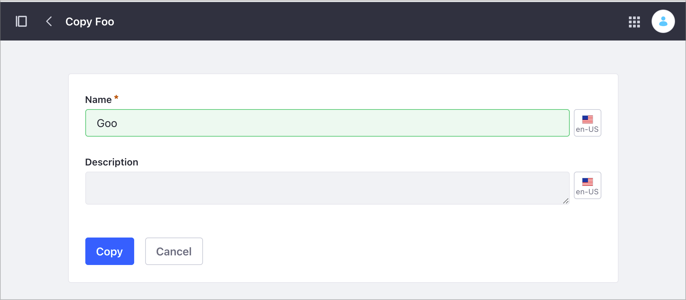
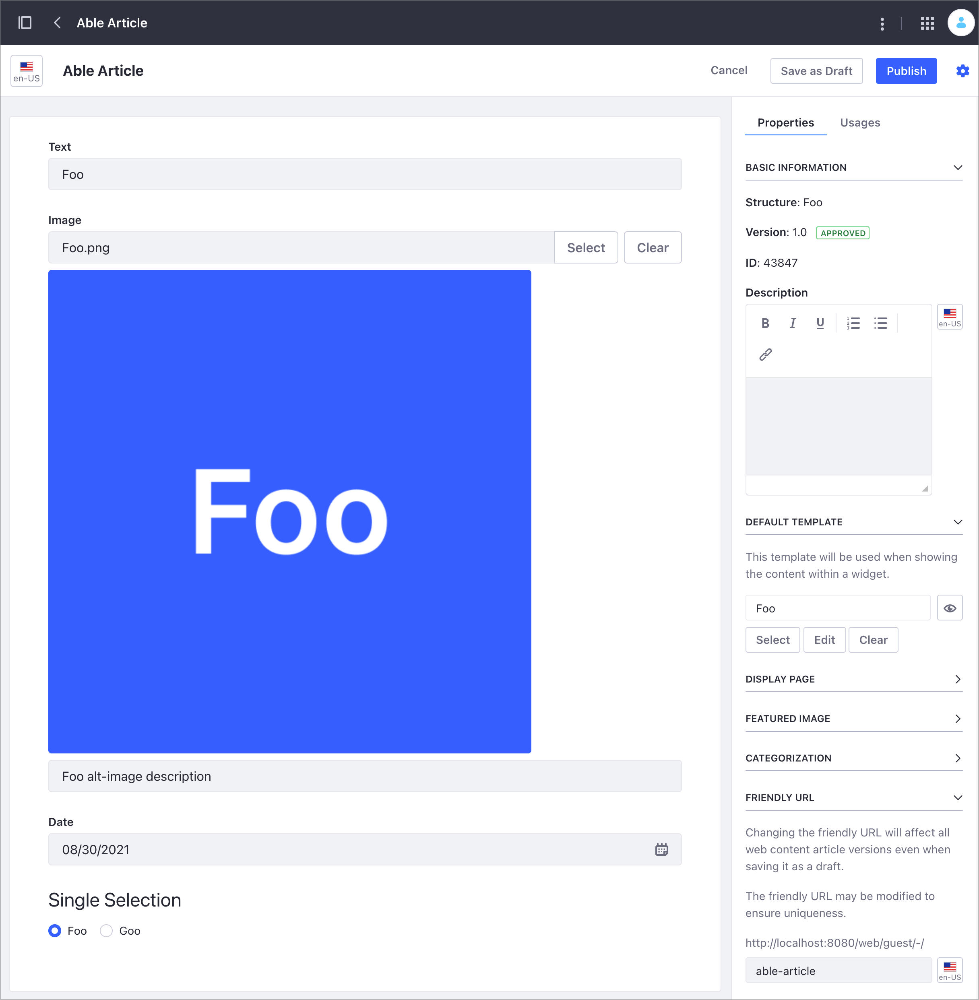

# Advanced Web Content API

Using the Liferay DXP REST services, you can create and manage your Site's structured content. Structured content is [Web Content](../web-content-articles/adding-a-basic-web-content-article.md) that uses a Web Content Structure. A Structure defines the information, such as author(s), a summary, and the content included in a Web Content article. Structures ensure that the content includes all the required information. For more information on Structures, read [Understanding Web Content Structures](../web-content-structures/understanding-web-content-structures.md).

Here, you'll use a pre-built Liferay DXP Docker image with several [cURL](https://curl.haxx.se/) code samples to learn about Structures and structured content. For an overview of using the REST API in Liferay DXP, see [Consuming REST Services](../../../headless-delivery/consuming-apis/consuming-rest-services.md).

```{note}
For an introduction to the Web Content API, see [Web Content API Basics](./web-content-api-basics.md).
```

## Setting Up Your Environment

1. Start the Liferay DXP Docker image:

    ```bash
    docker run -it -m 8g -p 8080:8080 [$LIFERAY_LEARN_DXP_DOCKER_IMAGE$]
    ```

   ```{important}
   Use at least 8 GB of memory for the Liferay DXP Docker image.
   ```

1. After Liferay DXP initializes, open your browser at `http://localhost:8080`.

1. Sign in using the default Liferay DXP Docker image credentials:

   - User Name: `test@liferay.com`
   - Password: `test`

   ```{note}
   - The cURL scripts here use these credentials by default. If you change the credentials in your Docker image, replace the user name and password before running the scripts.
   - These scripts use basic authentication and are designed for testing. Do not use basic authentication in a production Liferay DXP environment.
   ```

1. Download and unzip the [sample project](https://learn.liferay.com/dxp/latest/en/content-authoring-and-management/web-content/developer-guide/liferay-m7b2.zip):

    ```bash
    curl https://learn.liferay.com/dxp/latest/en/content-authoring-and-management/web-content/developer-guide/liferay-m7b2.zip -O
    ```

    ```bash
    unzip liferay-m7b2.zip
    ```

### Identify the Site Id

1. Open the Site menu () and go to *Configuration* &rarr; *Site Settings*.
1. Under the Platform section, click *Site Configuration*. For Liferay DXP versions 7.3 and earlier, click the *General* tab.
1. Find the Site identifier under Site Id.

   

### Adding the Images to Liferay DXP

Here, you'll work with a Web Content article containing different content fields, including images. To add these images for the sample Web Content article, follow these steps:

1. Open the Site menu () and go to *Content & Data* &rarr; *Documents and Media*.
1. Click the *Add* button () and select *Multiple Files Upload*.
1. Drag and drop the `foo.png`, `bar.png`, and `goo.png` images from the [sample project folder](https://learn.liferay.com/dxp/latest/en/content-authoring-and-management/web-content/developer-guide/liferay-m7b2.zip) onto the drop area.
1. Click *Publish*.

Alternatively, you can use the `Document_POST_ToSite.sh` script to post each image separately using the REST API `Document` service.

```bash
curl \
    -F "file=@${1}" \
    -H "Content-Type: multipart/form-data" \
    -X POST \
    "http://localhost:8080/o/headless-delivery/v1.0/sites/${2}/documents" \
    -u "test@liferay.com:test"
```

This example posts the `foo.png` image, using the relative image file path and Site id as parameters:

| Method | Service | Endpoint |
| --- | --- | --- |
| GET | `Document` | `/v1.0/sites/${2}/documents` |

```bash
./Document_POST_ImageToSite.sh "../images/foo.png" 20125
```

| Parameter # | Description |
| --- | --- |
| $1 | Relative path to file |
| $2 | `siteId` |

The JSON output includes the image identifier in the `id` field:

```json
{
  ...
  "encodingFormat" : "image/png",
  "externalReferenceCode" : "44339",
  "fileExtension" : "png",
  "id" : 44339,
  ...
  "title" : "foo.png"
}
```

For more information on working with Documents using the REST API, see [Document API Basics](../../documents-and-media/developer-guide/document-api-basics.md).

### Create the Sample Structure

```{note}
You cannot create a Web Content Structure programmatically using the REST API.
```

1. Open the Site menu () and go to *Content & Data* &rarr; *Web Content*.
1. Select the *Structures* tab and click the *Add* button ().
1. Create a new Web Content Structure with the following information:

    - Name: `Foo`
    - Fields (in this order): `Text`, `Image`, `Date`, `Single Selection`

1. Use these values for the Single Selection field:

   - First option value: `Foo`
   - Second option value: `Goo`

   

1. Click each Structure field and update its Field Reference value (see table below). You can find the Field Reference values on the sidebar, under the Advanced section.

1. Click *Save*.

  | Field | New Field Reference value |
  |:--- |:--- |
  | Text | `TextReference` |
  | Image | `ImageReference` |
  | Date | `DateReference` |
  | Selection | `SingleSelectionReference` |

  

For more information, see [Creating Structures](../web-content-structures/creating-structures.md).

### Create the Sample Templates

```{note}
You cannot create a Web Content Template programmatically using the REST API.
```

Create a Web Content Template including the Structure's `image` field:

1. Open the Site menu () and go to *Content & Data* &rarr; *Web Content*.
1. Select the *Templates* tab and click the *Add* button ().
1. Type _Foo_ as your Template name.
1. From the Properties side panel, click the *Add* button () next to the Structure field.

   

1. Select the _Foo_ Web Content Structure from the [previous section](#create-the-structure-sample).
1. Delete the default `<#-- -->` block comment included in the FreeMarker editor.
1. On the sidebar, click *Elements* ().
1. Under the Fields group, click the *Text*, *Image*, *Date*, and *Single Selection* fields to add them to your Template. Ensure that each field starts with a new line in the FreeMarker editor.

   

1. Click *Save*.

Create a second Web Content Template without the Structure's `image` field:

1. Under the Templates tab, click the *Actions* button () and select *Copy*.

   

1. Update the Template's name to _Goo_ and click *Copy*.

   

1. Under the Templates tab, click the new _Goo_ template.
1. In the Template editor, remove the image information `<#if (ImageReference.getData())></#if>` from the FreeMarker script.

   

1. Click *Save*.

 For more information, see [Creating Web Content Templates](../web-content-templates/creating-web-content-templates.md).

## Get the Web Content Structure Id

To return all existing Site Structures, use the `ContentStructures_GET_FromSite.sh` script. This script uses the `ContentStructure` service with a `GET` HTTP method and the [Site Id](#identify-the-site-id) parameter.

| Method | Service | Endpoint |
| --- | --- | --- |
| GET | `ContentStructure` | `/v1.0/sites/${1}/content-structures` |

```bash
./ContentStructures_GET_FromSite.sh 20125
```

| Parameter # | Description |
| --- | --- |
| $1 | `siteId` |

This code shows the script's JSON output, where you can identify the Web Content Structure `id` (`"id" : 43563`) and `name` (`"name" : "Foo"`). The `contentStructureFields` section describes the Structure fields. This Structure contains four different fields named `TextReference`, `ImageReference`, `DateReference`, and `SingleSelectionReference`.

```json
{
  "actions" : { },
  "facets" : [ ],
  "items" : [ {
    "availableLanguages" : [ "en-US" ],
    "contentStructureFields" : [ {
      "dataType" : "string",
      "inputControl" : "text",
      "label" : "Text",
      "localizable" : true,
      "multiple" : false,
      "name" : "TextReference",
      "nestedContentStructureFields" : [ ],
      "options" : [ ],
      "predefinedValue" : "",
      "repeatable" : false,
      "required" : false,
      "showLabel" : true
    }, {
      "dataType" : "image",
      "label" : "Image",
      "localizable" : true,
      "multiple" : false,
      "name" : "ImageReference",
      "nestedContentStructureFields" : [ ],
      "options" : [ ],
      "predefinedValue" : "{}",
      "repeatable" : false,
      "required" : false,
      "showLabel" : true
    }, {
      "dataType" : "date",
      "label" : "Date",
      "localizable" : true,
      "multiple" : false,
      "name" : "DateReference",
      "nestedContentStructureFields" : [ ],
      "options" : [ ],
      "predefinedValue" : "",
      "repeatable" : false,
      "required" : false,
      "showLabel" : true
    }, {
      "dataType" : "string",
      "inputControl" : "radio",
      "label" : "Single Selection",
      "localizable" : true,
      "multiple" : false,
      "name" : "SingleSelectionReference",
      "nestedContentStructureFields" : [ ],
      "options" : [ {
        "label" : "Foo",
        "value" : "Option13142925"
      }, {
        "label" : "Goo",
        "value" : "Option50805674"
      } ],
      "predefinedValue" : "[]",
      "repeatable" : false,
      "required" : false,
      "showLabel" : true
    } ],
    "creator" : {
      "additionalName" : "",
      "contentType" : "UserAccount",
      "familyName" : "Bowman",
      "givenName" : "David",
      "id" : 20129,
      "name" : "David Bowman"
    },
    "dateCreated" : "2021-08-25T07:52:46Z",
    "dateModified" : "2021-08-25T08:01:58Z",
    "description" : "",
    "id" : 43563,
    "name" : "Foo",
    "siteId" : 20125
  } ],
  "lastPage" : 1,
  "page" : 1,
  "pageSize" : 20,
  "totalCount" : 1
}
```

## Get the Images Ids

To obtain the Ids of the images you [posted before](#adding-the-images-to-liferay-dxp), use the `Documents_GET_FromSite.sh` script. This script uses the `Document` service with a `GET` HTTP method and the [Site Id](#identify-the-site-id) parameter.

| Method | Service | Endpoint |
| --- | --- | --- |
| GET | `Document` | `/v1.0/sites/${1}/documents` |

```bash
./Documents_GET_FromSite.sh 20125
```

| Parameter # | Description |
| --- | --- |
| $1 | `siteId` |

## Get the Web Content Templates

Use the `ContentTemplates_GET_FromSite` script to obtain all the Site's Templates. This script uses the `ContentTemplate` service with a `GET` HTTP method and the [Site Id](#identify-the-site-id) parameter.

| Method | Service | Endpoint |
| --- | --- | --- |
| GET | `ContentTemplate` | `/v1.0/sites/${1}/content-templates` |

```bash
./ContentTemplates_GET_FromSite.sh 20125
```

| Parameter # | Description |
| --- | --- |
| $1 | `siteId` |

Below is the JSON output from the script. Notice this information:

- There are two different templates in this JSON output: `"name": "Foo"` and `"name": "Goo"`.
- The `contentStructureId` field indicates the Web Content Structure linked to the Template.
- `templateScript` includes the script in the language specified in `programmingLanguage`. In this example, FreeMarker is the language.
- The `templateScript` field in the `Foo` Template includes the image field, referenced in `<#if (ImageReference.getData())></#if>`. The `templateScript` field in the `Goo` Template doesn't include this reference.

```bash
{
  "actions" : {
    "get" : {
      "method" : "GET",
      "href" : "http://localhost:8080/o/headless-delivery/v1.0/sites/20125/content-templates"
    }
  },
  "facets" : [ ],
  "items" : [ {
    "actions" : {
      "get" : {
        "method" : "GET",
        "href" : "http://localhost:8080/o/headless-delivery/v1.0/sites/20125/content-templates/{contentTemplateId}"
      }
    },
    "availableLanguages" : [ "en-US" ],
    "contentStructureId" : 43563,
    "creator" : {
      "additionalName" : "",
      "contentType" : "UserAccount",
      "familyName" : "Bowman",
      "givenName" : "David",
      "id" : 20129,
      "name" : "David Bowman"
    },
    "dateCreated" : "2021-08-25T13:39:20Z",
    "dateModified" : "2021-08-25T13:39:20Z",
    "description" : "",
    "id" : "43823",
    "name" : "Foo",
    "programmingLanguage" : "ftl",
    "siteId" : 20125,
    "templateScript" : "<#if (TextReference.getData())??>\n\t${TextReference.getData()}\n</#if>\n<#if (ImageReference.getData())?? && ImageReference.getData() != \"\">\n\t\n</#if>\n<#assign DateReference_Data = getterUtil.getString(DateReference.getData())>\n\n<#if validator.isNotNull(DateReference_Data)>\n\t<#assign DateReference_DateObj = dateUtil.parseDate(\"yyyy-MM-dd\", DateReference_Data, locale)>\n\n\t${dateUtil.getDate(DateReference_DateObj, \"dd MMM yyyy - HH:mm:ss\", locale)}\n</#if>\n<#if (SingleSelectionReference.getData())??>\n\t${SingleSelectionReference.getData()}\n</#if>"
  }, {
    "actions" : {
      "get" : {
        "method" : "GET",
        "href" : "http://localhost:8080/o/headless-delivery/v1.0/sites/20125/content-templates/{contentTemplateId}"
      }
    },
    "availableLanguages" : [ "en-US" ],
    "contentStructureId" : 43563,
    "creator" : {
      "additionalName" : "",
      "contentType" : "UserAccount",
      "familyName" : "Bowman",
      "givenName" : "David",
      "id" : 20129,
      "name" : "David Bowman"
    },
    "dateCreated" : "2021-08-26T10:10:22Z",
    "dateModified" : "2021-08-26T14:08:53Z",
    "description" : "",
    "id" : "44177",
    "name" : "Goo",
    "programmingLanguage" : "ftl",
    "siteId" : 20125,
    "templateScript" : "<#if (TextReference.getData())??>\n\t${TextReference.getData()}\n</#if>\n<#assign DateReference_Data = getterUtil.getString(DateReference.getData())>\n\n<#if validator.isNotNull(DateReference_Data)>\n\t<#assign DateReference_DateObj = dateUtil.parseDate(\"yyyy-MM-dd\", DateReference_Data, locale)>\n\n\t${dateUtil.getDate(DateReference_DateObj, \"dd MMM yyyy - HH:mm:ss\", locale)}\n</#if>\n<#if (SingleSelectionReference.getData())??>\n\t${SingleSelectionReference.getData()}\n</#if>"
  } ],
  "lastPage" : 1,
  "page" : 1,
  "pageSize" : 20,
  "totalCount" : 2
}
```

### Get a Web Content Template by Id

The script [above](#getting-the-web-content-templates) gathers all the Site's Web Content Templates, but you can get information about a particular Template by referencing its Id. Use the `ContentTemplate_GET_ById.sh` cURL script for this purpose. This script uses the Site Id and Template Id parameters.

| Method | Service | Endpoint |
| --- | --- | --- |
| GET | `ContentTemplate` | `/v1.0/sites/${1}/content-templates/${2}` |

```bash
./ContentTemplate_GET_ById.sh 20125 43823
```

| Parameter # | Description |
| --- | --- |
| $1 | `siteId` |
| $2 | Template `id` |

## Post the Web Content Article

The `StructuredContent_POST_ToSite.sh` cURL script creates a new Web Content article using the `POST` HTTP method and the sample Structure you [created before](#create-the-sample-structure). The script uses the [Site Id](#identifying-the-site-id), Structure Id, and foo.png's [image Id](#getting-the-images-ids) as parameters.

| Method | Service | Endpoint |
| --- | --- | --- |
| PUT | `StructuredContent` | `/v1.0/sites/{siteId}/structured-contents` |

```bash
./StructuredContent_POST_ToSite.sh 20125 43563 43795
```

cURL script parameters:

| Parameter # | Description |
| --- | --- |
| $1 | `siteId` |
| $2 | `contentStructureId` |
| $3 | image `id` |

To find your new Web Content article in Liferay DXP, open the *Site Menu* () and go to *Content & Data* &rarr; *Web Content*.



Below is the JSON output from the script. The script posts

- A new Web Content article named `"title" : "Able"`
- Four `contentFields` values defining the article's body:
  - Text string in `TextReference`.
  - Image in `ImageReference`.
  - Date information in `DateReference`.
  - Radio button control in `SingleSelectionReference`.

```bash
{
  "actions" : {
    ...
  },
  "availableLanguages" : [ "en-US" ],
  "contentFields" : [ {
    "contentFieldValue" : {
      "data" : "This text describes Foo."
    },
    "dataType" : "string",
    "inputControl" : "text",
    "label" : "Text",
    "name" : "TextReference",
    "nestedContentFields" : [ ],
    "repeatable" : false
  }, {
    "contentFieldValue" : {
      "image" : {
        "contentType" : "Document",
        "contentUrl" : "/documents/20125/0/foo.png/50956e56-9571-8f73-ae6e-9fca20fe0e3a?t=1629897455431",
        "description" : "This text describes Foo's image.",
        "encodingFormat" : "image/png",
        "fileExtension" : "png",
        "id" : 43795,
        "sizeInBytes" : 6232,
        "title" : "Foo"
      }
    },
    "dataType" : "image",
    "label" : "Image",
    "name" : "ImageReference",
    "nestedContentFields" : [ ],
    "repeatable" : false
  }, {
    "contentFieldValue" : {
      "data" : "2021-08-30T00:00:00Z"
    },
    "dataType" : "date",
    "label" : "Date",
    "name" : "DateReference",
    "nestedContentFields" : [ ],
    "repeatable" : false
  }, {
    "contentFieldValue" : {
      "data" : "Foo"
    },
    "dataType" : "string",
    "inputControl" : "radio",
    "label" : "Single Selection",
    "name" : "SingleSelectionReference",
    "nestedContentFields" : [ ],
    "repeatable" : false
  } ],
  "contentStructureId" : 43563,
  "creator" : {
    "additionalName" : "",
    "contentType" : "UserAccount",
    "familyName" : "Bowman",
    "givenName" : "David",
    "id" : 20129,
    "name" : "David Bowman"
  },
  "customFields" : [ ],
  "dateCreated" : "2021-08-26T06:14:06Z",
  "dateModified" : "2021-08-26T06:14:06Z",
  "datePublished" : "2021-08-26T06:14:00Z",
  "description" : "",
  "externalReferenceCode" : "43847",
  "friendlyUrlPath" : "able",
  "id" : 43849,
  "key" : "43847",
  "keywords" : [ ],
  "numberOfComments" : 0,
  "relatedContents" : [ ],
  "renderedContents" : [ {
    "contentTemplateId" : "43823",
    "contentTemplateName" : "Foo",
    "markedAsDefault" : true,
    "renderedContentURL" : "http://localhost:8080/o/headless-delivery/v1.0/structured-contents/43849/rendered-content/43823"
  }, {
    "contentTemplateId" : "43868",
    "contentTemplateName" : "Goo",
    "markedAsDefault" : false,
    "renderedContentURL" : "http://localhost:8080/o/headless-delivery/v1.0/structured-contents/44060/rendered-content/43868"
  } ],
  "siteId" : 20125,
  "subscribed" : false,
  "taxonomyCategoryBriefs" : [ ],
  "title" : "Able",
  "uuid" : "01ace059-814a-132d-d46d-21737ef2ec53"
}
```

<!--
Note: PATCH option information will be included in a follow-up (see LPS-137932).

## Updating the Web Content Article
-->

## Get the Web Content Article Rendered with a Particular Template

A Web Content article is not linked to a particular Template. The Template defines how the Web Content renders, and you can use different Templates for the same Web Content. For more information, read [Understanding Web Content Structures](../web-content-structures/understanding-web-content-structures.md).

```{tip}
Because a Web Content article is not linked to a particular Template, you cannot specify a Template when you `POST` a new article (the HTTP `POST` method ignores the `renderedContents` section describing the Template.)
```

The script `./StructuredContentRendered_GET_ById.sh` renders the Web Content using the Web Content and Template of your choice. This script uses the `GET` HTTP method in the `StructuredContent` service.

| Method | Service | Endpoint |
| --- | --- | --- |
| PUT | `StructuredContent` | `/v1.0/structured-contents/${1}/rendered-content/${2}` |

```bash
./StructuredContentRendered_GET_ById.sh 43849 43868
```

Here is the script output using the Template with the `image` field:

```html
Foo<picture data-fileentryid="43795"><source media="(max-width:300px)" srcset="http://localhost:8080/o/adaptive-media/image/43795/Thumbnail-300x300/foo.png?t=1629897455431, /o/adaptive-media/image/43795/Preview-1000x0/foo.png?t=1629897455431 2x" /><source media="(max-width:600px) and (min-width:300px)" srcset="http://localhost:8080/o/adaptive-media/image/43795/Preview-1000x0/foo.png?t=1629897455431" /></picture>30 Aug 2021 - 00:00:00Option1314292
```

If you specify the Web Content Template without the `image` field instead, the `<picture></picture>` information doesn't render in the output. Here is the script output using the Template without the `image` field:

```bash
./StructuredContentRendered_GET_ById.sh 43849 43823 
```

```html
Foo30 Aug 2021 - 00:00:00Option13142925
```

cURL scripts parameters:

| Parameter # | Description |
| --- | --- |
| $1 | Structured Content `id` |
| $2 | `contentTemplateId` |

## Put the Web Content Article

Use the `PUT` HTTP method with the `StructuredContent` service to replace the original Web Content information. The `StructuredContent_PUT_ById` script uses the Web Content and Structure identifiers to replace the article's name with `Baker` and the article's content from `Bar` to `Goo`.

| Method | Service | Endpoint |
| --- | --- | --- |
| PUT | `StructuredContent` | `/v1.0/structured-contents/{structuredContentId}` |

```bash
./StructuredContent_PUT_ById.sh 43849 43563 43805
```

cURL script parameters:

| Parameter # | Description |
| --- | --- |
| $1 | Structured Content `id` |
| $2 | `contentStructureId` |
| $3 | Image `id` |

## Additional Information

- [Web Content API Basics](./web-content-api-basics.md)
- [Consuming REST Services](../../../headless-delivery/consuming-apis/consuming-rest-services.md)
- [Understanding Web Content Structures](../web-content-structures/understanding-web-content-structures.md)
