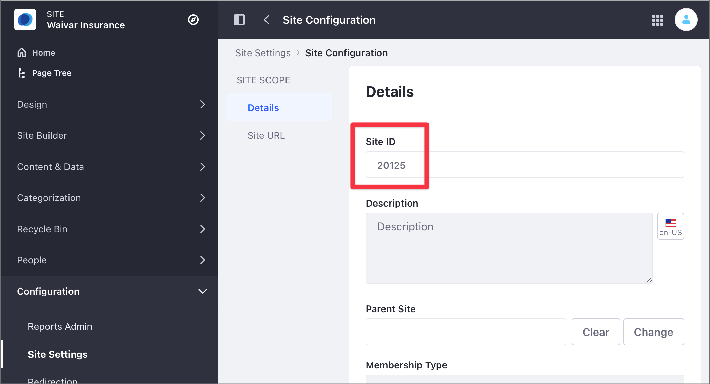
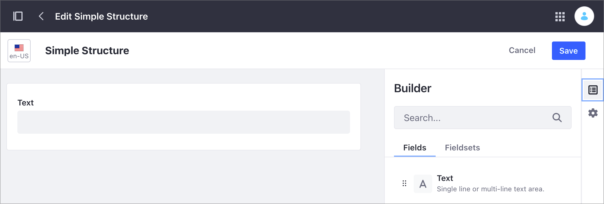

# Managing Structures and Templates by Using the REST API

Web Content Structures define the information included in a Web Content article. Structures facilitate creating and managing Web Content, while ensuring that the content includes all the required information. You can associate a Structure with a Web Content Template. A Template determines how content fields are rendered on a Page. The following table summarizes the available options using the Liferay DXP REST API with Web Content Structures and Templates:

| Available Options | Unavailable Options |
| --- | --- | 
| <ul><li>Gather Structures and Templates information</li><li>Replace Structures permissions</li></ul> | <ul><li>Create Structures or Templates</li><li>Delete Structures or Templates</li></ul> |

Here, you'll use a pre-built Liferay DXP Docker image with several [cURL](https://curl.haxx.se/) code samples to learn how to manage Structured Content. You can learn about the following topics:

- [Setting Up Your Environment](#setting-up-your-environment)
- [Identifying the Service to Consume](#identifying-the-service-to-consume)
- [Getting the Site Structures](#getting-the-site-structures)
- [Getting the Site Templates](#getting-the-site-templates)
- [Getting the Structure Permissions](#getting-the-structure-permissions)
- [Replacing the Structure Permissions](#replacing-the-structure-permissions)

## Setting Up Your Environment

1. Start the Liferay DXP Docker image:

    ```bash
    docker run -it -p 8080:8080 [$LIFERAY_LEARN_DXP_DOCKER_IMAGE$]
    ```

1. After Liferay DXP initializes, open your browser at `http://localhost:8080`.

1. Sign in using the default Liferay DXP Docker image credentials:

   - User Name: `test@liferay.com`
   - Password: `test`

   ```{note}
   The sample cURL scripts use this user name and password by default. If you're using different credentials, replace the values before running the scripts.

   These scripts use basic authentication and are designed for testing. Do not use basic authentication in a production Liferay DXP environment.
   ```

1. Download and unzip the [sample project](https://learn.liferay.com/dxp/latest/en/content-authoring-and-management/web-content/developer-guide/liferay-m7b1.zip):

    ```bash
    curl https://learn.liferay.com/dxp/latest/en/content-authoring-and-management/web-content/developer-guide/liferay-m7b1.zip -O
    ```

    ```bash
    unzip liferay-m7b1.zip
    ```

1. Complete the following steps to set up the environment:

   1. [Identify the Site ID](#identifying-the-site-id)
   1. [Create a Sample Structure](#create-a-sample-structure)
   1. [Identify the Structure ID](#identifying-the-structure-id)

### Identifying the Site ID

1. Open the Site menu () and go to *Configuration* &rarr; *Site Settings*.
1. Under the Platform section, click *Site Configuration*.
1. Find the Site identifier under Site ID.

   

### Create the Structure and Template Samples

```{note}
You cannot create a Structure or Template programmatically using the REST API.
```

To create the Structure, read [Creating Structures](../web-content-structures/creating-structures.md). To create the Template, read [Creating Web Content Templates](../web-content-templates/creating-web-content-templates.md) and create a Template based on the sample Structure. This tutorial uses a basic Structure with a single Text field to demonstrate the `ContentStructure` service.



### Identifying the Sample Structure and Template

1. Open the Site menu () and go to *Content & Data* &rarr; *Web Content*.
1. Click the *Structures* tab.
1. Under the ID column, identify the ID for your Structure.

   

You can also identify the Structure ID programmatically. For more information, read [Managing Structures and Templates by Using the REST API](./managing-structures-and-templates-by-using-the-rest-api.md).

## Identifying the Service to Consume

Use the `StructuredContent` service in the Liferay DXP Headless Delivery API to manage Web Content. To identify this service and all the different HTTP methods, use the Liferay API Explorer. For more information, see [Consuming REST Services](../../../headless-delivery/consuming-apis/consuming-rest-services.md).

## Getting the Site Structures

The `ContentStructures_GET_FromSite.sh` cURL script lists the existing Site Structures. This script uses the `ContentStructure` service with the `GET` HTTP method, using the Site ID as the only parameter.

table
| Method | Service | Endpoint |
| --- | --- | --- |
| GET | `ContentStructure` | /v1.0/sites/{siteId}/content-structures |

```bash
   ./ContentStructures_GET_FromSite.sh 20125
```

| Parameter # | Description |
| --- | --- |
| $1 | `siteId`|

The following code shows the JSON output generated by the script. The script returns all the Structures in the Site. In this example you can see a single Structure identified by an `id` and a `name`.

```json
   {
    "actions" : { },
    "facets" : [ ],
    "items" : [ {
        "availableLanguages" : [ "en-US" ],
        "contentStructureFields" : [ {
        "dataType" : "string",
        "inputControl" : "text",
        "label" : "Text",
        "localizable" : true,
        "multiple" : false,
        "name" : "Text86549034",
        "nestedContentStructureFields" : [ ],
        "options" : [ ],
        "predefinedValue" : "",
        "repeatable" : false,
        "required" : false,
        "showLabel" : true
        } ],
        "creator" : {
        "additionalName" : "",
        "contentType" : "UserAccount",
        "familyName" : "Bowman",
        "givenName" : "David",
        "id" : 20129,
        "name" : "David Bowman"
        },
        "dateCreated" : "2021-08-02T13:15:42Z",
        "dateModified" : "2021-08-02T13:16:57Z",
        "description" : "",
        "id" : 41837,
        "name" : "Simple Structure",
        "siteId" : 20125
    } ],
    "lastPage" : 1,
    "page" : 1,
    "pageSize" : 20,
    "totalCount" : 1
   }
```

The Structure has a single Text field described in the `dataType` section under `contentStructureFields`. When you include more elements on the Structure, you can see additional sections under `contentStructureFields`. Below is the partial JSON output for a Structure with a Text (`"dataType" : "string"`) and Image fields (`"dataType" : "image"`):

```json
   {
    "actions" : { },
    "facets" : [ ],
    "items" : [ {
        "availableLanguages" : [ "en-US" ],
        "contentStructureFields" : [ {
        "dataType" : "string",
        "inputControl" : "text",
        "label" : "Text",
        "localizable" : true,
        "multiple" : false,
        "name" : "Text86549034",
        "nestedContentStructureFields" : [ ],
        "options" : [ ],
        "predefinedValue" : "",
        "repeatable" : false,
        "required" : false,
        "showLabel" : true
        }, {
        "dataType" : "image",
        "label" : "Image",
        "localizable" : true,
        "multiple" : false,
        "name" : "Image96876678",
        "nestedContentStructureFields" : [ ],
        "options" : [ ],
        "predefinedValue" : "{}",
        "repeatable" : false,
        "required" : false,
        "showLabel" : true
        } ],
```

## Getting the Site Templates

The `ContentTemplates_GET_FromSite.sh` cURL script lists the existing Site Templates. This script uses the `ContentTemplate` service with the `GET` HTTP method, using the Site ID as the only parameter.

table
| Method | Service | Endpoint |
| --- | --- | --- |
| GET | `ContentTemplate` | /v1.0/sites/{siteId}/content-templates |

```bash
   ./ContentTemplates_GET_FromSite.sh 20125
```

cURL script parameters:

| Parameter # | Description |
| --- | --- |
| $1 | `siteId`|

Below is the partial JSON output generated by the script. The script returns all the Templates in the Site. In this example you can see a single Template identified by an `id` and a `name`. The `contentStructureId` corresponds to the associated Structure ID and the `templateScript` corresponds to the FreeMarker Template Language describing the Template.

```json
   {
    ...
        "availableLanguages" : [ "en-US" ],
        "contentStructureId" : 41837,
        "creator" : {
        "additionalName" : "",
        "contentType" : "UserAccount",
        "familyName" : "Bowman",
        "givenName" : "David",
        "id" : 20129,
        "name" : "David Bowman"
        },
        "dateCreated" : "2021-08-02T13:24:32Z",
        "dateModified" : "2021-08-02T14:33:24Z",
        "description" : "",
        "id" : "41847",
        "name" : "Simple Template",
        "programmingLanguage" : "ftl",
        "siteId" : 20125,
        "templateScript" : "<#if (Text86549034.getData())??>\n\t${Text86549034.getData()}\n</#if>"
    } ],
    "lastPage" : 1,
    "page" : 1,
    "pageSize" : 20,
    "totalCount" : 1
   }
```

```{note}
For more information about Templates, read [Creating Web Content Templates](../web-content-templates/creating-web-content-templates.md).
```

## Getting the Structure Permissions

The `ContentStructure_GET_Permissions.sh` cURL script lists the Structure's permission. This script uses the `ContentStructure` service with the `GET` HTTP method, using the Structure ID as the only parameter.

| Method | Service | Endpoint |
| --- | --- | --- |
| PUT | `ContentStructure` | `/v1.0/content-structures/{contentStructureId}/permissions` |

```bash
   ./ContentStructure_GET_Permissions.sh 41837
```

cURL script parameters:

| Parameter # | Description |
| --- | --- |
| $1 | Structure `id` |

The JSON output includes the permissions under the `items` section. In this example, there is only one Role with permissions on the sample Structure in `roleName`, with the list of permission in `actionIds`:

```json
    {
    "actions" : {
        "get" : {
        "method" : "GET",
        "href" : "http://localhost:8080/o/headless-delivery/v1.0/content-structures/41837/permissions"
        },
        "replace" : {
        "method" : "PUT",
        "href" : "http://localhost:8080/o/headless-delivery/v1.0/content-structures/41837/permissions"
        }
    },
    "facets" : [ ],
    "items" : [ {
        "actionIds" : [ "DELETE", "PERMISSIONS", "UPDATE", "VIEW" ],
        "roleName" : "Owner"
    } ],
    "lastPage" : 1,
    "page" : 1,
    "pageSize" : 2,
    "totalCount" : 2
    }
```

```{note}
To learn how to manage permissions, see [Assigning Permissions to Web Content Structures and Templates] (../assigning-web-content-structures/assigning-permissions-to-structures-and-templates.md).
```

## Replacing the Structure Permissions

Use the `PUT` HTTP method with the `ContentStructure` service to replace the original Structure permission. This script example uses the Structured Content identifier `id` to include the `DELETE` and `VIEW` permissions for the Power User Role:

| Method | Service | Endpoint |
| --- | --- | --- |
| PUT | `ContentStructure` | `/v1.0/content-structures/{contentStructureId}/permissions` |

```bash
   ./ContentStructure_PUT_Permissions.sh 41837
```

cURL script parameters:

| Parameter # | Description |
| --- | --- |
| $1 | Structure `id` |

The JSON output shows two entries under the `items` section, one for each Role:

```json
    {
    "actions" : {
        "get" : {
        "method" : "GET",
        "href" : "http://localhost:8080/o/headless-delivery/v1.0/content-structures/41837/permissions"
        },
        "replace" : {
        "method" : "PUT",
        "href" : "http://localhost:8080/o/headless-delivery/v1.0/content-structures/41837/permissions"
        }
    },
    "facets" : [ ],
    "items" : [ {
        "actionIds" : [ "DELETE", "PERMISSIONS", "UPDATE", "VIEW" ],
        "roleName" : "Owner"
    }, {
        "actionIds" : [ "DELETE", "VIEW" ],
        "roleName" : "Power User"
    } ],
    "lastPage" : 1,
    "page" : 1,
    "pageSize" : 2,
    "totalCount" : 2
    }
```
