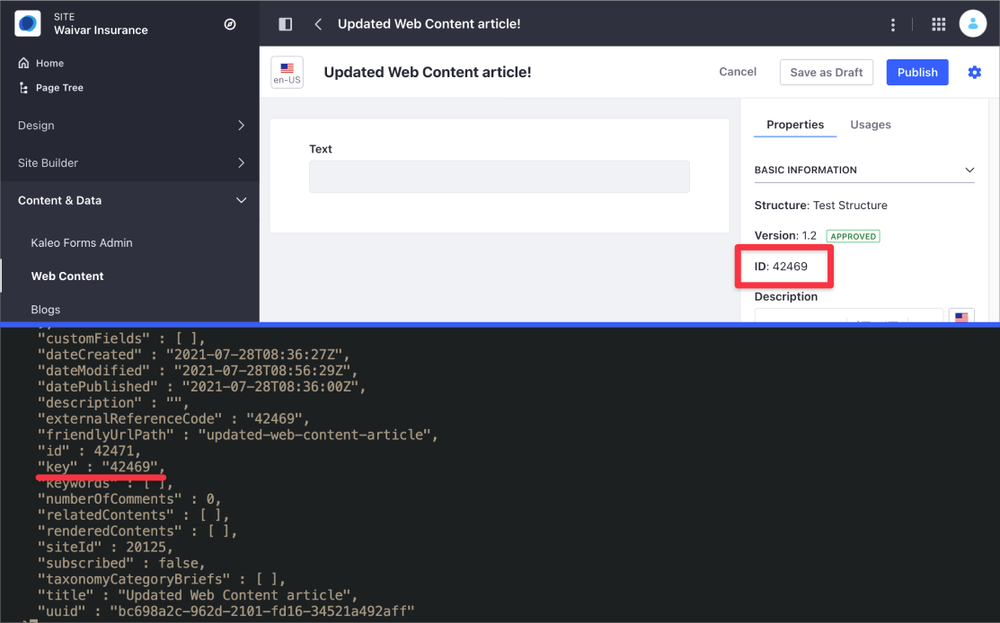
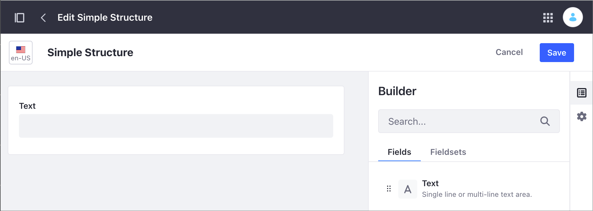
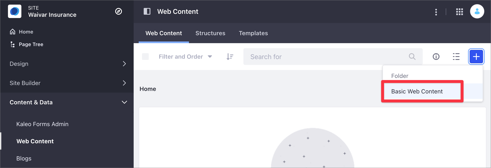

# Web Content API Basics

Using the Liferay DXP REST services you can create and manage Structured Content in your Site. For an overview of how to use the REST API in Liferay DXP, see [Consuming REST Services](../../../headless-delivery/consuming-apis/consuming-rest-services.md).

Structured Content is a [Web Content article](../web-content-articles/adding-a-basic-web-content-article.md) using a Structure. With a Structure, you define the information you want to include in a Web Content article. Structures facilitate creating and managing Web Content, while ensuring that the content includes all the required information. For more information on Structures, read [Understanding Web Content Structures](../web-content-structures/understanding-web-content-structures.md).

```note::
   You can use a Structure with a Template to format the content, but a template is not required to create Structured Content.
```

In this article, you use a pre-built Liferay DXP Docker image with several [cURL](https://curl.haxx.se/) code samples to learn how to manage Structured Content. You can learn about the following topics:

- [Setting Up Your Environment](#setting-up-your-environment)
- [Identifying the Service to Consume](#identifying-the-service-to-consume)
- [Posting a Web Content Article](#posting-a-web-content-article)
- [Getting the Web Content Articles](#getting-the-web-content-articles)
- [Replacing the Web Content Article](#replacing-the-web-content-article)
- [Updating the Web Content Article](#updating-the-web-content-article)
- [Deleting the Web Content Article](#deleting-the-web-content-article)

## Setting Up Your Environment

1. Start the Liferay DXP Docker image:

    ```bash
    docker run -it -p 8080:8080 [$LIFERAY_LEARN_DXP_DOCKER_IMAGE$]
    ```

1. After Liferay DXP initializes, open your browser at `http://localhost:8080`.

1. Sign in using the default Liferay DXP Docker image credentials:

   - User Name: `test@liferay.com`
   - Password: `test`

   ```note::
      The sample cURL scripts on this article use this user name and password by default. If you're usign different credentials, replace the values before running the scripts.

      The scripts in this article use basic authentication and are designed for testing. Do not use basic authentication in a production Liferay DXP environment.
   ```

1. Download and unzip de [sample project](https://learn.liferay.com/dxp/latest/en/content-authoring-and-management/web-content/developer-guide/liferay-r4h9.zip):

    ```bash
    curl https://learn.liferay.com/dxp/latest/en/content-authoring-and-management/web-content/developer-guide/liferay-r4h9.zip -O
    ```

    ```bash
    unzip liferay-r4h9.zip
    ```

1. Complete the following steps to set up the environment:

   1. [Identify the Site ID](#identifying-the-site-id)
   1. [Create a Sample Structure](#create-a-sample-structure)
   1. [Identify the Structure ID](#identifying-the-structure-id)

### Identifying the Site ID

1. Open the Site menu () and go to *Configuration* &rarr; *Site Settings*.
1. Under the Platform section, click *Site Configuration*.
1. Find the Site identifier under Site ID.

   

### Create a Sample Structure

```note::
   You cannot create a Structure or Template programmatically using the REST API. For more information, see `Managing Structures and Templates by Using the REST API <./managing-structures-and-templates-by-using-the-rest-api.md>`_.
```

To create the Structure, read [Creating Structures](../web-content-structures/creating-structures.md). This tutorial uses a basic Structure with a single Text field to demonstrate the `StructuredContent` service.



### Identifying the Structure ID

1. Open the Site menu () and go to *Content & Data* &rarr; *Web Content*.
1. Click the *Structures* tab.
1. Under the ID column, identify the ID for your Structure.

   

You can also identify the Structure ID programatically. For more information, read [Managing Structures and Templates by Using the REST API](./managing-structures-and-templates-by-using-the-rest-api.md).

## Identifying the Service to Consume

Use the `StructuredContent` service in the Liferay DXP Headless Delivery API to manage Web Content. To identify this service and all the different HTTP methods, use the Liferay API Explorer. For more information, read [Consuming REST Services](../../../headless-delivery/consuming-apis/consuming-rest-services.md).

## Posting a Web Content Article

The `StructuredContent_POST_ToSite.sh` cURL script example creates a new Web Content article using the `POST` HTTP method. The script uses the [Site ID](#identifying-the-site-id) and [Structure ID](#identifying-the-structure-id) as parameters.

| Method | Service | Endpoint |
| --- | --- | --- |
| PUT | `StructuredContent` | `/v1.0/sites/{siteID}/structured-contents` |

1. On the command prompt, change to the curl directory in the zip folder.
1. Execute the following command, replacing the parameters with your Site ID and Structure ID:

   ```bash
      ./StructuredContent_POST_ToSite.sh 20125 42173
   ```

cURL script parameters:

| Parameter # | Description |
| --- | --- |
| $1 | `siteId` |
| $2 | `contentStructureId` |

To find your new Web Content article in Liferay DXP, open the Site Menu () and go to *Content & Data* &rarr; *Web Content*.

## Getting the Web Content Articles

The `StructuredContents_GET_FromSite.sh` cURL script example lists the Web Content articles in the Site. This script uses the `StructuredContent` service with a `GET` HTTP method, using the Site ID as the only parameter.

| Method | Service | Endpoint |
| --- | --- | --- |
| GET | `StructuredContent` | `/v1.0/sites/{siteID}/structured-contents` |

```bash
   ./StructuredContents_GET_FromSite.sh 20125
```

| Parameter # | Description |
| --- | --- |
| $1 | `siteId` |

The following code shows the partial JSON output generated by the script. The script returns all the Web Content articles in the Site. In this example you can see a single Web Content article identified by an `id` and a friendly URL in `friendlyUrlPath`. The Web Content uses the Structure in `contentStructureId`. This Structure has a single Text field described in the `contentFieldValue` section under `contentFields`. When you include more elements on your Structure, you can see additional `contentFieldValue` sections describing these elements.

```json
   "availableLanguages" : [ "en-US" ],
    "contentFields" : [ {
      "contentFieldValue" : {
        "data" : ""
      },
      "dataType" : "string",
      "inputControl" : "text",
      "label" : "Text",
      "name" : "Text56820165",
      "nestedContentFields" : [ ],
      "repeatable" : false
    } ],
    "contentStructureId" : 42173,
    "creator" : {
      "additionalName" : "",
      "contentType" : "UserAccount",
      "familyName" : "Bowman",
      "givenName" : "David",
      "id" : 20129,
      "name" : "David Bowman"
    },
    "customFields" : [ ],
    "dateCreated" : "2021-07-27T07:20:12Z",
    "dateModified" : "2021-07-27T07:20:12Z",
    "datePublished" : "2021-07-27T07:20:00Z",
    "description" : "",
    "externalReferenceCode" : "42469",
    "friendlyUrlPath" : "new-web-content-article-1",
    "id" : 42471,
    "key" : "42469",
    "keywords" : [ ],
    "numberOfComments" : 0,
    "relatedContents" : [ ],
    "renderedContents" : [ ],
    "siteId" : 20125,
    "subscribed" : false,
    "taxonomyCategoryBriefs" : [ ],
    "title" : "New Web Content Article",
    "uuid" : "a50dd88e-0093-821b-3033-29ac23cdd779"
```

## Replacing the Web Content Article

Use the `PUT` HTTP method with the `StructuredContent` service to replace the original Web Content article's information. This first script example uses the Structured Content identifier `id` to replace the Web Content article's name:

| Method | Service | Endpoint |
| --- | --- | --- |
| PUT | `StructuredContent` | `/v1.0/structured-contents/{structuredContentId}` |

```bash
   ./StructuredContent_PUT_ById.sh 42471 42173
```

cURL script parameters:

| Parameter # | Description |
| --- | --- |
| $1 | Structured Content `id` |
| $2 | `contentStructureId` (mandatory) |

The second example uses the `PUT` method with the `externalReferenceCode` to replace the Web Content article's name:

| Method | Service | Endpoint |
| --- | --- | --- |
| PUT | `StructuredContent` | `/v1.0/sites/{siteId}/structured-contents/by-external-reference-code/{externalReferenceCode}` |

```bash
   ./StructuredContent_PUT_ByExternalReference.sh 20125 42469 42471
```

cURL script parameters:

| Parameter # | Description |
| --- | --- |
| $1 | `siteId` |
| $2 | `externalReferenceCode` |
| $3 | Structured Content `id` |

```tip::
   The Web Content article ID you can find in the user interface corresponds to the JSON `key` property.
```


## Updating the Web Content Article

Use the `PATCH` HTTP method with the `StructuredContent` service to update the Web Content article. This script uses the Structured Content identifier `id` to update the Web Content article's [friendly URL](../../site-building/displaying-content/using-display-page-templates/about-display-page-templates-and-display-pages.md):

| Method | Service | Endpoint |
| --- | --- | --- |
| PATCH | `StructuredContent` | `/v1.0/structured-contents/{structuredContentId}` |

```bash
   ./StructuredContent_PATCH_ById.sh 42471
```

cURL script parameters:

| Parameter # | Description |
| --- | --- |
| $1 | Structured Content `id` |

## Deleting the Web Content Article

Use the `DELETE` HTTP method with the `structured-contents` service to delete a Web Content article. This script uses the Web Content identifier `id` to delete the Web Content article's friendly URL.

```important::
   When you delete Structured Content using the REST API, you deleted the content permanently, without using the `Liferay DXP Recycle Bin <(../../../content-authoring-and-management/recycle-bin/recycle-bin-overview.md)>`_.
```

| Method | Service | Endpoint |
| --- | --- | --- |
| DELETE | `structured-contents` | `/v1.0/structured-contents/{structuredContentId}` |

```bash
   ./StructuredContent_DELETE_ById.sh 42471
```

cURL script parameters:

| Parameter # | Description |
| --- | --- |
| $1 | Structured Content `id` |

## Related Information

- [Consuming REST Services](../../../headless-delivery/consuming-apis/consuming-rest-services.md)
- [Understanding Web Content Structures](../web-content-structures/understanding-web-content-structures.md)
- [About Display Page Templates and Display Pages](../../site-building/displaying-content/using-display-page-templates//about-display-page-templates-and-display-pages.md)
