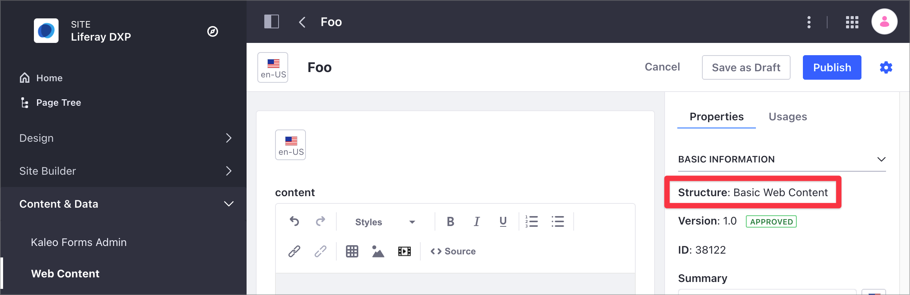

# Web Content API Basics

Using the Liferay DXP REST services, you can create and manage structured content on your Site. Structured content is [Web Content](../web-content-articles/adding-a-basic-web-content-article.md) that uses a Web Content Structure. A Structure defines the information, such as author(s), a summary, and the content included in a Web Content Article. Structures ensure that the content includes all the required information. For more information, read [Understanding Web Content Structures](../web-content-structures/understanding-web-content-structures.md).

```{note}
You can use a Structure with a [Web Content Template](../web-content-templates/creating-web-content-templates.md) to render the structured content, but a Template is not required to create structured content.
```

See the cURL and Java samples for Structures and structured content below. For more advanced examples of managing structured content, see [Advanced Web Content API](./advanced-web-content-api.md). For an overview of using the REST API in Liferay DXP, see [Consuming REST Services](../../../headless-delivery/consuming-apis/consuming-rest-services.md).

## Setting Up Your Environment

1. Start the Liferay DXP Docker image:

    ```bash
    docker run -it -m 8g -p 8080:8080 [$LIFERAY_LEARN_PORTAL_DOCKER_IMAGE$]
    ```

   ```{note}
   Use at least 8 GB of memory for the Liferay DXP Docker image.
   ```

1. After Liferay DXP initializes, open your browser at `http://localhost:8080`.

1. Sign in using the default Liferay DXP Docker image credentials:

   - User Name: `test@liferay.com`
   - Password: `test`

   ```{note}
   - The cURL scripts here use these credentials by default. If you change the credentials in your Docker image, replace the username and password before running the scripts.
   - These scripts use basic authentication and are designed for testing. Do not use basic authentication in a production Liferay DXP environment.
   ```

1. Download and unzip the [Web Content API Basics](./liferay-r4h9.zip) files:

    ```bash
    curl https://learn.liferay.com/dxp/latest/en/content-authoring-and-management/web-content/developer-guide/liferay-r4h9.zip -O
    ```

    ```bash
    unzip liferay-r4h9.zip
    ```

1. Complete these steps to set up the environment:

   1. [Identify the Services to Consume](#identify-the-services-to-consume)
   1. [Identify the Site Id](#identify-the-site-id)

### Identify the Services to Consume

Use the following services in the Liferay DXP Headless Delivery API to manage Web Content:

- `StructuredContent` for Web Content Articles.
- `ContentStructure` for Web Content Structures.
- `ContentTemplate` for Web Content Templates.

To identify these services and the available HTTP methods, use the Liferay API Explorer. For more information, read [Consuming REST Services](../../../headless-delivery/consuming-apis/consuming-rest-services.md).

### Identify the Site Id

To identify the Site ID, follow the instructions [here](../../../headless-delivery/consuming-apis/consuming-rest-services.md#identify-the-site-containing-the-data).

### Create a Basic Web Content Article in the User Interface

To create Web Content, you need a Web Content Structure. When you create Web Content in the user interface without declaring a Structure, Liferay DXP uses a default Basic Web Content Structure.

```{note}
The Basic Web Content Structure is not visible in the Liferay DXP user interface.
```

These examples use a basic Web Content Article with a single Text field and the default Basic Web Content Structure. Use these steps to create the Web Content.

1. Open the Site menu () and go to *Content & Data* &rarr; *Web Content*.
1. Under the *Web Content* tab, click Add () and choose *Basic Web Content*.

   

1. Enter _Foo_ as the New Web Content name and click *Publish*.

   

For more information, see [Adding a Basic Web Content Article](../web-content-articles/adding-a-basic-web-content-article.md).

## Get Web Content Articles from Site

You can retrieve a site's Web Content articles by executing the following cURL or Java command. Replace `1234` with your site's ID.

### StructuredContents_GET_FromSite.sh

The `StructuredContents_GET_FromSite.sh` cURL script lists all the Site's Web Content Articles. This script uses the `StructuredContent` service with a `GET` HTTP method, with the Site ID as the only parameter.

| Method | Service | Endpoint |
| :--- | :--- | :--- |
| `GET` | `StructuredContent` | `/v1.0/sites/{siteID}/structured-contents` |

```bash
./StructuredContents_GET_FromSite.sh 1234
```

| Parameter # | Description |
| :--- | :--- |
| `$1` | `siteId` |

Below is the partial JSON output generated by the script. In this output, you can see a single Web Content Article identified by an `id` and a friendly URL in `friendlyUrlPath`. The Web Content uses the Structure in `contentStructureId`. This Structure has a single Text field described in the `contentFieldValue` section under `contentFields`. When you include more elements in your Structure, you can see additional `contentFieldValue` sections describing these elements.

```json
{
  "actions" : {
    ...
  },
  "facets" : [ ],
  "items" : [ {
    "actions" : {
   ...
    },
    "availableLanguages" : [ "en-US" ],
    "contentFields" : [ {
      "contentFieldValue" : {
        "data" : ""
      },
      "dataType" : "string",
      "label" : "content",
      "name" : "content",
      "nestedContentFields" : [ ],
      "repeatable" : false
    } ],
    "contentStructureId" : 40697,
    "creator" : {
      "additionalName" : "",
      "contentType" : "UserAccount",
      "familyName" : "Bowman",
      "givenName" : "David",
      "id" : 20129,
      "name" : "David Bowman"
    },
    "customFields" : [ ],
    "dateCreated" : "2021-08-10T08:10:21Z",
    "dateModified" : "2021-08-10T08:10:21Z",
    "datePublished" : "2021-08-10T08:10:00Z",
    "description" : "",
    "externalReferenceCode" : "41537",
    "friendlyUrlPath" : "foo",
    "id" : 41539,
    "key" : "41537",
    "keywords" : [ ],
    "numberOfComments" : 0,
    "relatedContents" : [ ],
    "renderedContents" : [ {
      "contentTemplateId" : "BASIC-WEB-CONTENT",
      "contentTemplateName" : "Basic Web Content",
      "markedAsDefault" : true,
      "renderedContentURL" : "http://localhost:8080/o/headless-delivery/v1.0/structured-contents/41539/rendered-content/BASIC-WEB-CONTENT"
    } ],
    "siteId" : 20125,
    "subscribed" : false,
    "taxonomyCategoryBriefs" : [ ],
    "title" : "Foo",
    "uuid" : "162155dc-c9aa-96b0-df5c-a61c591d1389"
  } ],
  "lastPage" : 1,
  "page" : 1,
  "pageSize" : 20,
  "totalCount" : 1
}
```

Review the following information in the JSON output:

- The output shows a single Web Content Article identified by `id: 41539`, `title: Foo`, and the friendly URL `friendlyUrlPath: foo`.
- This Web Content uses the default Liferay DXP Web Content Structure identified in `contentStructureId`.
- The Web Content Structure has a single Text field described in the `contentFieldValue` section under `contentFields`. When you include more elements in the Structure, you can see additional `contentFieldValue` sections describing these elements.
- The Web Content Id in the user interface corresponds to the `key` property in the JSON output.

   

### StructuredContents_GET_FromSite.java

The `StructuredContents_GET_FromSite.java` class gets a list of Web Content articles by calling the structured content related services.

```{literalinclude} ./web-content-api-basics/resources/liferay-r4h9.zip/java/StructuredContents_GET_FromSite.java
   :dedent: 1
   :language: java
   :lines: 11-26
```

This class invokes the REST service using only three lines of code: 

| Line (abbreviated) | Description |
| :----------------- | :---------- |
| `StructuredContentResource.Builder builder = ...` | Gets a `Builder` for generating a `StructuredContentResource` service instance. |
| `StructuredContentResource structuredContentResource = builder.authentication(...).build();` | Specifies basic authentication and generates a `StructuredContentResource` service instance. |
| `Page<StructuredContent> page = structuredContentResource.getSiteStructuredContentsPage(...);` | Calls the `structuredContentResource.getSiteStructuredContentsPage` method and retrieves the data. |

Note that the project includes the `com.liferay.headless.delivery.client.jar` file as a dependency. You can find client JAR dependency information for all REST applications in the API explorer in your installation at `/o/api`.

```{note}
The `main` method's comment demonstrates running the class.
```

The other example Java classes are similar to this one, but call different `StructuredContentResource` methods.

```{important}
See [StructuredContentResource](https://github.com/liferay/liferay-portal/blob/[$LIFERAY_LEARN_PORTAL_GIT_TAG$]/modules/apps/headless/headless-delivery/headless-delivery-client/src/main/java/com/liferay/headless/delivery/client/resource/v1_0/StructuredContentResource.java) for service details.
```

Below are examples of calling other REST services using cURL and Java.

## Get a Web Content Article

The script in [the previous step](#get-web-content-articles-from-site) returns all the Site's Web Content articles. To get a specific article, use the `StructuredContent_GET_ById.[java|sh]` script. Replace `1234` with your Web Content article's ID.

### StructuredContent_GET_ById.sh

Command:

```bash
./StructuredContent_GET_ById.sh 1234
```

Code:

```{literalinclude} ./web-content-api-basics/resources/liferay-r4h9.zip/curl/StructuredContent_GET_ById.sh
   :language: bash
```

### StructuredContent_GET_ById.java

Command: 

```bash
java -classpath .:* -DstructuredContentId=1234 StructuredContent_GET_ById
```

Code:

```{literalinclude} ./web-content-api-basics/resources/liferay-r4h9.zip/java/StructuredContent_GET_ById.java
   :dedent: 1
   :language: java
   :lines: 9-23
```

The `StructuredContent` fields appear in JSON.

## Get Web Content Structures

You can retrieve a site's Content Structures by executing the following cURL or Java command. Replace `1234` with your site's ID.

```{note}
The default Basic Web Content Structure is not visible using this endpoint.
```

### ContentStructures_GET_FromSite.sh

Command:

```bash
./ContentStructures_GET_FromSite.sh 1234
```

Code:

```{literalinclude} ./web-content-api-basics/resources/liferay-r4h9.zip/curl/ContentStructures_GET_FromSite.sh
   :language: bash
```

### ContentStructures_GET_FromSite.java

Command:

```bash 
java -classpath .:* -DsiteId=1234 ContentStructures_GET_FromSite
```

Code:

```{literalinclude} ./web-content-api-basics/resources/liferay-r4h9.zip/java/ContentStructures_GET_FromSite.java
   :dedent: 1
   :language: java
   :lines: 11-26
```

The site's `ContentStructure` objects appear in JSON.

## Get Web Content Structure by Id

The default Web Content Structure in the sample Web Content Article is not visible in the Liferay DXP user interface. However, you can use the `ContentStructure` service to gather the Structure's description.

The `ContentStructure_GET_ById.[java|sh]` script returns a Web Content Structure description.

### ContentStructure_GET_ById.sh

| Method | Service | Endpoint |
| :--- | :--- | :--- |
| `GET` | `ContentStructure` | `/v1.0/content-structures/{contentStructureId}` |

```bash
./ContentStructure_GET_ById.sh 40697
```

| Parameter # | Description |
| :--- | :--- |
| $1 | `contentStructureId`|

Below is the JSON output. You can identify the default Web Content Structure in Liferay DXP by its `id` and `name`. The `contentStructureFields` section contains a description of the Structure fields. Notice that this Structure contains a single content field of type `string` and name `content`. In [Post a Basic Web Content Article](#post-a-basic-web-content-article), you create a new Web Content Article adding information to this content field.

```json
{
  "availableLanguages" : [ "en-US" ],
  "contentStructureFields" : [ {
    "dataType" : "string",
    "label" : "content",
    "localizable" : true,
    "multiple" : false,
    "name" : "content",
    "nestedContentStructureFields" : [ ],
    "options" : [ ],
    "repeatable" : false,
    "required" : false,
    "showLabel" : true
  } ],
  "dateCreated" : "2021-08-09T23:30:23Z",
  "dateModified" : "2021-08-09T23:30:23Z",
  "description" : "Basic Web Content",
  "id" : 40697,
  "name" : "Basic Web Content",
  "siteId" : 20127
}
```

### ContentStructure_GET_ById.java

Command: 

```bash
java -classpath .:* -DcontentStructureId=1234 ContentStructure_GET_ById
```

Code:

```{literalinclude} ./web-content-api-basics/resources/liferay-r4h9.zip/java/ContentStructure_GET_ById.java
   :dedent: 1
   :language: java
   :lines: 9-23
```

The `ContentStructure` fields appear in JSON.

## Post a Basic Web Content Article

Use the `StructuredContent_POST_ToSite[java|sh]` script to create a new Web Content article. Replace `1234` with a Web Content Structure ID. Replace `5678` with your site's ID.

### StructuredContent_POST_ToSite.sh

The `StructuredContent_POST_ToSite.sh` cURL script example creates a new Web Content article using the `POST` HTTP method and the default Web Content Structure. The script uses the [Site Id](#identifying-the-site-id) and Structure `id` as parameters.

| Method | Service | Endpoint |
| :--- | :--- | :--- |
| `PUT` | `StructuredContent` | `/v1.0/sites/{siteId}/structured-contents` |

```bash
./StructuredContent_POST_ToSite.sh 20125 40697
```

cURL script parameters:

| Parameter # | Description |
| :--- | :--- |
| $1 | `siteId` |
| $2 | `contentStructureId` |

To find your new Web Content Article in Liferay DXP, open the Site Menu () and go to *Content & Data* &rarr; *Web Content*.

Below is the partial JSON output generated by the script. The script posts a simple `<p>Foo</p>` HTML string using the Structure `contentField` `content` as reference.

```json
{
  "actions" : {
    ...
  },
  "availableLanguages" : [ "en-US" ],
  "contentFields" : [ {
    "contentFieldValue" : {
      "data" : "<p>Foo</p>"
    },
    "dataType" : "string",
    "label" : "content",
    "name" : "content",
    "nestedContentFields" : [ ],
    "repeatable" : false
  } ],
  "contentStructureId" : 40697,
  "creator" : {
    "additionalName" : "",
    "contentType" : "UserAccount",
    "familyName" : "Bowman",
    "givenName" : "David",
    "id" : 20129,
    "name" : "David Bowman"
  },
  "customFields" : [ ],
  "dateCreated" : "2021-08-10T09:19:40Z",
  "dateModified" : "2021-08-10T09:19:40Z",
  "datePublished" : "2021-08-10T09:19:00Z",
  "description" : "",
  "externalReferenceCode" : "41569",
  "friendlyUrlPath" : "able-article",
  "id" : 41571,
  "key" : "41569",
  "keywords" : [ ],
  "numberOfComments" : 0,
  "relatedContents" : [ ],
  "renderedContents" : [ {
    "contentTemplateId" : "BASIC-WEB-CONTENT",
    "contentTemplateName" : "Basic Web Content",
    "markedAsDefault" : true,
    "renderedContentURL" : "http://localhost:8080/o/headless-delivery/v1.0/structured-contents/41571/rendered-content/BASIC-WEB-CONTENT"
  } ],
  "siteId" : 20125,
  "subscribed" : false,
  "taxonomyCategoryBriefs" : [ ],
  "title" : "Able Article",
  "uuid" : "c7005ffb-5677-e030-9eb9-9b1a24a85054"
}
```

### StructuredContent_POST_ToSite.java

The `StructuredContent_POST_ToSite.java` class adds a Web Content article by calling the structured content related service.

Command: 

```bash
java -classpath .:* -DcontentStructureId=1234 -DsiteId=5678 StructuredContent_POST_ToSite
```

Code:

```{literalinclude} ./web-content-api-basics/resources/liferay-r4h9.zip/java/StructuredContent_POST_ToSite.java
   :dedent: 1
   :language: java
   :lines: 11-45
```

The `StructuredContent` fields appear in JSON.

## Patch Web Content Article

Use the `PATCH` method with the `StructuredContent` service to update the Web Content Article. The `StructuredContent_PATCH_ById.[java|sh]` script uses the structured content identifier `id` to update the article's content from 'Foo' to 'Bar'.

### StructuredContent_PATCH_ById.sh

Command:

```bash
./StructuredContent_PATCH_ById.sh 1234
```

Code:

```{literalinclude} ./web-content-api-basics/resources/liferay-r4h9.zip/curl/StructuredContent_PATCH_ById.sh
   :language: bash
```

### StructuredContent_PATCH_ById.java

Command: 

```bash 
java -classpath .:* -DcontentStructureId=1234 -DstructuredContentId=5678 StructuredContent_PATCH_ById
``` 

Code:

```{literalinclude} ./web-content-api-basics/resources/liferay-r4h9.zip/java/StructuredContent_PATCH_ById.java
   :dedent: 1
   :language: java
   :lines: 11-44
```

## Put Web Content Article

Use the `PUT` method with the `StructuredContent` service to replace the original Web Content information. The `StructuredContent_PUT_ById.[java|sh]` script uses the Web Content and Structure identifiers to replace the article's name and the article's content from `Bar` to `Goo`.

### StructuredContent_PUT_ById.sh

Command:

```bash
./StructuredContent_PUT_ById.sh 1234
```

Code:

```{literalinclude} ./web-content-api-basics/resources/liferay-r4h9.zip/curl/StructuredContent_PUT_ById.sh
   :language: bash
```

### StructuredContent_PUT_ById.java

Command:

```bash
java -classpath .:* -DcontentStructureId=1234 -DstructuredContentId=5678 StructuredContent_PUT_ById
```

Code:

```{literalinclude} ./web-content-api-basics/resources/liferay-r4h9.zip/java/StructuredContent_PUT_ById.java
   :dedent: 1
   :language: java
   :lines: 9-26
```

## Delete Web Content Article

Use the `DELETE` method with the `StructuredContent` service to delete a Web Content Article. The `StructuredContent_DELETE_ById.[java|sh]` script example uses the Web Content `id` to delete the Web Content.

```{important}
When you delete Web Content using the REST API, it's deleted permanently, without using the [Liferay DXP Recycle Bin](../../../content-authoring-and-management/recycle-bin/recycle-bin-overview.md).
```

### StructuredContent_DELETE_ById.sh

Command:

```bash
./StructuredContent_DELETE_ById.sh 1234
```

Code:

```{literalinclude} ./web-content-api-basics/resources/liferay-r4h9.zip/curl/StructuredContent_DELETE_ById.sh
   :language: bash
```

### StructuredContent_DELETE_ById.java

Command

```bash 
java -classpath .:* -DstructuredContentId=1234 StructuredContent_DELETE_ById
```

Code:

```{literalinclude} ./web-content-api-basics/resources/liferay-r4h9.zip/java/StructuredContent_DELETE_ById.java
   :dedent: 1
   :language: java
   :lines: 8-19
```

## More Web Content and Web Content Folder Services

The other cURL commands and Java classes demonstrate more `StructuredContent` and `StructuredContentFolder` services. You can find these in [Web Content API Basics](./liferay-r4h9.zip).

| File | Description |
| :--- | :--- |
| `StructuredContentFolder_GET_ById.[java|sh]` | Lists a Web Content folder's fields. |
| `StructuredContentFolders_GET_FromSite.[java|sh]` | Lists all Web Content folders in the Site. |
| `StructuredContentFolder_POST_ToSite.[java|sh]` | Posts a Web Content folder to a Site. |
| `StructuredContentFolder_PATCH_ById.[java|sh]` | Updates a Web Content Folder. |
| `StructuredContentFolder_PUT_ById.[java|sh]` | Replaces a Web Content Folder. |
| `StructuredContentFolder_DELETE_ById.[java|sh]` | Deletes a Web Content Folder. |
| `StructuredContent_POST_ToStructuredContentFolder.[java|sh]` | Posts a Web Content Article to a folder. |

```{important}
When you delete a Web Content Folder using the REST API, the folder and its content are deleted permanently, without using the [Liferay DXP Recycle Bin](../../../content-authoring-and-management/recycle-bin/recycle-bin-overview.md).
```

## Related Information

- [Advanced Web Content API](./advanced-web-content-api.md)
- [Consuming REST Services](../../../headless-delivery/consuming-apis/consuming-rest-services.md)
- [Understanding Web Content Structures](../web-content-structures/understanding-web-content-structures.md)
