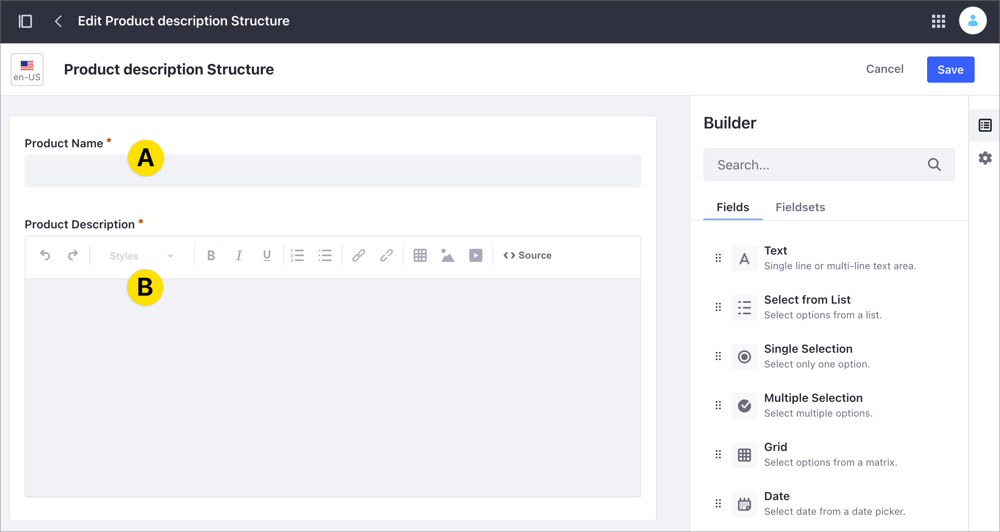

# Web Content API Basics

Using the Liferay DXP REST services, you can create and manage Structured Content on your Site. Structured Content is [Web Content](../web-content-articles/adding-a-basic-web-content-article.md) using a Web Content Structure. With a Structure, you define the information you want to include in a Web Content article. Structures facilitate creating and managing Web Content while ensuring that the content includes all the required information. For more information on Structures, read [Understanding Web Content Structures](../web-content-structures/understanding-web-content-structures.md).

```note::
   You can use a Structure with a `Web Content Template <../web-content-templates/creating-web-content-templates.md>`_ to render the Structure content, but a Template is not required to create Structured Content.
```

In this article, you use a pre-built Liferay DXP Docker image with several [cURL](https://curl.haxx.se/) code samples to learn about Structures and Structured Content. For more advanced examples managing Structured content using the REST API, see [Advanced Web Content API](./advanced-web-content-api.md). For an overview of using the REST API in Liferay DXP, see [Consuming REST Services](../../../headless-delivery/consuming-apis/consuming-rest-services.md).

You can learn about the following topics:

- [Setting Up Your Environment](#setting-up-your-environment)
- [Getting the Web Content Articles](#getting-the-web-content-articles)
- [Getting the Web Content Structure by Id](#getting-the-web-content-structure-by-id)
- [Posting a Basic Web Content Article](#posting-a-basic-web-content-article)
- [Updating the Web Content Article](#updating-the-web-content-article)
- [Replacing the Web Content Article](#replacing-the-web-content-article)
- [Deleting the Web Content Article](#deleting-the-web-content-article)
- [More Web Content and Web Content Folder Services](#more-web-content-and-web-content-folder-services)

## Setting Up Your Environment

1. Start the Liferay DXP Docker image:

    ```bash
    docker run -it -m 8g -p 8080:8080 [$LIFERAY_LEARN_DXP_DOCKER_IMAGE$]
    ```

   ```note::
      Use at least 8 GB of memory for the Liferay DXP Docker image.
   ```

1. After Liferay DXP initializes, open your browser at `http://localhost:8080`.

1. Sign in using the default Liferay DXP Docker image credentials:

   - User Name: `test@liferay.com`
   - Password: `test`

   ```note::
      The cURL scripts on this article use these credentials by default. If you change the credentials in your Docker image, replace the username and password before running the scripts.
      These scripts use basic authentication and are designed for testing. Do not use basic authentication in a production Liferay DXP environment.
   ```

1. Download and unzip de [sample project](https://learn.liferay.com/dxp/latest/en/content-authoring-and-management/web-content/developer-guide/liferay-r4h9.zip):

    ```bash
    curl https://learn.liferay.com/dxp/latest/en/content-authoring-and-management/web-content/developer-guide/liferay-r4h9.zip -O
    ```

    ```bash
    unzip liferay-r4h9.zip
    ```

1. Complete these steps to set up the environment:

   1. [Identify the Services to Consume](#identify-the-services-to-consume)
   1. [Identify the Site Id](#identify-the-site-id)

### Identify the Services to Consume

Use the following services in the Liferay DXP Headless Delivery API to manage Web Content:

- `StructuredContent` for Web Content Articles
- `ContentStructure` for Web Content Structures
- `ContentTemplate` for Web Content Templates

To identify these services and the available HTTP methods, use the Liferay API Explorer. For more information, read [Consuming REST Services](../../../headless-delivery/consuming-apis/consuming-rest-services.md).

### Identify the Site Id

1. Open the Site menu () and go to *Configuration* &rarr; *Site Settings*.
1. Under the Platform section, click *Site Configuration*. For Liferay DXP versions 7.3 and earlier, click the *General* tab.
1. Find the Site identifier under Site Id.

   

### Create a Basic Web Content Article in the User Interface

To create Web Content, you need a Web Content Structure. When you create Web Content in the user interface without declaring a Structure, Liferay DXP uses a by-default Basic Web Content Structure for you.

This tutorial uses a basic Web Content article with a single Text field and the by-default Basic Web Content Structure. Use these steps to create this Web Content (you can find more information in [Adding a Basic Web Content Article](../web-content-articles/adding-a-basic-web-content-article.md)):

1. Open the Site menu () and go to *Content & Data* &rarr; *Web Content*.
1. Under the *Web Content* tab, click Add () and choose *Basic Web Content*.

   

1. Enter 'Foo' as the New Web Content name and click *Publish*.

   

This new Web Content uses a by-default Basic Web Content Structure that is not visible in the Liferay DXP user interface.

## Getting the Web Content Articles

The `StructuredContents_GET_FromSite.sh` cURL script lists the Web Content articles in the Site. This script uses the `StructuredContent` service with a `GET` HTTP method with the [Site Id](#identify-the-site-id) parameter.

| Method | Service | Endpoint |
| --- | --- | --- |
| GET | `StructuredContent` | `/v1.0/sites/{siteID}/structured-contents` |

1. On the command prompt, change to the curl directory in the zip folder.
1. Execute the following command, replacing the parameter with your Site Id:

   ```bash
      ./StructuredContents_GET_FromSite.sh 20125
   ```

| Parameter # | Description |
| --- | --- |
| $1 | `siteId` |

The following code shows the partial JSON output generated by the script:

```json
{
  "actions" : {
    ...
  },
  "facets" : [ ],
  "items" : [ {
    "actions" : {
   ...
    },
    "availableLanguages" : [ "en-US" ],
    "contentFields" : [ {
      "contentFieldValue" : {
        "data" : ""
      },
      "dataType" : "string",
      "label" : "content",
      "name" : "content",
      "nestedContentFields" : [ ],
      "repeatable" : false
    } ],
    "contentStructureId" : 40697,
    "creator" : {
      "additionalName" : "",
      "contentType" : "UserAccount",
      "familyName" : "Bowman",
      "givenName" : "David",
      "id" : 20129,
      "name" : "David Bowman"
    },
    "customFields" : [ ],
    "dateCreated" : "2021-08-10T08:10:21Z",
    "dateModified" : "2021-08-10T08:10:21Z",
    "datePublished" : "2021-08-10T08:10:00Z",
    "description" : "",
    "externalReferenceCode" : "41537",
    "friendlyUrlPath" : "foo",
    "id" : 41539,
    "key" : "41537",
    "keywords" : [ ],
    "numberOfComments" : 0,
    "relatedContents" : [ ],
    "renderedContents" : [ {
      "contentTemplateId" : "BASIC-WEB-CONTENT",
      "contentTemplateName" : "Basic Web Content",
      "markedAsDefault" : true,
      "renderedContentURL" : "http://localhost:8080/o/headless-delivery/v1.0/structured-contents/41539/rendered-content/BASIC-WEB-CONTENT"
    } ],
    "siteId" : 20125,
    "subscribed" : false,
    "taxonomyCategoryBriefs" : [ ],
    "title" : "Foo",
    "uuid" : "162155dc-c9aa-96b0-df5c-a61c591d1389"
  } ],
  "lastPage" : 1,
  "page" : 1,
  "pageSize" : 20,
  "totalCount" : 1
}
```

Review the following information in the JSON output:

- The output shows a single Web Content article identified by `id: 41539`, `title: Foo`, and the friendly URL `friendlyUrlPath: foo`.
- This Web Content uses the by-default Liferay DXP Web Content Structure identified in `contentStructureId`.
- The Web Content Structure has a single Text field described in the `contentFieldValue` section under `contentFields`. When you include more elements in the Structure, you can see additional `contentFieldValue` sections describing these elements.
- The Web Content Id you can see in the user interface corresponds to the `key` property in the JSON output.

   

### Getting the Web Content Article by Id

The script in [the previous step](#getting-the-web-content-article) returns all the Web Content articles on the Site. To check a specific Web Content, use the article identifier `id` as a reference. The `StructuredContent_GET_ById.sh` script lists a Web Content by `id`. This script uses the `StructuredContent` service with a `GET` HTTP method and the Structured Content `id` parameter.

| Method | Service | Endpoint |
| --- | --- | --- |
| GET | `StructuredContent` | `/v1.0/structured-contents/{structuredContentId}` |

```bash
   ./StructuredContent_GET_ById.sh 41539
```

| Parameter # | Description |
| --- | --- |
| $1 | Structured Content `id` |

## Getting the Web Content Structure by Id

The by-default Web Content Structure in the sample Web Content article is not visible in the Liferay DXP user interface. However, you can use the `ContentStructure` service in the REST API to gather the Structure's description.

The `ContentStructure_GET_ById.sh` cURL script returns a Web Content Structure description using the `ContentStructure` service with the `GET` HTTP method and the Structure Id parameter.

| Method | Service | Endpoint |
| --- | --- | --- |
| GET | `ContentStructure` | `/v1.0/content-structures/{contentStructureId}` |

```bash
   ./ContentStructure_GET_ById.sh 40697
```

| Parameter # | Description |
| --- | --- |
| $1 | `contentStructureId`|

This code shows the JSON output generate by the script, where you can identify the by-default Web Content Structure in Liferay DXP by its `id` and `name`. The `contentStructureFields` section contains a description of the Structure fields. Notice that this Structure contains a single content field of type `string` and name `content`. In the [next step](#posting-a-basic-web-content-article), you create a new Web Content article adding information to this content field.

```json
{
  "availableLanguages" : [ "en-US" ],
  "contentStructureFields" : [ {
    "dataType" : "string",
    "label" : "content",
    "localizable" : true,
    "multiple" : false,
    "name" : "content",
    "nestedContentStructureFields" : [ ],
    "options" : [ ],
    "repeatable" : false,
    "required" : false,
    "showLabel" : true
  } ],
  "dateCreated" : "2021-08-09T23:30:23Z",
  "dateModified" : "2021-08-09T23:30:23Z",
  "description" : "Basic Web Content",
  "id" : 40697,
  "name" : "Basic Web Content",
  "siteId" : 20127
}
```

### Getting the Web Content Structures

The script in [the previous step](#getting-the-web-content-structure-by-id) returns a specific Web Content Structure. To return all the existing Site Structures, use the `ContentStructures_GET_FromSite.sh` script. This script uses the `ContentStructure` service with a `GET` HTTP method and the [Site Id](#identify-the-site-id) parameter.

| Method | Service | Endpoint |
| --- | --- | --- |
| GET | `ContentStructure` | `/v1.0/sites/${1}/content-structures` |

```bash
   ./ContentStructures_GET_FromSite.sh 20125
```

| Parameter # | Description |
| --- | --- |
| $1 | `siteId` |

```note::
   The by-default Web Content Structure is not visible using this endpoint.
```

## Posting a Basic Web Content Article

The `StructuredContent_POST_ToSite.sh` cURL script example creates a new Web Content using the `POST` HTTP method and the by-default Web Content Structure you analyzed [in the previous step](#getting-the-web-content-structure). The script uses the [Site Id](#identifying-the-site-id) and Structure Id as parameters.

| Method | Service | Endpoint |
| --- | --- | --- |
| PUT | `StructuredContent` | `/v1.0/sites/{siteId}/structured-contents` |

   ```bash
      ./StructuredContent_POST_ToSite.sh 20125 40697
   ```

cURL script parameters:

| Parameter # | Description |
| --- | --- |
| $1 | `siteId` |
| $2 | `contentStructureId` |

To find your new Web Content article in Liferay DXP, open the Site Menu () and go to *Content & Data* &rarr; *Web Content*.

The following code shows the partial JSON output generated by the script. The script posts a simple `<p>Foo</p>` HTML string using the Structure `contentField` `content` as reference.

```json
{
  "actions" : {
    ...
  },
  "availableLanguages" : [ "en-US" ],
  "contentFields" : [ {
    "contentFieldValue" : {
      "data" : "<p>Foo</p>"
    },
    "dataType" : "string",
    "label" : "content",
    "name" : "content",
    "nestedContentFields" : [ ],
    "repeatable" : false
  } ],
  "contentStructureId" : 40697,
  "creator" : {
    "additionalName" : "",
    "contentType" : "UserAccount",
    "familyName" : "Bowman",
    "givenName" : "David",
    "id" : 20129,
    "name" : "David Bowman"
  },
  "customFields" : [ ],
  "dateCreated" : "2021-08-10T09:19:40Z",
  "dateModified" : "2021-08-10T09:19:40Z",
  "datePublished" : "2021-08-10T09:19:00Z",
  "description" : "",
  "externalReferenceCode" : "41569",
  "friendlyUrlPath" : "able-article",
  "id" : 41571,
  "key" : "41569",
  "keywords" : [ ],
  "numberOfComments" : 0,
  "relatedContents" : [ ],
  "renderedContents" : [ {
    "contentTemplateId" : "BASIC-WEB-CONTENT",
    "contentTemplateName" : "Basic Web Content",
    "markedAsDefault" : true,
    "renderedContentURL" : "http://localhost:8080/o/headless-delivery/v1.0/structured-contents/41571/rendered-content/BASIC-WEB-CONTENT"
  } ],
  "siteId" : 20125,
  "subscribed" : false,
  "taxonomyCategoryBriefs" : [ ],
  "title" : "Able Article",
  "uuid" : "c7005ffb-5677-e030-9eb9-9b1a24a85054"
}
```

## Updating the Web Content Article

Use the `PATCH` HTTP method with the `StructuredContent` service to update the Web Content article. The `StructuredContent_PATCH_ById` script uses the Structured Content identifier `id` to update the article's content from `Foo` to `Bar`:

| Method | Service | Endpoint |
| --- | --- | --- |
| PATCH | `StructuredContent` | `/v1.0/structured-contents/{structuredContentId}` |

```bash
   ./StructuredContent_PATCH_ById.sh 41571
```

cURL script parameters:

| Parameter # | Description |
| --- | --- |
| $1 | Structured Content `id` |

## Replacing the Web Content Article

Use the `PUT` HTTP method with the `StructuredContent` service to replace the original Web Content information. The `StructuredContent_PUT_ById` script uses the Web Content and Structure identifiers to replace the article's name to `Baker Article` and the article's content from `Bar` to `Goo`:

| Method | Service | Endpoint |
| --- | --- | --- |
| PUT | `StructuredContent` | `/v1.0/structured-contents/{structuredContentId}` |

```bash
   ./StructuredContent_PUT_ById.sh 41571 40697
```

cURL script parameters:

| Parameter # | Description |
| --- | --- |
| $1 | Structured Content `id` |
| $2 | `contentStructureId` |

## Deleting the Web Content Article

Use the `DELETE` HTTP method with the `StructuredContent` service to delete a Web Content article. The `StructuredContent_DELETE_ById` script example uses the Web Content `id` to delete the Web Content:

```important::
   When you delete Web Content using the REST API, you deleted the content permanently, without using the `Liferay DXP Recycle Bin <(../../../content-authoring-and-management/recycle-bin/recycle-bin-overview.md)>`_.
```

| Method | Service | Endpoint |
| --- | --- | --- |
| DELETE | `structured-contents` | `/v1.0/structured-contents/{structuredContentId}` |

```bash
   ./StructuredContent_DELETE_ById.sh 41571
```

cURL script parameters:

| Parameter # | Description |
| --- | --- |
| $1 | Structured Content `id` |

## More Web Content and Web Content Folder Services

The following cURL commands demonstrate more `StructuredContent` and `StructuredContentFolder` services. You can find these scripts in the [sample project folder](https://learn.liferay.com/dxp/latest/en/content-authoring-and-management/web-content/developer-guide/liferay-r4h9.zip).

| File | Description |
| --- | --- |
| `StructuredContentFolder_GET_ById.sh` | Lists a Web Content folder's fields. |
| `StructuredContentFolders_GET_FromSite.sh` | Lists all Web Content folders in the Site. |
| `StructuredContentFolder_POST_ToSite.sh` | Posts a Web Content folder to a Site. |
| `StructuredContentFolder_PATCH_ById.sh` | Updates a Web Content Folder. |
| `StructuredContentFolder_PUT_ById.sh` | Replaces a Web Content Folder. |
| `StructuredContentFolder_DELETE_ById.sh` | Deletes a Web Content Folder. |
| `StructuredContent_POST_ToStructuredContentFolder.sh` | Posts a Web Content Article to a folder. |

```important::
   When you delete a Web Content Folder using the REST API, you deleted the folder and its content permanently, without using the `Liferay DXP Recycle Bin <(../../../content-authoring-and-management/recycle-bin/recycle-bin-overview.md)>`_.
```

## Related Information

- [Consuming REST Services](../../../headless-delivery/consuming-apis/consuming-rest-services.md)
- [Understanding Web Content Structures](../web-content-structures/understanding-web-content-structures.md)
- [About Display Page Templates and Display Pages](../../site-building/displaying-content/using-display-page-templates//about-display-page-templates-and-display-pages.md)
