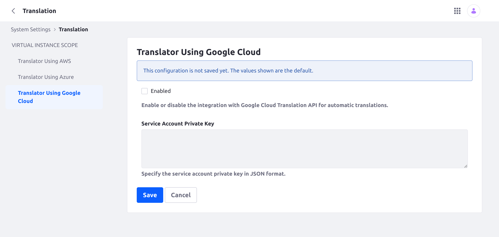
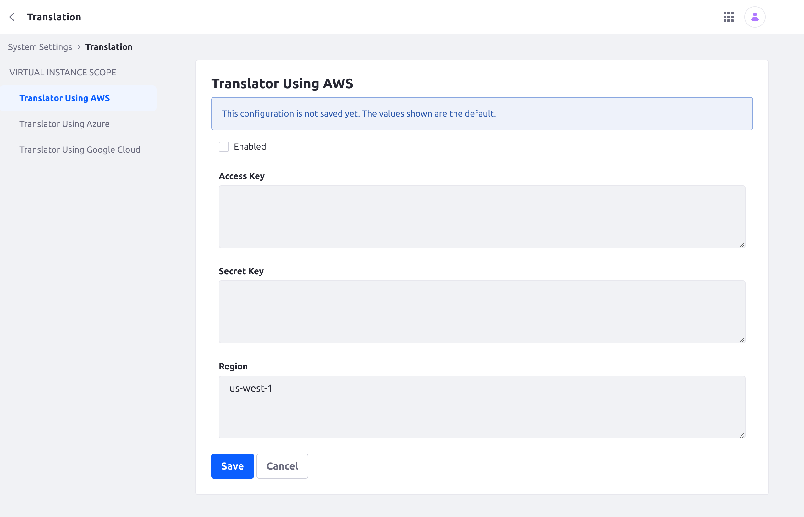
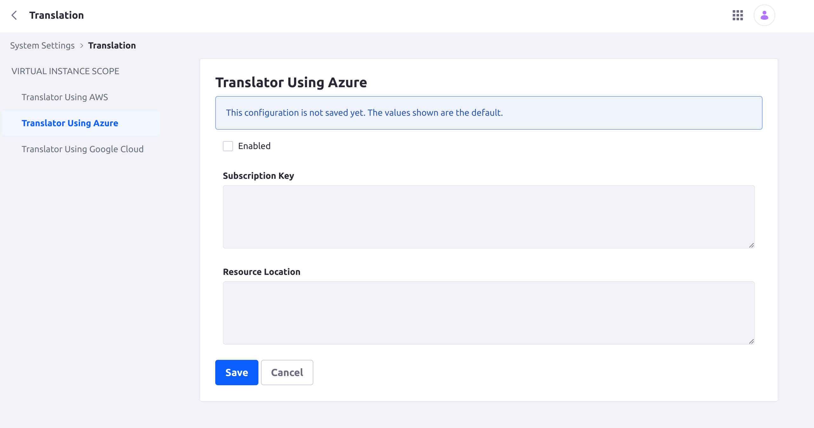
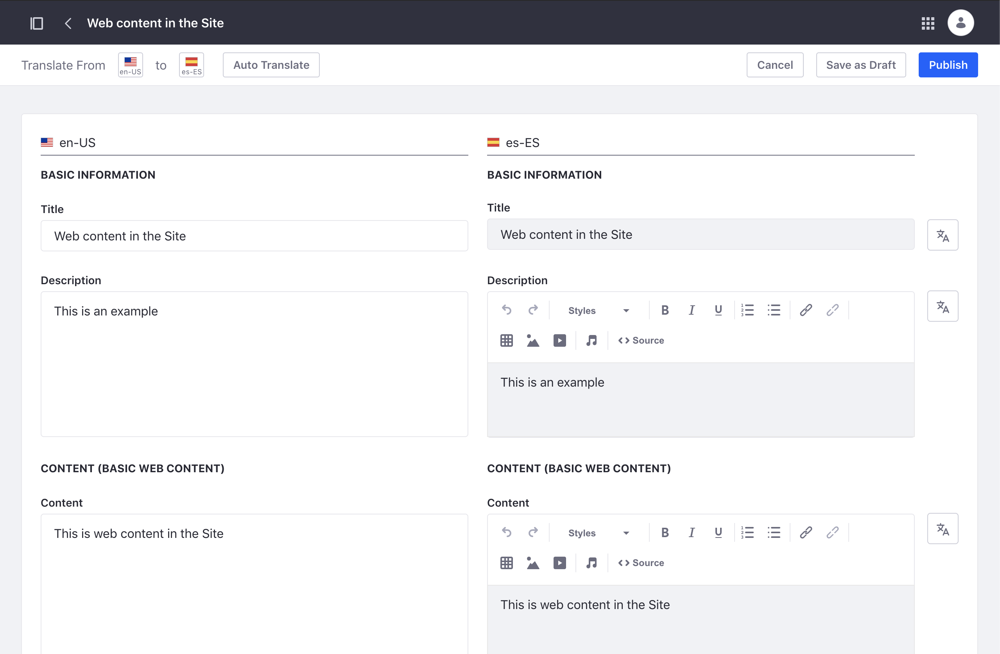

# Automatically Translating Web Content

Liferay integrates with the Google Cloud Translation API to generate automatic translations of Web Content. To enable this feature, you must have an active Google Cloud project with Cloud Translation API enabled. This project must also have a service account with a JSON account key. See official [Google Cloud Translation documentation](https://cloud.google.com/translate/docs/setup) for more information.

## Enabling Automatic Translation

1. Open the *Global Menu*(). Click the *Control Panel* tab and go to *System Settings* &rarr; *Translation*.

   

1. Check *Enabled*.

1. Enter a valid Google Cloud service account key in JSON format.

1. Click *Save*.

## Using Automatic Translation

Once Google Cloud Translation is enabled, auto translate buttons are added to the translation interface for Web Content.

Follow these steps to automatically translate all or only individual Web Content fields:

1. Open the Web Content application in a Site or Asset Library.

1. Click *Actions* () for the content you want to translate and select *Translate*.

   

1. Click the top left *Auto Translate* button to translate all Web Content fields into the selected language.

   

   Alternatively, click a field's individual *Auto Translate* button () to only translate its text.

   

1. Click *Save as Draft* or *Publish* when finished.

## Additional Information

* [Manually Translating Web Content](./manually-translating-web-content.md)
* [Exporting and Importing Translations](./exporting-and-importing-translations.md)
