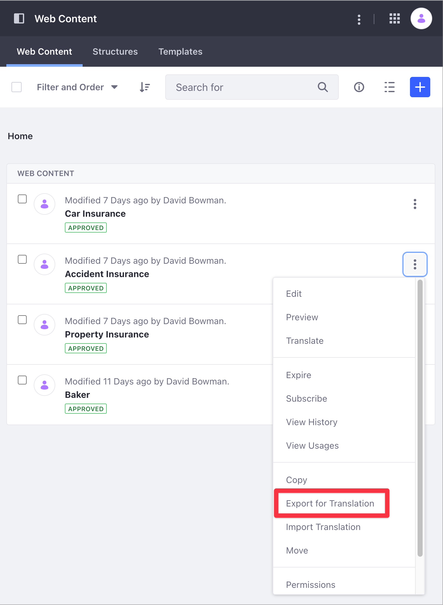
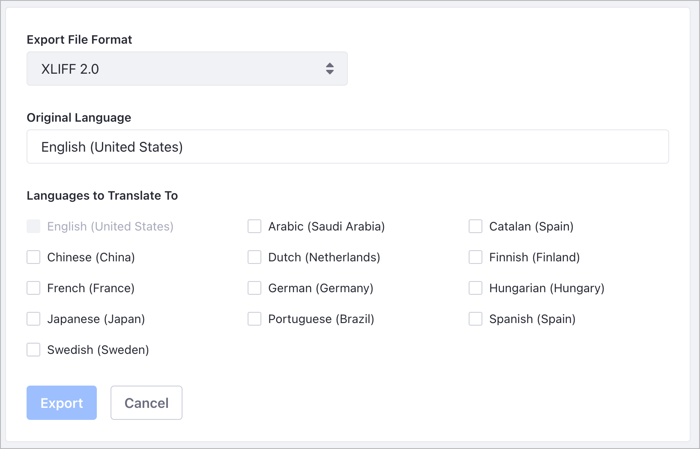
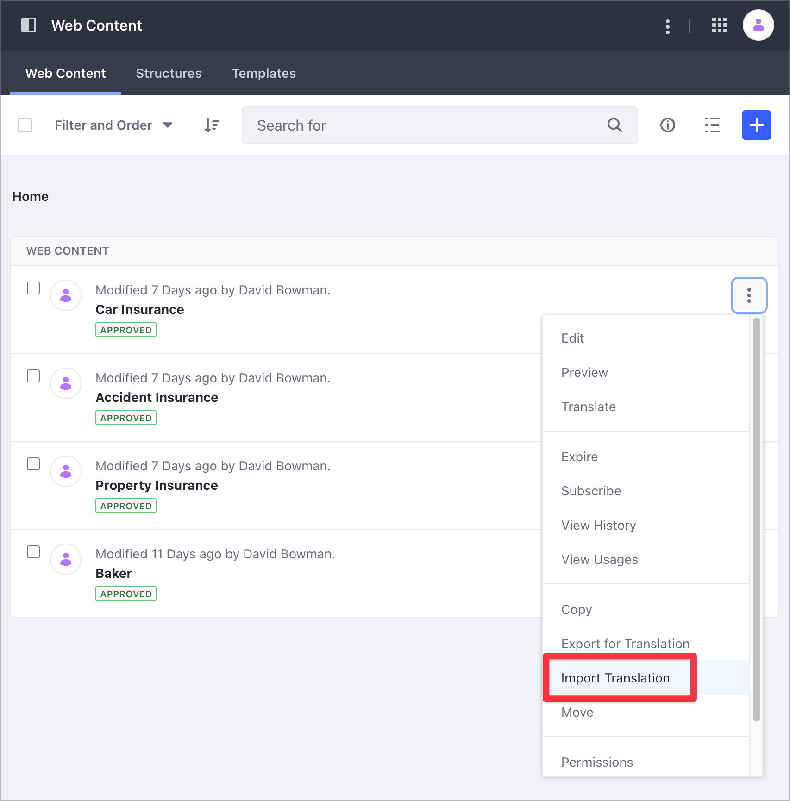
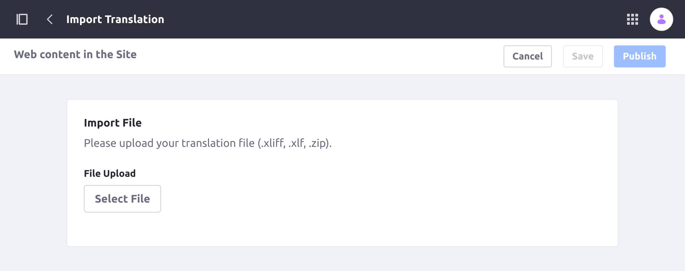

# Exporting and Importing Translations

Exporting your web content to the XLIFF format is an alternative to manual translation in Liferay. XLIFF (1.2 or 2.0) is the main interchange format used for dedicated translation software. Exported translations can be sent to professional translators and imported to provide translations for your content.

```note::
   To export web content for translation or import content translations, you must have *View* and *Update* permissions for the selected content. See `Managing Permissions for Translation <./manually-translating-web-content.md#managing-permissions-for-translation>`_.
```

## Exporting Content for Translation

1. Open the Product menu, and go to *Content & Data* &rarr; *Web Content*.

1. Click the *Actions* menu (  ) for the web content you want to translate and select *Export for Translation*. This opens a modal window that you can use to configure your export.

   

1. Select the Export format (XLIFF 1.2 or XLIFF 2.0)

1. Specify the web content's original language. This is used as a reference for the translation.

1. Select the languages for translation using the checkboxes. 

   

1. When finished, click *Export* to begin exporting for translation.

Liferay generates a Zip archive for download that contains as many XLIFF files as languages you've selected for translation. These files can be used with compatible translation software to translate your web content.

## Importing Content Translations

Once your translations are ready, follow these steps to import them to your web content.

1. Open the Product menu and go to *Content & Data* &rarr; *Web Content*.

1. Click the *Actions* menu (  ) for the translated web content and select *Import Translation*.

   

1. Select the translation file you want to import and then publish your changes.

   

When the import completes, the web content is updated with all changes included in the XLIFF file. If workflow is enabled, this change must be approved as with other content updates.

```note::
   Although Liferay supports both XLIFF 1.2 and 2.0, it may not support all features and capabilities those formats provide. Also, while Liferay supports importing XLIFF files created using the *Export for Translation* action, it cannot guarantee the successful import of files generated by other means.
```

## Additional Information

* [Manually Translating Web Content](./manually-translating-web-content.md)
* [Adding a Basic Web Content Article](../web-content-articles/adding-a-basic-web-content-article.md)
