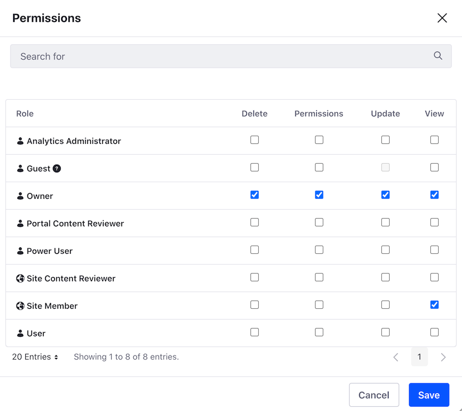

# Assigning Permissions to Web Content Structures and Templates

Structures and Web Content Templates provide direct access to Liferay's API. To avoid unauthorized or unintended access to Liferay DXP functionality, you should configure permissions for Structures and Web Content Templates.

As a best practice, define two different Roles with access to Structures and Web Content Templates:

* **Content Developer:** Users with this Role have permission to create and edit Structures or Web Content Templates.
* **Content Creator:** Users this Role have permission to view Structures or Web Content Templates, so they can use them to create content.

For information about how to create Roles, see [Creating and Managing Roles](../../../../users-and-permissions/roles-and-permissions/creating-and-managing-roles.md).

Consider the following information when you assign permissions to Structures and Web Content Templates:

* Determine if your Roles must have global permissions for all Structures and Web Content Templates across the Liferay DXP instance, or only for specific Sites.
* The *View* permission only allows Users to view Structures or Web Content Templates.
* The majority of Users should not be able to edit Structures or Web Content Templates.

## Security Considerations for Web Content Templates

Web Content Templates use the FreeMarker Template Language (FTL) by default. Users with permission to Create or Edit templates using FreeMarker may execute arbitrary code on your DXP instance and access sensitive information, including information about other users.

```important::
   Grant permission to Create or Edit templates in FreeMarker to trusted users only.
```

You can disable template creation completely. Once disabled, Users can no longer access creation options for Web Content Templates. This action does not affect existing templates.

1. Open the *Control Panel* tab in the Global Menu.
1. Go to *Configuration* → *System Settings* → *Content and Data* → *Dynamic Data Mapping*.
1. Click *Dynamic Data Mapping Web*.
1. Uncheck *Enable Template Creation*.
1. Click *Save*.

## Assigning Permissions

1. Go to *Site Administrator* &rarr; *Content & Data* &rarr; *Web Content*.
1. Select the *Structures* tab to set permissions for Structures, or the *Templates* tab to set permissions for Templates.
1. For the Web Content Template where you want to assign permissions, click the *Actions* button () and select *Permissions*.
1. Select the permissions you need for your Roles.
1. Click *Save*.

.

See [Defining Role Permissions](../../../../users-and-permissions/roles-and-permissions/defining-role-permissions.md) for more information on configuring Permissions.

## Related Information

* [Creating Structures](./creating-structures.md)
* [Managing Structures](./managing-structures.md)
* [Configuring Structure Fields](./configuring-structure-fields.md)
