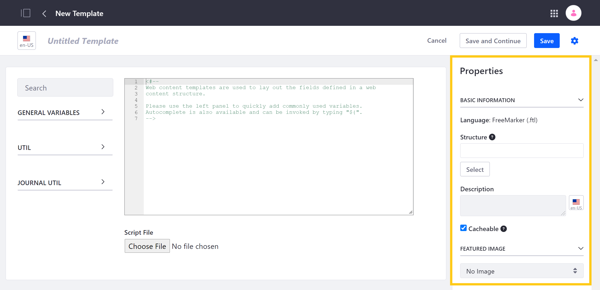
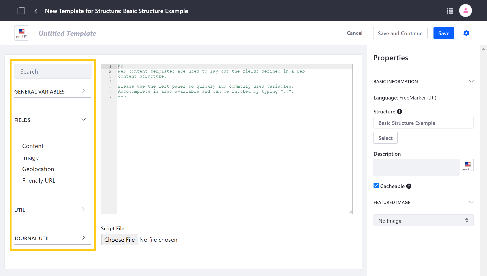

# Creating Web Content Templates

Web Content Templates use the FreeMarker Template Language (FTL) to determine how content fields are rendered on a Page. Each Template can be associated with a Web Content [Structure](../web-content-structures/creating-structures.md), or even [embedded in other Templates](./embedding-widgets-in-templates.md#embedding-other-templates).

```important::
   Grant permission to Create or Edit templates in FreeMarker to trusted users only. See `Assigning Permissions to Web Content Structures and Templates <../web-content-structures/assigning-permissions-to-structures-and-templates.md#security-considerations-for-web-content-templates>`_ for information about Web Content Templates security.
```

## How to Create a Web Content Template

1. Open the *Site Menu* (), and go to *Content & Data* &rarr; *Web Content*.

1. Select the *Templates* tab, and click on the *Add button* () to create a new Web Content Template.

1. Enter a title for your new Template.

1. Optionally, you can determine these configurable [Template Properties](#configurable-template-properties):

   

1. Add FreeMarker code to your Template via the script window, or by clicking on *Choose File* to select an existing `.ftl` script file to import.

   When manually entering code in the script window, you can quickly access standard variables in the left Template panel. If you've selected a Structure for your Template, you can also access variables for its specific fields, as well as the *Friendly URL* variable.

   You can then add HTML or additional FreeMarker code to your Template's script.

   

1. Click on *Save* when finished or *Save and Continue* to save your progress and continue editing.

   ```important::
      Once your Template is linked with a Structure and saved, you can no longer change this Template property.
   ```

   When saved, DXP automatically generates a DDM Template Key, URL, and WebDAV URL for your Template, which you can view in its Properties panel.

   

Once you've created a Template, you can [use it for Web Content](../web-content-articles/adding-a-basic-web-content-article.md) created with its linked Structure or [embed it in other Templates](./embedding-widgets-in-templates.md#embedding-other-templates), depending on its configuration. You can also edit your Template at any time.

```note::
   Changes in a Structure may require changes in associated Templates. For example, if a Structure field name referenced in a Template is renamed or removed, the Template's reference must be updated manually.
```

## Configurable Template Properties

While Creating a template, you can optionally determine the following Template settings in the Properties panel:

* **Structure**: Use the Structure field to link your Template with an existing Web Content Structure, or leave this field blank to create a generic Template that can be embedded in other Web Content Templates.

* **Description**: Use the Description field to provide localized descriptions of your Template.

* **Cacheable**: By default, new Templates are cacheable. Uncheck this property if dynamic behavior is needed (e.g., [taglibs](./using-taglibs-in-templates.md), request handling, CMS query API).

* **Featured Image**: Select a featured image for your Template via URL or from your device.

## Additional Information

* [Creating Structures](../web-content-structures/creating-structures.md)
* [Adding a Basic Web Content Article](../web-content-articles/adding-a-basic-web-content-article.md)
* [Embedding Widgets in Templates](./embedding-widgets-in-templates.md)
