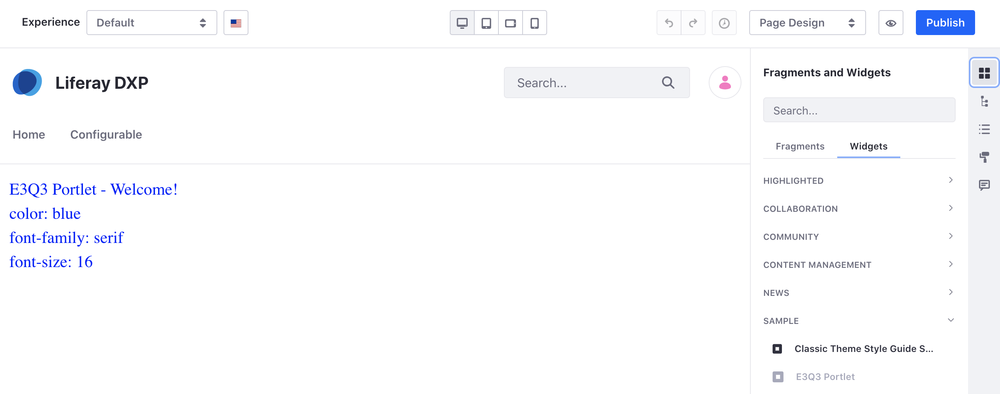
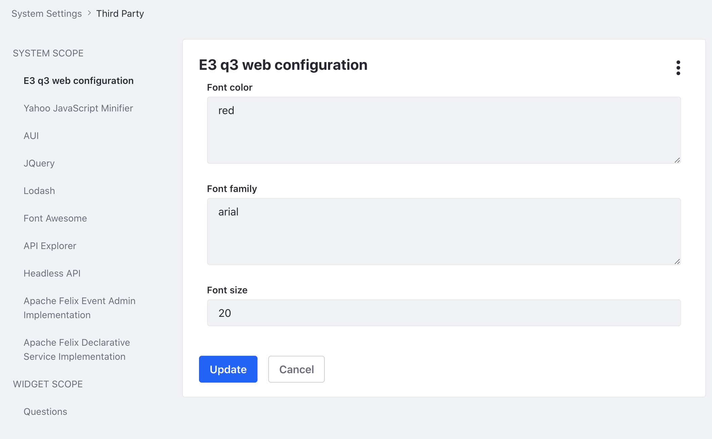

# Setting and Accessing Configurations

Liferay's configuration interface provides a simple method to add a configuration UI to your application. 

## See the Sample Project for a MVC Portlet

1. Start Liferay DXP. If you don't already have a docker container, use

    ```bash
    docker run -it -p 8080:8080 [$LIFERAY_LEARN_DXP_DOCKER_IMAGE$]
    ```
1. Download and unzip [Setting and Accessing Configurations](./liferay-e3q3.zip).

    ```bash
    curl https://learn.liferay.com/dxp/latest/en/developing-applications/core-frameworks/configurable-application/liferay-e3q3.zip -O
    ```

    ```bash
    unzip liferay-e3q3.zip
    ```

1. From the module root, build and deploy.

    ```bash
    ./gradlew deploy -Ddeploy.docker.container.id=$(docker ps -lq)
    ```

    ```note::
       This command is the same as copying the deployed jars to /opt/liferay/osgi/modules on the Docker container.
    ```

1. Confirm the deployment in the Liferay Docker container console.

    ```bash
    STARTED com.acme.e3q3.web.0.0 [1650]

1. Verify that the example module is working. Open your browser to `https://localhost:8080`

1. Add the E3Q3 Portlet to a page. You can find the example portlet under Sample Widgets.

    

    You should see a welcome message along with the 3 attributes that can be configured: font color, font family, and font size.

1. To change the configuration, navigate to *Control Panel* &rarr; *Configuration* &rarr; *System Settings*. Under *Platform* click *Third Party*. Click the name of the sample application on the left.

    

    Try a different font color, font family, and font size. Click the *Update* button and go back to your page with the published widget. Verify that the attributes have changed.

Now let's see how the configuration interface works.

## Creating the Configuration Interface

Creating a configuration interface adds a UI in settings. It also defines the attributes that are configurable.

In the sample project, the E3Q3WebConfiguration.java file is the configuration interface. 

```java
@Meta.OCD(id = "com.acme.e3q3.web.internal.configuration.E3Q3WebConfiguration")
public interface E3Q3WebConfiguration {

	@Meta.AD(deflt = "blue", required = false)
	public String fontColor();

	@Meta.AD(deflt = "serif", required = false)
	public String fontFamily();

	@Meta.AD(deflt = "16", required = false)
	public int fontSize();

}
```

For this interface there is no scope defined so the configuration scope is automatically set to `SYSTEM`.

The interface has three attributes that are configurable: font color, font family, and font size. Note that color and family are type `string` and size is type `int`.

`Meta.OCD` registers this class as a configuration with a specific id. Note that the id must be the fully qualified configuration class name.

`Meta.AD` specifies [optional metadata](http://bnd.bndtools.org/chapters/210-metatype.html) about the attribute such as a default value or whether the attribute is a required field. Note that if an attribute value is required but a default is not set, an administrator must set a value in settings for the application to work properly.

### Categorizing the Configuration

By default, the configuration UI for your app is generated in *System Settings* &rarr; *Platform* &rarr; *Third Party*. The categorization of the UI can be easily changed.

All available categories are nested beneath these sections:

* Commerce
* Platform
* Security
* Content and Data
* Other

Specify the category for your UI by placing an `@ExtendedObjectClassDefinition` annotation in your configuration interface. For example, if you wanted to place the UI under blogs, add the following line above the `@Meta.OCD` annotation:

```java
@ExtendedObjectClassDefinition(category = "blogs")
```

The fully qualified class name of `@ExtendedObjectClassDefinition` class is `com.liferay.portal.configuration.metatype.annotations.ExtendedObjectClassDefinition`.

Redeploy the example module and the configuration UI is now located in *System Settings* &rarr; *Content and Data* &rarr; *Blogs*.

### Implement a Dropdown Selection UI

The sample project has 3 attributes that can be configured. An administrator must input values for each attribute. The UI can be further customized to present a dropdown list instead of a text input field.

For example, a dropdown list can be used for the font family attribute. Replace the `@Meta.AD` annotation with the following:

```java
@Meta.AD(
	optionLabels = {"Arial", "Georgia", "Helvetica", "Tahoma", "Verdana"},
	optionValues = {"arial", "georgia", "helvetica", "tahoma", "verdana"},
required = false)
```

Redeploy the example module.


Now the font family attribute is a dropdown selection.

## Reading the Configuration from the Application

Next we'll see how the configuration is read by the MVC Portlet.

1. In the `@Component` annotation, specify the configuration interface class name with `configurationPid`:

    ```java
    configurationPid = "com.acme.e3q3.web.internal.configuration.E3Q3WebConfiguration"
    ```

1. The `activate()` method has an `@Activate` annotation that is used to invoke the method as soon as the app is started. The `@Modified` annotation is invoked whenever the configuration is modified.

    ```java
    @Activate
	@Modified
	protected void activate(Map<Object, Object> properties) {
		_e3q3WebConfiguration = ConfigurableUtil.createConfigurable(
			E3Q3WebConfiguration.class, properties);
	}

	private E3Q3WebConfiguration _e3q3WebConfiguration;
    ```

    The `activate()` method calls the `ConfigurableUtil.createConfigurable()` method to convert a map of the configuration's attributes to a typed class. The configuration is stored in a private field. Now this field can be used to retrieve configuration values or set values.

1. A configuration object is added to the request object so its values can be read from a JSP. 

    ```java
    @Override
	public void render(
			RenderRequest renderRequest, RenderResponse renderResponse)
		throws IOException, PortletException {

		renderRequest.setAttribute(
			E3Q3WebConfiguration.class.getName(), _e3q3WebConfiguration);

		super.render(renderRequest, renderResponse);
	}    
    ```

    The configuration can now be read from the request by the application's JSP.

## Accessing the Configuration from a JSP

1. Add the import for the configuration interface.

    ```markup
    <%@ page import="com.acme.e3q3.web.internal.configuration.E3Q3WebConfiguration" %>
    ```

1. Obtain the configuration object from the request object and read the configuration values.

    ```markup
    <%
    E3Q3WebConfiguration e3q3WebConfiguration = (E3Q3WebConfiguration)request.getAttribute(E3Q3WebConfiguration.class.getName());
    %>
    ```

1. The attributes `fontColor()`, `fontFamily()`, `fontSize()` are now available to use in the JSP. 