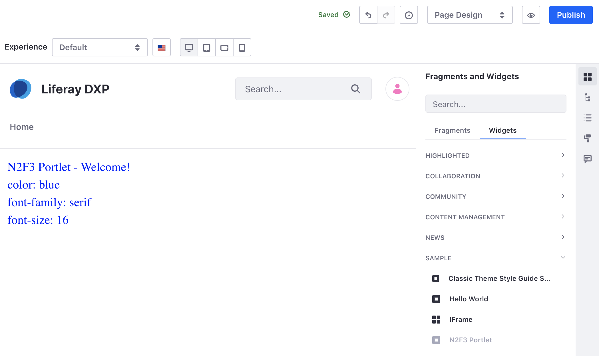

# Setting and Accessing Configurations

You can use Liferay's configuration framework to add a settings UI for a MVC Portlet.

## See the Example Portlet

1. Start Liferay DXP. If you don't already have a docker container, use

    ```bash
    docker run -it -m 8g -p 8080:8080 [$LIFERAY_LEARN_PORTAL_DOCKER_IMAGE$]
    ```

1. Download and unzip [Setting and Accessing Configurations](./liferay-n2f3.zip).

    ```bash
    curl https://learn.liferay.com/dxp/latest/en/developing-applications/core-frameworks/configuration-framework/liferay-n2f3.zip -O
    ```

    ```bash
    unzip liferay-n2f3.zip
    ```

1. From the module root, build and deploy.

    ```bash
    ./gradlew deploy -Ddeploy.docker.container.id=$(docker ps -lq)
    ```

    ```{note}
    This command is the same as copying the deployed jars to `/opt/liferay/osgi/modules` on the Docker container.
    ```

1. Confirm the deployment in the Liferay Docker container console.

    ```
    STARTED com.acme.n2f3.web.0.0 [1650]
    ```

1. Verify that the example module is working. Open your browser to `https://localhost:8080`

1. Add the N2F3 Portlet to a page. You can find the example portlet under Sample Widgets.

    

    The UI shows a welcome message along with the three configurable attributes: font color, font family, and font size.

1. To change the configuration, navigate to *Control Panel* &rarr; *Configuration* &rarr; *System Settings*. Under Other click *category.n2f3*.

    

    Try entering a different font color, font family, and font size. Click the *Update* button and go back to your page with the published widget. Verify that the attributes have changed.

Here's how the configuration framework works.

## Creating the Configuration Interface

Defining configurable attributes in a configuration interface is enough to generate a configuration UI in [System Settings](../../../system-administration/configuring-liferay/system-settings.md).

In the sample project, the `N2F3WebConfiguration.java` file is the configuration interface.

```{literalinclude} ./scoping-configurations/resources/liferay-n2f3.zip/n2f3-web/src/main/java/com/acme/n2f3/web/internal/configuration/N2F3WebConfiguration.java
:language: java
:lines: 5-17
```

Note, for this example interface the scope is set to `Scope.COMPANY`. See [Scoping Configurations](./scoping-configurations.md) for more information.

The interface has three configurable attributes: font color, font family, and font size. Note that color and family are type `string` and size is type `int`.

`Meta.OCD` registers this class as a configuration with a specific ID.

```{important}
Note that the ID must be the fully qualified class name (FQCN) of the configuration interface.
```

`Meta.AD` specifies [optional metadata](http://bnd.bndtools.org/chapters/210-metatype.html) about the attribute such as a default value or whether the attribute is a required field. Note that if an attribute value is required but a default is not set, an administrator must set a value in settings for the application to work properly.

Next, see how the configuration is read by the MVC Portlet.

## Reading the Configuration from the Application

1. In the `@Component` annotation, the configuration interface class is specified with the `configurationPid`:

    ```java
    configurationPid = "com.acme.n2f3.web.internal.configuration.N2F3WebConfiguration"
    ```

1. To access the configuration, the `render()` method utilizes a `ConfigurationProvider`. The Configuration Provider API provides methods to retrieve a configuration at different levels of scope. The sample project's configuration is instance scoped and uses the `getCompanyConfiguration()` method to retrieve the configuration.

    ```{literalinclude} ./scoping-configurations/resources/liferay-n2f3.zip/n2f3-web/src/main/java/com/acme/n2f3/web/internal/portlet/N2F3Portlet.java
    :dedent: 1
    :language: java
    :lines: 44-51
    ```

    The configuration object is added to the request object and can now be read from the request of the application's JSP.

## Create a Configuration Bean Declaration

To use the `ConfigurationProvider`, the configuration class must also be regisered with a `ConfigurationBeanDeclaration`. This enables the system to keep track of configuration changes as they happen.

```{literalinclude} ./scoping-configurations/resources/liferay-n2f3.zip/n2f3-web/src/main/java/com/acme/n2f3/web/internal/settings/definition/N2F3WebConfigurationBeanDeclaration.java
:language: java
:lines: 9-18
```

This class has one method that returns the configuration interface class of your application.

## Accessing the Configuration from a JSP

1. The following import statement adds the configuration interface to the JSP:

    ```markup
    <%@ page import="com.acme.n2f3.web.internal.configuration.N2F3WebConfiguration" %>
    ```

1. The configuration object from the request object is obtained and the configuration values are read.

    ```markup
    <%
    N2F3WebConfiguration n2f3WebConfiguration = (N2F3WebConfiguration)request.getAttribute(N2F3WebConfiguration.class.getName());
    %>
    ```

1. The attributes `fontColor()`, `fontFamily()`, `fontSize()` can now be used in the JSP.

## Implementing a Dropdown Selection UI

The sample project has three attributes that can be configured. Currently the attributes must be manually entered into a text input field, but this can be further customized.

For example, you can use a dropdown list for the font family attribute instead of an input field. In the project's configuration interface, replace the `@Meta.AD` annotation with this:

```java
@Meta.AD(
	optionLabels = {"Arial", "Georgia", "Helvetica", "Tahoma", "Verdana"},
	optionValues = {"arial", "georgia", "helvetica", "tahoma", "verdana"},
required = false)
```

Redeploy the example module.


Now the font family attribute is a dropdown selection.

## Further Customization

* [Categorizing a Configuration](./categorizing-a-configuration.md)
* [Scoping Configurations](./scoping-configurations)
* [Field Options Provider](./field-options-provider.md)
