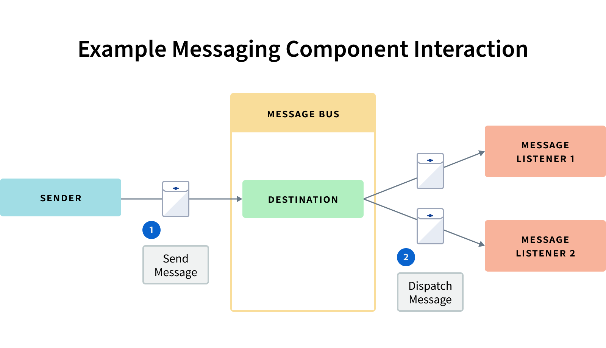

# Message Bus

```{toctree}
:maxdepth: 3

message-bus/listening-for-messages.md
message-bus/using-asynchronous-messaging.md
message-bus/using-default-synchronous-messaging.md
message-bus/using-direct-synchronous-messaging.md
message-bus/listening-for-registration-events.md
message-bus/tuning-messaging-performance.md
```

The Message Bus provides a loosely coupled way to exchange messages. A class sending a message invokes the Message Bus to send the message to a destination, while other classes (*listeners*) registered at that destination receive the message. The listeners are transparent to senders and vice-versa.

Here are the main messaging components:

**Destinations:** Logical (not physical), named locations where messages are sent.

**Listeners:** Classes that *listen* for messages sent to specific destinations.

**Message Bus:** The framework that handles destination registration and sends messages to listeners.

**Messages:** Objects that can contain a payload and metadata, including an optional response destination.

**Senders:** Arbitrary classes that invoke Message Bus to send messages to a destination's listeners.

The figure below demonstrates component interaction.



Here is an example interaction sequence:

1. `Destination` *D1* is registered with the Message Bus. Any class can register a `Destination`.
1. `MessageListener`s *ML1* and *ML2* register with `Destination` *D1*.
1. Arbitrary class *Foo* creates `Message` *M1*.
1. *Foo* invokes the Message Bus to send `Message` *M1* to `Destination` *D1*.
1. The Message Bus sends `Message` *M1* to *D1*-registered `MessageListener`s *ML1* and *ML2*.

*Foo* is concerned with using Message Bus to send *M1* to *D1*; it's not concerned with message recipients. `MessageListener`s *ML1* and *ML2* are only concerned with receiving messages at *D1*; they aren't concerned with message senders.

## Synchronous and Asynchronous Messaging

Message Bus sends messages synchronously and asynchronously.

**Synchronous Messaging:** The sender blocks after sending a message. When the sender's condition (determined by the sender type) is met, the sender unblocks and continues processing.

**Asynchronous Messaging:** The sender immediately continues processing after sending a message.

The following topics cover both ways of messaging:

* [Using Asynchronous Messaging](./message-bus/using-asynchronous-messaging.md) shows how to configure a destination and send messages asynchronously to it. This is the simplest way to send messages.

* [Using Default Synchronous Messaging](./message-bus/using-default-synchronous-messaging.md) demonstrates a message sender blocking until one listener responds to the message *or*, if no listener responds, until the message times out.

* [Using Direct Synchronous Messaging](./message-bus/using-default-synchronous-messaging.md) shows a message sender blocking on sending a message until *all* listeners receive the message.

## Tuning Performance

The Message Bus API facilitates monitoring registration events, destinations, destination message listeners, and message queues. You can configure Message Bus components to meet your needs by adjusting destination types, message queue parameters, and thread parameters. See [Tuning Messaging Performance](./message-bus/tuning-messaging-performance.md) for more information.

## What's Next

Listening on Liferay's built-in destinations is a great way to begin using Message Bus. Start with [Listening for Messages](./message-bus/listening-for-messages.md) next.
