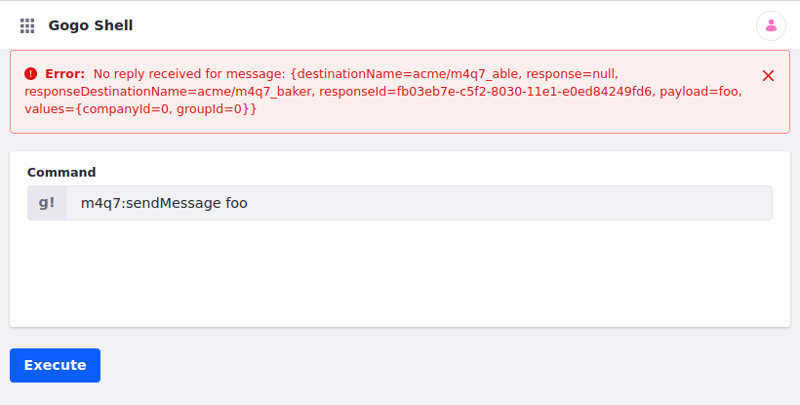

# Using Default Synchronous Messaging

In default synchronous messaging, the sender blocks while a Message Bus thread dispatches the message to registered message listeners. The sender unblocks when either a response message is received or the sender thread times out.

```note::
   The sender unblocks on the *first* response message received.
```

You'll send a default synchronous message using an example project. Then you'll modify the example to make the message time out.

## Send a Default Synchronous Message

The example project uses a `SynchronousMessageSender` in default mode to send a message and wait for a reply.

1. Start a [Liferay Docker container](../../../installation-and-upgrades/installing-liferay/using-liferay-docker-images/docker-container-basics.md).

    ```bash
    docker run -it -m 8g -p 8080:8080 [$LIFERAY_LEARN_DXP_DOCKER_IMAGE$]
    ```

1. Download and unzip the example.

    ```bash
    curl https://learn.liferay.com/dxp/latest/en/developing-applications/core-frameworks/message-bus/liferay-m4q7.zip -O
    ```

    ```bash
    unzip liferay-m4q7.zip
    ```

1. Build and deploy the example project modules.

    ```bash
    cd liferay-m4q7
    ```

    ```bash
    ./gradlew deploy -Ddeploy.docker.container.id=$(docker ps -lq)
    ```

    ```note::
       This command is the same as copying the module JARs to ``/opt/liferay/osgi/modules`` on the Docker container.
    ```

1. The Docker container console shows module startup.

    ```bash
    STARTED com.acme.m4q7.able.impl_1.0.0
    STARTED com.acme.m4q7.baker.impl_1.0.0
    STARTED com.acme.m4q7.charlie.impl_1.0.0
    ```

1. Visit the Liferay instance with your browser at `http://localhost:8080` and sign in using your credentials.

1. Open the [Gogo shell](../../../liferay-internals/fundamentals/using-the-gogo-shell/using-the-gogo-shell.md).

1. In the Gogo shell command field, enter `m4q7:sendMessage` followed by a message. For example,

    ```groovy
    m4q7:sendMessage foo
    ```

1. Confirm the output looks like this.

    ```
    INFO  [acme/m4q7_able-2][M4Q7CharlieMessageListener:23] Received message payload foo
    INFO  [acme/m4q7_baker-2][M4Q7BakerMessageListener:21] Received message payload M4Q7CharlieMessageListener
    INFO  [pipe-m4q7:sendMessage foo][M4Q7BakerOSGiCommands:28] Response: M4Q7CharlieMessageListener
    ```

At the `acme/m4q7_able` destination, `M4Q7CharlieMessageListener` received the Gogo shell message. At the `acme/m4q7_baker` destination, `M4Q7BakerMessageListener` received the response message from `M4Q7CharlieMessageListener`. Lastly, `M4Q7BakerOSGiCommands`'s `sendMessage` method logged the response object returned from the message sender.

## Project Overview

The three example module classes manage destinations, listen for messages, and send messages.

**`m4q7-able-impl` module:** `M4Q7AbleMessagingConfigurator` creates a message destination named `acme/m4q7_able` and registers it with the Message Bus.

**`m4q7-baker-impl` module:**

* `M4Q7BakerOSGiCommands` sends a message to the `acme/m4q7_able` destination and logs the response.
* `M4Q7BakerMessagingConfigurator` creates a message destination named `acme/m4q7_baker` and registers it with the Message Bus.
* `M4Q7BakerMessageListener` listens for messages sent to the `acme/m4q7_baker` destination and logs the message payload.

**`m4q7-charlie-impl` module:** `M4Q7CharlieMessageListener` Listens for messages sent to the `acme/m4q7_able` destination, logs the message payload, and sends a response message to the original message's response destination. 

Here's the event flow:

1. You invoke the `m4q7:sendMessage` Gogo shell command, passing in a message.
1. `M4Q7BakerOSGiCommands`'s `sendMessage(String)` method triggers on the Gogo shell command and sends the command arguments in a message to the `acme/m4q7_able` destination.
1. A Message Bus thread delivers the message to `M4Q7CharlieMessageListener`.
1. `M4Q7CharlieMessageListener` logs the message payload and sends its own class name in a response message to the original message's response destination `acme/m4q7_baker`.
1. `M4Q7BakerMessageListener` receives the response message and logs its payload.
1. Processing returns to `M4Q7BakerOSGiCommands`, where it logs the response to the original message.

Now examine each class, starting with the destination configurators.

## Examine the Destination Configurators

The `m4q7-able-impl` module and `m4q7-baker-impl` module have destination configurator classes `M4Q7AbleMessagingConfigurator` and `M4Q7BakerMessagingConfigurator`, respectively. They each create and configure destinations.

The `M4Q7AbleMessagingConfigurator` class configures the `acme/m4q7_able` destination:

```{literalinclude} ./using-default-synchronous-messaging/resources/liferay-m4q7.zip/m4q7-able-impl/src/main/java/com/acme/m4q7/able/internal/messaging/M4Q7AbleMessagingConfigurator.java
   :language: java
   :lines: 15-45
```

The `M4Q7BakerMessagingConfigurator` class configures the `acme/m4q7_baker` destination:

```{literalinclude} ./using-default-synchronous-messaging/resources/liferay-m4q7.zip/m4q7-baker-impl/src/main/java/com/acme/m4q7/baker/internal/messaging/M4Q7BakerMessagingConfigurator.java
   :language: java
   :lines: 15-45
```

Both configurators are [`Component`](https://docs.osgi.org/javadoc/osgi.cmpn/7.0.0/org/osgi/service/component/annotations/Component.html) classes. They use the [`@Reference`](https://docs.osgi.org/javadoc/osgi.cmpn/7.0.0/org/osgi/service/component/annotations/Reference.html) annotation to inject a `DestinationFactory` instance.

The `_activate(BundleContext)` method uses the [`DestinationFactory`](https://github.com/liferay/liferay-portal/blob/[$LIFERAY_LEARN_PORTAL_GIT_TAG$]/portal-kernel/src/com/liferay/portal/kernel/messaging/DestinationFactory.java) and a [`DestinationConfiguration`](https://github.com/liferay/liferay-portal/blob/[$LIFERAY_LEARN_PORTAL_GIT_TAG$]/portal-kernel/src/com/liferay/portal/kernel/messaging/DestinationConfiguration.java) to create a *serial* destination. Lastly, the `_activate(BundleContext)` method registers the [`Destination`](https://github.com/liferay/liferay-portal/blob/[$LIFERAY_LEARN_PORTAL_GIT_TAG$]/portal-kernel/src/com/liferay/portal/kernel/messaging/Destination.java) in an OSGi service using the `BundleContext`.

```warning::
   Only use serial or parallel destinations with default synchronous messaging. You can create them by calling ``DestinationConfiguration``'s ``createSerialDestinationConfiguration(String)`` and ``createParallelDestinationConfiguration(String)`` methods.

   Don't use synchronous destinations with default synchronous messaging because they nullify message sender timeouts.
```

When the configurators deactivate, their `_deactivate()` methods unregister the destination services.

## Examine the Listeners

The `m4q7-charlie-impl` module's `M4Q7CharlieMessageListener` class listens for messages sent to the `acme/m4q7_able` [`Destination`](https://github.com/liferay/liferay-portal/blob/[$LIFERAY_LEARN_PORTAL_GIT_TAG$]/portal-kernel/src/com/liferay/portal/kernel/messaging/Destination.java). It registers the same way [Listening for Messages](./listening-for-messages.md) demonstrates. 

`M4Q7CharlieMessageListener` class:

```{literalinclude} ./using-default-synchronous-messaging/resources/liferay-m4q7.zip/m4q7-charlie-impl/src/main/java/com/acme/m4q7/charlie/internal/messaging/M4Q7CharlieMessageListener.java
   :language: java
   :lines: 12-42
```

When `M4Q7CharlieMessageListener` receives a message, its `receive(Message)` method logs the message payload and sends a response message to the original message's response destination. The method sets the response message payload to the listener class name and sets the response message ID to the original message's response ID.

```important::
   In default synchronous messaging, response messages must use the original message's response ID *and* must be sent to the response destination.
```

The `m4q7-baker-impl` module's `M4Q7BakerMessageListener` class listens for messages sent to `acme/m4q7_baker`, which is the response destination for `M4Q7BakerOSGiCommands`'s messages. 

`M4Q7BakerMessageListener` class:

```{literalinclude} ./using-default-synchronous-messaging/resources/liferay-m4q7.zip/m4q7-baker-impl/src/main/java/com/acme/m4q7/baker/internal/messaging/M4Q7BakerMessageListener.java
   :language: java
   :lines: 10-28
```

When `M4Q7BakerMessageListener` receives a message, its `receive(Message)` method logs the message payload.

## Examine the Sender

The `m4q7-baker-impl` module's `M4Q7BakerOSGiCommands` class provides an OSGi Command that triggers sending the command arguments in a message to the `"acme/m4q7_able"` destination.

```{literalinclude} ./using-default-synchronous-messaging/resources/liferay-m4q7.zip/m4q7-baker-impl/src/main/java/com/acme/m4q7/baker/internal/osgi/commands/M4Q7BakerOSGiCommands.java
   :language: java
   :lines: 12-42
```

`M4Q7BakerOSGiCommands` is a service `Component` of its own class type. It uses an `@Reference` annotation to inject a `SynchronousMessageSender` that's set to *default* mode (specified by the annotation's `target = "(mode=DEFAULT)"` attribute). 

```note::
   In *default* mode, the ``SynchronousMessageSender``'s ``send`` method blocks the calling class until a response message is received or until the sender times out.
```

`M4Q7BakerOSGiCommands`'s `@Component` properties define a Gogo shell command function called `sendMessage` in the `m4q7` scope. The command takes an input `String` and maps to `M4Q7BakerOSGiCommands`'s `sendMessage(String)` method.

The `sendMessage(String)` method creates a [`Message`](https://github.com/liferay/liferay-portal/blob/[$LIFERAY_LEARN_PORTAL_GIT_TAG$]/portal-kernel/src/com/liferay/portal/kernel/messaging/Message.java) with the Gogo shell command's `String` as the payload and `"acme/m4q7_baker"` as the response destination.

The `sendMessage(String)` method sends the message by calling `SynchronousMessageSender`'s `send(String, Message, long)` method, passing in the `"acme/m4q7_able"` destination name, the message instance, and a `10000` millisecond timeout. In default mode, the `SynchronousMessageSender` uses a Message Bus thread to deliver the message to message listeners. Execution blocks in the `M4Q7BakerOSGiCommands` class until a message that has the original message's response ID is received at the `"acme/m4q7_baker"` response destination. When the response is received, execution continues in the `M4Q7BakerOSGiCommands` `sendMessage(String)` method, where it logs the message response. If the timeout expires before a matching response message is received, `SynchronousMessageSender`'s `send(String, Message, long)` method throws a `MessageBusException`.

```important::
   In default synchronous messaging, response messages must use the original message's response ID *and* must be sent to the response destination.
```

Now that you've seen a message listener reply with a response message, you can test the response timeout.

## Demonstrate the Response Timeout

Here's how to turn off the message response logic to force the timeout.

1. In `M4Q7CharlieMessageListener`'s `receive(Message)` method, comment out the `_messageBus.sendMessage(...)` call.

    ```java
    @Override
	public void receive(Message message) {
		if (_log.isInfoEnabled()) {
			Object payload = message.getPayload();

			_log.info("Received message payload " + payload.toString());
		}

		// _messageBus.sendMessage(
		// 	message.getResponseDestinationName(),
		// 	new Message() {
		// 		{
		// 			setPayload("M4Q7CharlieMessageListener");
		// 			setResponseId(message.getResponseId());
		// 		}
		// 	});
	}
    ```

1. Redeploy the example project.

    ```bash
    ./gradlew deploy -Ddeploy.docker.container.id=$(docker ps -lq)
    ```

1. In the Gogo shell command field, enter `m4q7:sendMessage` followed by a message. For example,

    ```groovy
    m4q7:sendMessage foo
    ```

1. Confirm the Gogo shell page looks like this:

    

1. Confirm the message in the Docker console looks like this.

    ```bash
    INFO  [acme/m4q7_able-2][M4Q7CharlieMessageListener:23] Received message payload foo
    ```

`M4Q7CharlieMessageListener` received the message but never replied to it. The `SynchronousMessageSender` threw a `MessageBusException` that was printed in the Gogo shell page.

Congratulations on sending messages synchronously with a timeout.

## What's Next

If you want to explore synchronous messaging using *direct* mode, see [Using Direct Synchronous Messaging](./using-direct-synchronous-messaging.md).

If you want to continue processing immediately after sending a message, see [Using Asynchronous Messaging](./using-asynchronous-messaging.md).

## Additional Information

* [Message Bus](./message-bus.md)
* [Listening for Messages](./listening-for-messages.md)
* [Using Asynchronous Messaging](./using-asynchronous-messaging.md)
* [Listening for Registration Events](./listening-for-registration-events.md)