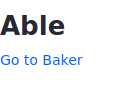
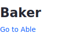

# MVC Render Command

MVC Render Commands are classes that handle render logic. They are invoked by `MVCPortlet` render URLs and requests. If your render logic is simple and you want to implement all of it in your portlet class, see [Rendering Views with MVC Portlet](./rendering-views-with-mvc-portlet.md). If your render logic is complex or you want clean separation between render paths, use MVC Render Commands.

## Invoke an MVC Render Command

Here you'll deploy an example portlet that renders views using MVC render commands.

1. Start a [Liferay Docker container](../../../installation-and-upgrades/installing-liferay/using-liferay-docker-images/docker-container-basics.md).

   ```bash
   docker run -it -m 8g -p 8080:8080 [$LIFERAY_LEARN_DXP_DOCKER_IMAGE$]
   ```

1. Download and unzip the example.

   ```bash
   curl https://learn.liferay.com/dxp/latest/dxp/latest/en/developing-applications/developing-a-java-web-application/using-mvc/liferay-a4p1.zip -O
   ```

   ```bash
   unzip liferay-a4p1.zip
   ```

1. Build and deploy the example.

    ```bash
    cd liferay-a4p1
    ```

    ```bash
    ./gradlew deploy -Ddeploy.docker.container.id=$(docker ps -lq)
    ```

    ```{note}
    This command is the same as copying module JARs to `/opt/liferay/osgi/modules` on the Docker container.
    ```

1. Confirm the deployment in the Docker container console.

    ```bash
    STARTED com.acme.a4p1.web_1.0.0
    ```

1. Open a browser to `http://localhost:8080`.

1. Sign in using the default credentials:

    **User Name:** `test@liferay.com`

    **Password:** `test`

1. Add the *A4P1 Portlet* widget from the *Samples* category to a widget page. The A4P1 Portlet appears.

    

1. Invoke an MVC render command to visit the Baker view by clicking *Go to Baker*. `A4P1BakerMVCRenderCommand` logs invoking its `render` method and renders the Baker view.

    ```bash
    [A4P1BakerMVCRenderCommand:26] Invoking #render(RenderRequest, RenderResponse)
    ```

    

1. Invoke the other MVC render command and revisit the Able view by clicking *Go to Able*. `A4P1AbleMVCRenderCommand` logs invoking its `render` method and renders the Able view again.

    ```bash
    [A4P1AbleMVCRenderCommand:26] Invoking #render(RenderRequest, RenderResponse)
    ```

You've seen MVC Render Commands in action. Now learn how they work.


## Examine the Portlet

`A4P1Portlet` is a minimal [`MVCPortlet`](https://github.com/liferay/liferay-portal/blob/[$LIFERAY_LEARN_PORTAL_GIT_TAG$]/portal-kernel/src/com/liferay/portal/kernel/portlet/bridges/mvc/MVCPortlet.java).

```{literalinclude} ./mvc-render-command/resources/liferay-a4p1.zip/a4p1-web/src/main/java/com/acme/a4p1/web/internal/portlet/A4P1Portlet.java
:language: java
:lines: 9-19
```

The [`@Component`](https://osgi.org/javadoc/r6/residential/org/osgi/service/component/annotations/Component.html) `javax.portlet.name` property sets the portlet's name.

```{literalinclude} ./mvc-render-command/resources/liferay-a4p1.zip/a4p1-web/src/main/java/com/acme/a4p1/web/internal/portlet/A4P1Portlet.java
:dedent: 2
:language: java
:lines: 14
```

The portlet renders `/a4p1/able.jsp` by default.

```{note}
`MVCRenderCommand`s bind to a portlet by the portlet's name (e.g., the portlet component `javax.portlet.name` property value).
```

The portlet's MVC Render Command classes are next.

## Examine the MVCRenderCommand Classes

MVC Render Command classes can implement [`MVCRenderCommand`](https://github.com/liferay/liferay-portal/blob/[$LIFERAY_LEARN_PORTAL_GIT_TAG$]/portal-kernel/src/com/liferay/portal/kernel/portlet/bridges/mvc/MVCRenderCommand.java) directly or implement it indirectly by extending [`BaseMVCRenderCommand`](https://github.com/liferay/liferay-portal/blob/[$LIFERAY_LEARN_PORTAL_GIT_TAG$]/portal-kernel/src/com/liferay/portal/kernel/portlet/bridges/mvc/BaseMVCRenderCommand.java). `A4P1AbleMVCRenderCommand` directly implements `MVCRenderCommand`. Here is `A4P1AbleMVCRenderCommand`:

```{literalinclude} ./mvc-render-command/resources/liferay-a4p1.zip/a4p1-web/src/main/java/com/acme/a4p1/web/internal/portlet/action/A4P1AbleMVCRenderCommand.java
:language: java
:lines: 12-35
```

`A4P1AbleMVCRenderCommand` is a [`Component`](https://docs.osgi.org/javadoc/osgi.cmpn/7.0.0/org/osgi/service/component/annotations/Component.html) that provides an `MVCRenderCommand` service. The component properties apply the `A4P1AbleMVCRenderCommand` to the portlet named `com_acme_a4p1_web_internal_portlet_A4P1Portlet` and map `A4P1AbleMVCRenderCommand` to the MVC command name `/a4p1/able`.

```{note}
You can associate an `MVCRenderCommand` component with multiple portlets by declaring a `javax.portlet.name` property for each portlet.
```

When the portlet receives a request parameter that specifies the MVC command name `/a4p1/able`, `A4P1AbleMVCRenderCommand`'s `render` method executes. This `render` method logs a message that identifies itself and then returns the path of the view to render.

`A4P1BakerMVCRenderCommand` is similar to `A4P1AbleMVCRenderCommand` except its MVC command name is `/a4p1/baker` and its render method returns the view path `/a4p1/baker.jsp`.

These example MVC Render Commands provide trivial functionality for demonstration purposes. Implement your MVC Render Command `render` method with logic required to render your views.

The example view JSPs' portlet render URLs trigger the MVC Render Commands.

## Examine the Portlet Render URLs

The `able.jsp` and `baker.jsp` files indirectly link to each other using portlet render URLs. Here is `able.jsp`:

```{literalinclude} ./mvc-render-command/resources/liferay-a4p1.zip/a4p1-web/src/main/resources/META-INF/resources/a4p1/able.jsp
:language: javascript
```

The `portlet:renderURL` tag is available from the portlet taglib and is assigned the prefix `portlet`. This render URL declares the `mvcRenderCommandName` portlet parameter value `/a4p1/baker`--this is `A4P1AbleMVCRenderCommand`'s MVC command name. The variable `bakerURL` references this render URL.

The hyperlink `<a href="<%= bakerURL %>">Go to Baker</a>` binds the render URL to an action.When a user clicks on the hyperlink, the portlet sends the [`RenderRequest`](https://docs.liferay.com/portlet-api/2.0/javadocs/javax/portlet/RenderRequest.html) to `A4P1BakerMVCRenderCommand` because its `mvc.command.name` component property value `/a4p1/baker` matches the `mvcRenderCommandName` parameter value.

`baker.jsp` is similar to `able.jsp` except its portlet render URL `mvcRenderCommandName` parameter value is `/a4p1/able`. Each JSP's `portlet:renderURL` tag maps to an MVC Render Command by assigning the MVC Render Command's `mvc.command.name` property value to the tag's `mvcRenderCommandName` portlet parameter.

| `able.jsp` Portlet Render URL Parameter | `A4P1BakerMVCRenderCommand` Component Property |
| ----------------------------- | ----------------------------------------------- |
| `<portlet:param name="mvcRenderCommandName" value="/a4p1/baker" />` | `mvc.command.name=/a4p1/baker` |

| `baker.jsp` Portlet Render URL Parameter | `A4P1AbleMVCRenderCommand` Component Property |
| ----------------------------- | ----------------------------------------------- |
| `<portlet:param name="mvcRenderCommandName" value="/a4p1/able" />` | `mvc.command.name=/a4p1/able` |

## What's Next

Now you know how to implement render logic in MVC Render Command classes. Next, you can act on resources such as files using [MVC Resource Command](./mvc-resource-command.md) classes. 

## Additional Information

* [MVC Resource Command](./mvc-resource-command.md)
* [MVC Action Command](./mvc-action-command.md)
* [Using Localized Messages in an MVC Portlet](./using-localized-messages-in-an-mvc-portlet.md)
* [Portlets](../reference/portlets.md)