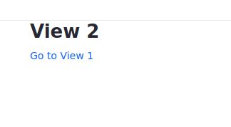

# Rendering Views with MVC Portlet

If you want users to access your portlet's views, you must implement navigation to them. Portlet render URLs help you do this.

Here you'll deploy an example application that uses portlet render URLs. You'll examine how the portlet creates URLs that set the view path using use MVC Portlet's `mvcPath` parameter.

The example portlet has two views: *View 1* displays its name and a link to *View 2*, and vice-versa.


## Deploy an MVC Portlet with Multiple Views

Here's how to deploy the example portlet and navigate between its views. For learning purposes, the portlet logs the `mvcPath` parameter value.

1. Start a [Liferay Docker container](../../../installation-and-upgrades/installing-liferay/using-liferay-docker-images/docker-container-basics.md).

   ```bash
   docker run -it -m 8g -p 8080:8080 [$LIFERAY_LEARN_PORTAL_DOCKER_IMAGE$]
   ```

1. Download and unzip the example.

   ```bash
   curl https://learn.liferay.com/dxp/latest/en/developing-applications/developing-a-java-web-application/using-mvc/liferay-c8m3.zip -O
   ```

   ```bash
   unzip liferay-c8m3.zip
   ```

1. Build and deploy the example.

    ```bash
    cd liferay-c8m3
    ```

    ```bash
     ./gradlew deploy -Ddeploy.docker.container.id=$(docker ps -lq)
    ```

    ```{note}
    This command is the same as copying module JARs to `/opt/liferay/osgi/modules` on the Docker container.
    ```

1. Confirm the deployment in the Docker container console.

    ```bash
    STARTED com.acme.c8m3.web_1.0.0
    ```

1. Open a browser to `http://localhost:8080`.

1. Sign in using the default credentials:

   **User Name:** `test@liferay.com`

   **Password:** `test`

1. Add the *C8M3 Portlet* widget from the *Samples* category to a widget page. *View 1* (the portlet's default view) appears.

    

    The following message prints to your log.

    ```bash
    MVC path null
    ```

    The render request doesn't yet include an MVC path parameter. This is expected. The portlet renders View 1 by default using the portlet class (described later). The next step uses the MVC path parameter.

1. Click *Go to View 2*. View 2 appears.

    

    The log message shows the MVC path value `/view_2.jsp`---the path to the View 2 template.

    ```bash
    MVC path /view_2.jsp
    ```

1. Click *Go to View 1*. View 1 appears again.

   

   The log message prints the MVC path `/view_1.jsp`.

   ```bash
    MVC path /view_1.jsp
   ```

You've made the round trip between the portlet views. Next, learn how the portlet sets a default view and sets paths to views using render URLs and the MVC path request parameter.

## Setting the Default View

A portlet's default view renders when users first land on the portlet's page. An initialization parameter in the portlet class sets the default view. The `C8M3Portlet.java` example class sets the default view in its [`@Component`](https://osgi.org/javadoc/r6/residential/org/osgi/service/component/annotations/Component.html) annotation.

```{literalinclude} ./rendering-views-with-mvc-portlet/resources/liferay-c8m3.zip/c8m3-web/src/main/java/com/acme/c8m3/web/internal/portlet/C8M3Portlet.java
   :language: java
   :lines: 16-24
```

The [`@Component`](https://osgi.org/javadoc/r6/residential/org/osgi/service/component/annotations/Component.html) property `"javax.portlet.init-param.view-template=/view1.jsp"` specifies `/view1.jsp` as the default view template. The template path is relative to the portlet's `src/main/resources/META-INF/resources` folder.

Next, learn how View 1 links to View 2.

## Linking to a View Using a Portlet Render URL

View 1 has only a heading called *View 1* and a link labeled *Go to View 2*. Here's the `view1.jsp` code:

```{literalinclude} ./rendering-views-with-mvc-portlet/resources/liferay-c8m3.zip/c8m3-web/src/main/resources/META-INF/resources/view_1.jsp
   :language: jsp
```

The `portlet:renderURL` tag comes from the portlet taglib and is assigned the prefix `portlet`. The render URL above is assigned to the variable `view2URL`. The render URL declares the `portlet:param` named `mvcPath` the value `/view_2.jsp`. When the portlet renders, the `mvcPath` parameter is added to the portlet's [`RenderRequest`](https://docs.liferay.com/portlet-api/2.0/javadocs/javax/portlet/RenderRequest.html) object. On processing portlet requests, [`MVCPortlet`](https://github.com/liferay/liferay-portal/blob/[$LIFERAY_LEARN_PORTAL_GIT_TAG$]/portal-kernel/src/com/liferay/portal/kernel/portlet/bridges/mvc/MVCPortlet.java) renders the template assigned to `mvcPath`.

A render URL must be bound to a UI component, such as a hyperlink or buttons, for the portlet to use the URL. The hyperlink `<a href="<%= view2URL %>">Go to View 2</a>` binds the render URL to a UI component.

When a user clicks on the *Go to View 2* hyperlink, a portlet request that includes the `mvcPath` parameter is sent to the portlet class.

## Handling the mvcPath Portlet Parameter

When a portlet receives the request object, it can respond to the request object parameters. `C8M3Portlet`'s `render` method responds to render requests.

```{literalinclude} ./rendering-views-with-mvc-portlet/resources/liferay-c8m3.zip/c8m3-web/src/main/java/com/acme/c8m3/web/internal/portlet/C8M3Portlet.java
   :dedent: 1
   :language: java
   :lines: 26-40
```

`C8M3Portlet`'s `render` method logs the `mvcPath` parameter value and then delegates rendering the portlet to the superclass `MVCPortlet`. [`MVCPortlet`](https://github.com/liferay/liferay-portal/blob/[$LIFERAY_LEARN_PORTAL_GIT_TAG$]/portal-kernel/src/com/liferay/portal/kernel/portlet/bridges/mvc/MVCPortlet.java) renders the view assigned to the `mvcPath` portlet request parameter.

```{note}
In the absence of an `mvcPath` request parameter, `MVCPortlet` displays its default template (i.e., the template that the `javax.portlet.init-param.view-template` component property specifies).
```

The View 2 template `view2.jsp` maps back to `view1.jsp` using a portlet render URL too.

```{literalinclude} ./rendering-views-with-mvc-portlet/resources/liferay-c8m3.zip/c8m3-web/src/main/resources/META-INF/resources/view_2.jsp
   :language: jsp
```

It implements the round trip back to View 1.

## What's Next

Now you know how to render portlet views. Next, you can perform actions in your portlet or render your views using separate `RenderCommand` classes.

## Additional Information

* [MVC Render Command](./mvc-render-command.md)
* [MVC Action Command](./mvc-action-command.md)
* [Using Localized Messages in an MVC Portlet](./using-localized-messages-in-an-mvc-portlet.md)
* [Portlets](../reference/portlets.md)
