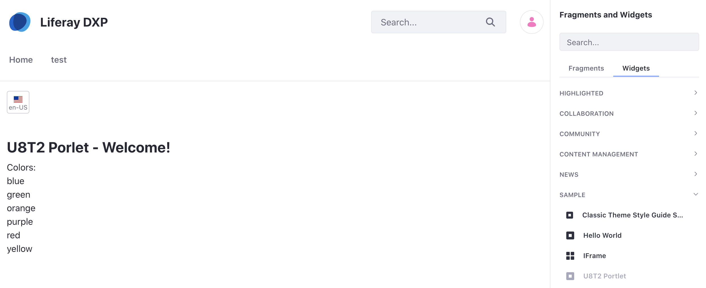

# Sharing Localized Messages

As you work on an application you might have multiple modules, each of which has its own language keys. Instead of maintaining various language properties files in different places, consolidate them into one place. This example project will demonstrate how to language keys can be shared across different modules.

## Overview

1. [Deploy the Example](#deploy-the-example)
1. [Walk Through the Example](#walk-through-the-example)

## Deploy the Example

To see the example:

1. Start Liferay DXP. If you don't already have a docker container, use

    ```bash
    docker run -it -p 8080:8080 [$LIFERAY_LEARN_DXP_DOCKER_IMAGE$]
    ```

    If you're running a different Liferay Portal CE version or Liferay DXP, adjust the above command accordingly. 

1. Download and unzip [Sharing Localized Messages](./liferay-u8t2.zip).

    ```bash
    curl https://learn.liferay.com/dxp/7.x/en/liferay-internals/extending-liferay/liferay-u8t2.zip -O
    ```

    ```bash
    unzip liferay-u8t2.zip
    ```

1. From the module root, build and deploy.

    ```bash
    ./gradlew deploy -Ddeploy.docker.container.id=$(docker ps -lq)
    ```

    ```note::
       This command is the same as copying the deployed jars to /opt/liferay/osgi/modules on the Docker container.
    ```

1. Confirm the deployment in the Liferay Docker container console.

    ```bash
    STARTED com.acme.u8t2.web.0.0 [1009]
    ```

1. Verify that the example module is working. Open your browser to `https://localhost:8080`

1. Add the U8T2 Portlet to a page. You can find the example portlet under Sample Widgets.

    

    You should see the welcome message header from the example.

1. This example project also includes locales for Portuguese and Japanese. For example, use the language selector to select Brazilian Portuguese or Japanese to see the welcome message.

    

Now that you've seen the example, let's see how it works.

## Walk Through the Example