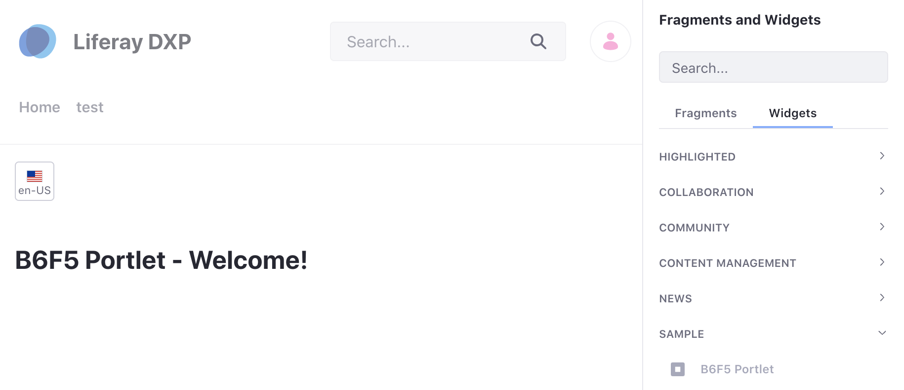

# Using Localized Messages in an MVC Portlet

Liferay's localization framework helps you create and use localized messages in your MVC Portlet. Follow the steps below to see an example project that demonstrates this. 

## Deploy the Sample Code

To see the example:

1. Start Liferay DXP. If you don't already have a docker container, use

    ```bash
    docker run -it -p 8080:8080 [$LIFERAY_LEARN_DXP_DOCKER_IMAGE$]
    ```

    If you're running a different Liferay Portal CE version or Liferay DXP, adjust the above command accordingly. 

1. Download and unzip [Using Localized Messages](./liferay-b6f5.zip).

    ```bash
    curl https://learn.liferay.com/dxp/7.x/en/developing-applications/developing-a-java-web-application/using-mvc/using-localized-messages-in-an-mvc-portlet/resources/liferay-b6f5.zip -O
    ```

    ```bash
    unzip liferay-b6f5.zip
    ```

1. From the module root, build and deploy.

    ```bash
    ./gradlew deploy -Ddeploy.docker.container.id=$(docker ps -lq)
    ```

    ```note::
       This command is the same as copying the deployed jars to /opt/liferay/osgi/modules on the Docker container.
    ```

1. Confirm the deployment in the Liferay Docker container console.

    ```bash
    STARTED com.acme.b6f5.web.0.0 [1009]
    ```

1. Verify that the example module is working. Open your browser to `https://localhost:8080`

1. Add the B6F5 Portlet to a page. You can find the example portlet under Sample Widgets.

    

    You should see the welcome message header from the example.

1. The example project also includes locales for Portuguese and Japanese. For example, use the language selector to select Brazilian Portuguese or Japanese to see the welcome message.

    

Now that you've seen the example, let's see how it works.

## Create the Language Properties File

Create a `Language.properties` file and add it to your module's `src/main/resources/content` folder. In the file define the keys you will use in your MVC portlet. 

Language property files for other locales can also be included in the folder. For example, to include language keys for Japanese, add a `Language_ja.properties` file to the folder.

## Create the JSP File

Create your JSP file and add it to your module's `/src/main/resources/META-INF/resources` folder.

The example project includes a `view.jsp` file with a simple welcome header that utilized the liferay-ui taglib.

```jsp
<%@ taglib uri="http://liferay.com/tld/ui" prefix="liferay-ui" %>

<h1><liferay-ui:message key="b6f5-portlet-welcome" /></h1>
```

Note that there is an extra `liferay-ui:message` that is included in the example jsp file: 

```jsp
<liferay-ui:message key="supercalifragilisticexpialidocious" />
```

This demonstrates that if no such key is found in the `Language.properties` file, simply the label will be displayed.

Learn more about taglibs in our [Liferay Tag Library Documentation](https://docs.liferay.com/portal/7.3-latest/taglibs/util-taglib/). 
Each taglib has a list of attributes that can be passed to the tag.

## Add the Component Definition

As you create your custom MVC Portlet, make sure to include the language resource bundle property in the class's `@Component` definition.

```java
@Component(
	property = {
		"com.liferay.portlet.display-category=category.sample",
		"javax.portlet.display-name=B6F5 Portlet",
		"javax.portlet.init-param.view-template=/view.jsp",
		"javax.portlet.resource-bundle=content.Language",
		"javax.portlet.supported-locale=en_US,ja,pt_BR"
	},
	service = Portlet.class
)
```

The example project includes this property to use the language resource bundle: 

```java
"javax.portlet.resource-bundle=content.Language"
```

The different locales are also defined for each of the languages that the portlet will support:

```java
"javax.portlet.supported-locale=en_US,ja,pt_BR"
```