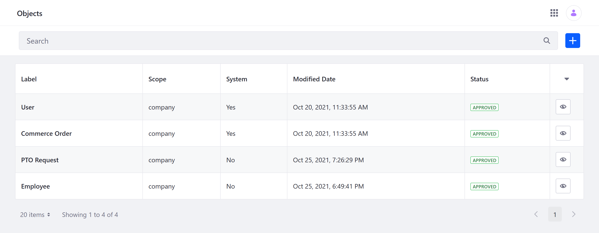
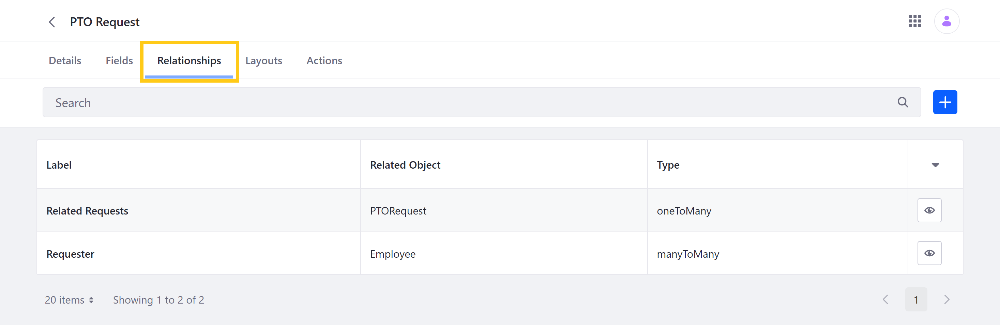
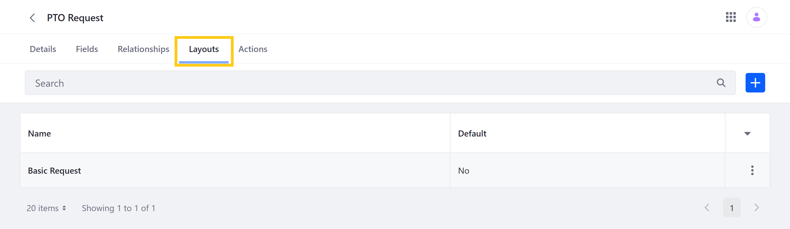
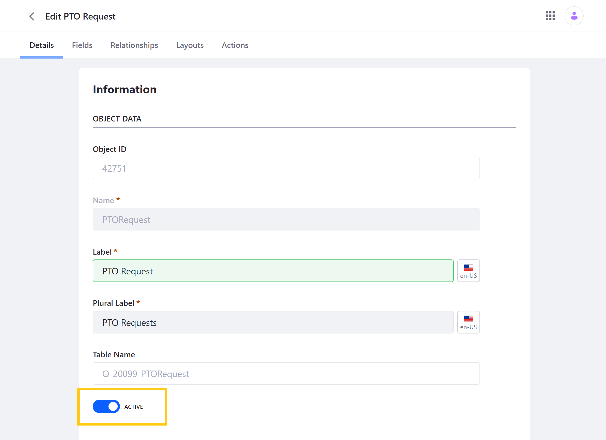

# Managing Objects

The Objects portlet provides a powerful way to manage both system and custom Objects. System Objects include any Liferay applications that have been integrated with the Objects framework, while custom Objects are applications created using the Objects portlet. Though both types of Objects are supported, some management options are only available for custom Objects.



```{note}
See [Objects Application Permissions](../objects-admin-permission.md) to learn more about the permissions necessary for performing these management actions.
```

## Editing and Extending Objects

With the Objects portlet, users can edit and extend both system and custom Objects using [fields](#fields), [relationships](#relationships), and [layouts](#layouts).

### Fields


You can add fields to any system or custom Object. Any field added to a system or custom Object after it's published can be edited and removed at any time. However, fields included in a custom Object at the time it is published can only be edited minimally and cannot be removed, and native system Object fields cannot be edited or removed at all. All fields can be viewed in an Object's fields in its Fields tab. See [Adding Fields to Objects](./adding-fields-to-objects.md) for more information.

### Relationships



You can add and configure relationships for custom Objects. After creation, users can only edit a relationship's Label and Deletion Type. Also, relationships can only be removed from an Object draft and cannot be removed from system and published Objects.  Depending on the relationship type, an Object's relationships are displayed in either the Fields or Relationships tab. See [Defining Object Relationships](./defining-object-relationships.md) for more information.
<!--TASK: Replace with following text once system Objects are supported, "You can add relationships to both system and custom Objects. After creation, users can only edit a relationship's Label and Deletion Type. Also, relationships can only be removed from an Object draft and cannot be removed from system and published Objects.  Depending on the relationship type, an Object's relationships are displayed in either the Fields or Relationships tab. See [Defining Object Relationships](./defining-object-relationships.md) for more information."-->

### Layouts



You can add, edit, and remove layouts for custom Objects at any time. Custom layouts must include all of an Object's required fields in order to be set as the Object's default layout. See [Designing Object Layouts](./designing-object-layouts.md) for more information.
<!--TASK: Replace with following text once system Objects are supported, "You can add, edit, and remove layouts for both system and custom Objects at any time. Custom layouts must include all of an Object's required fields in order to be set as the Object's default layout. See [Designing Object Layouts](./designing-object-layouts.md) for more information."-->

## Activating and Deactivating Objects

By default, custom Objects are *Activated* when they're first [published](./creating-objects.md#publishing-object-drafts). This makes the application available for use as soon as it's created. While active, the Object and its entries can be accessed via the Liferay UI and Headless API calls. However, you can deactivate custom Objects at any time if desired.

Deactivating an Object removes it from its Panel Category, integrated frameworks, and related Objects. While inactive, an Object can only be [edited and extended](#editing-and-extending-objects) in the Objects portlet. If an Object's entries are displayed in a Site or related Object at the time it's deactivated, those entries appear blank. Also, its fields are no longer displayed in any related Object layouts.

When desired, you can reactivate any inactive Object to make it and its data available for use.

```{important}
Deactivating an Object does not affect its data; it only prevents users from accessing it until the Object is reactivated.
```

Follow these steps to deactivate or activate a custom Object via the Objects portlet.

1. From the *Objects* portlet, click on the desired *Object*.

   ```{note}
   System Objects cannot be deactivated.
   ```

1. In the Details tab, set the toggle switch to either *Active* or *Inactive*.

    

1. Click on *Save*.

## Removing Objects

In the Objects portlet, you can remove Object drafts. However, once an Object has been published, it cannot be removed. Published Objects can only be [activated or deactivated](#activating-and-deactivating-objects).

To remove an Object draft, click on its *Actions* button (), and select *Delete*.


## Additional Information

* [Introduction to Objects](../introduction-to-objects.md)
* [Creating Objects](./creating-objects.md)
<!--TASK: Add once article is finished * [Objects UI Reference](../objects-ui-reference.md) -->
