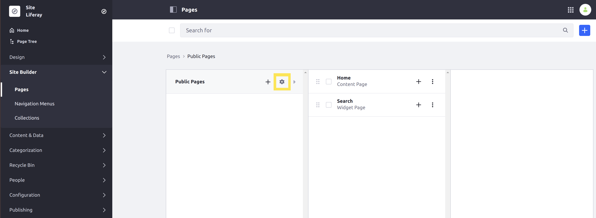
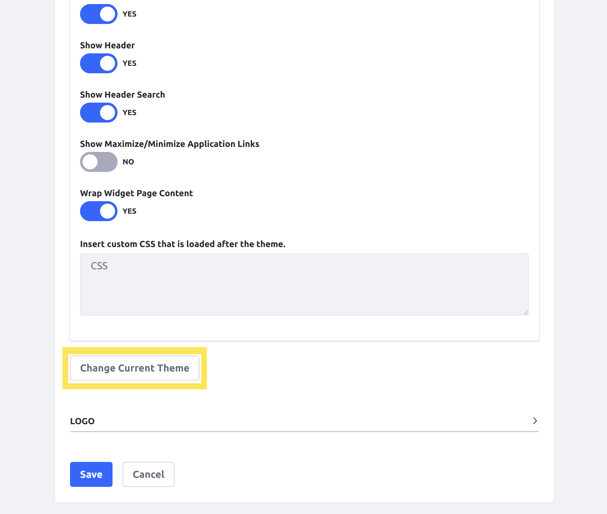
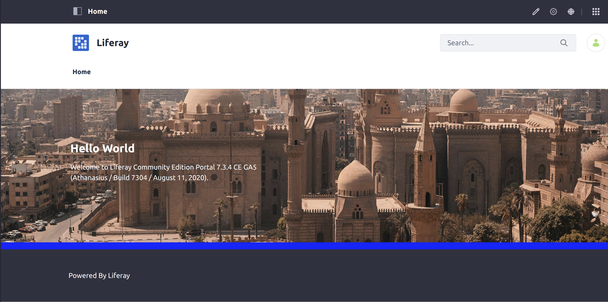

# Changing Your Site's Appearance

Changing the site logo, favicon, and theme are some of first look and feel areas you may want to change. Themes are used to set the overall look and feel for your Site. A Site's Pages can be configured to use any theme that has been deployed to your DXP instance.

The DXP Docker image has the _Classic_ theme available by default. In this example, we deploy a new simple theme and then show you how to switch from one theme to another.

## Changing Your Site's Theme

### Deploy a New Theme

1. Start up the Liferay DXP Docker image:

    ```bash
    docker run -it -m 8g -p 8080:8080 [$LIFERAY_LEARN_PORTAL_DOCKER_IMAGE$]
    ```

1. Download the WAR containing the [Acme Sample Blue Theme](./liferay-5b2v-theme.war):

    ```bash
    curl https://learn.liferay.com/dxp/latest/en/getting-started/changing-your-sites-appearance/liferay-5b2v-theme.war -O
    ```

1. Deploy the WAR containing the theme:

    <!-- ./gradlew deploy -Ddeploy.docker.container.id=$(docker ps -lq) -->

    ```bash
    docker cp liferay-5b2v-theme.war docker-container:path-to-deploy-folder
    ```

This will load the sample theme into your DXP instance. You can check your console for the following message to confirm that the theme successfully deployed:

```
2020-03-11 17:06:35.601 INFO  [fileinstall-/opt/liferay/osgi/war][BundleStartStopLogger:39] STARTED liferay-5b2v-theme_1.0.0 [1112]
```

### Change Your Site's Theme

Configure the Pages for your Site to use the deployed theme:

1. Open your browser to `https://localhost:8080` and [login as an administrator](./introduction-to-the-admin-account.md).

1. In the _Site Menu_ on the left side of the screen, navigate to _Site Builder_ → _Pages_.

1. Click the gear icon  next to _Public Pages_ to configure them:

    

1. Scroll down and click the _Change Current Theme_ button:

    

1. Select the deployed sample theme, _Acme Sample Blue Theme._

1. Navigate back to the home page for your Site to confirm that the theme has changed. The background for the content section of your Site is now blue.

    

Your Site's theme has been updated.

### What's Next

For a full length overview of how you can manage your Site's appearance, see [Managing Your Site's Appearance](../site-building/site-appearance/site-appearance.md).

There are many themes available on the [Liferay Marketplace](../system-administration/installing-and-managing-apps/getting-started/using-marketplace.md) that can be used to quickly achieve a professional look and feel.

You can also learn how to [create your own theme](../site-building/site-appearance/themes/introduction-to-themes.md).

<!-- ## Changing Your Site's Logo

Coming soon!

## Changing Your Site's Favicon

Coming soon! -->
